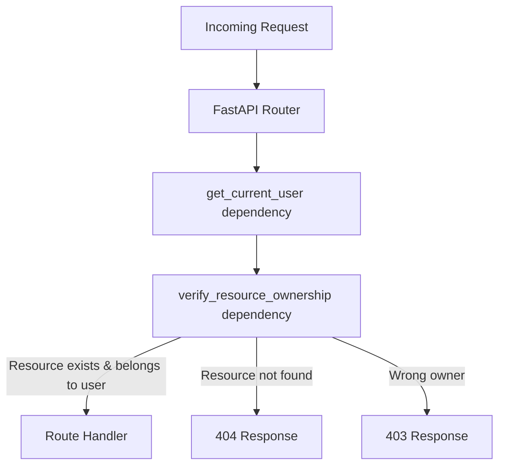

# Design Document: API Security Middleware

## Overview

This design hardens the Life OS API against IDOR vulnerabilities and adds leaderboard privacy controls. The current codebase uses a `_verify_owner` pattern that checks `user_id` in the URL path against the authenticated user, but several endpoints (notifications, subtasks, focus tasks) fail to verify that the *specific resource* belongs to that user. An attacker who knows a notification ID can mark another user's notification as read, toggle another user's subtask, or add another user's task to their focus list.

The solution introduces:
1. A centralized, reusable FastAPI dependency (`verify_resource_ownership`) that validates resource ownership before the route handler executes.
2. Fixes for the three IDOR gaps: notification mark-read/dismiss, subtask toggle/delete, and focus task add.
3. A `profile_visibility` field on the User model with a toggle endpoint.
4. Leaderboard filtering to exclude private users (while always including the requester).

### Current Vulnerabilities

| Endpoint | Vulnerability |
|---|---|
| `PUT /users/{user_id}/notifications/{notification_id}/read` | `mark_notification_read` queries by `notification_id` only — no `user_id` filter |
| `DELETE /users/{user_id}/notifications/{notification_id}` | `dismiss_notification` queries by `notification_id` only — no `user_id` filter |
| `PATCH /users/{user_id}/tasks/{task_id}/subtasks/{subtask_id}/toggle` | Verifies task ownership but `toggle_subtask` queries subtask by ID only — doesn't verify `subtask.task_id == task_id` |
| `DELETE /users/{user_id}/tasks/{task_id}/subtasks/{subtask_id}` | Same as toggle — `delete_subtask` doesn't verify parent task relationship |
| `POST /users/{user_id}/weekly-review/{week}/focus-tasks` | Checks task exists but doesn't verify `task.user_id == current_user.id` |

## Architecture

The design uses FastAPI's dependency injection system rather than ASGI middleware. Dependencies run before the route handler, have access to path parameters and the database session, and can short-circuit with HTTP exceptions — exactly what ownership validation needs.



### Dependency Design

Rather than a single monolithic middleware, the design provides a factory function `require_ownership` that returns a FastAPI `Depends`-compatible callable. Each resource type registers a lookup function that:
1. Fetches the resource by ID (single DB query)
2. Returns the `user_id` that owns it (directly or via parent)

```python
# Usage in a route:
@router.put("/{notification_id}/read")
def mark_read(
    notification: models.Notification = Depends(require_ownership("notification")),
    ...
):
    # notification is guaranteed to belong to current_user
```

## Components and Interfaces

### 1. Ownership Registry (`backend/ownership.py`)

New module containing the centralized ownership validation logic.

```python
# Type for ownership checker functions
OwnershipChecker = Callable[[Session, int], Optional[Tuple[Any, int]]]
# Returns (resource, owner_user_id) or None if not found

_registry: Dict[str, OwnershipChecker] = {}

def register_ownership_checker(resource_type: str, checker: OwnershipChecker) -> None:
    """Register a new resource type's ownership checker."""
    _registry[resource_type] = checker

def require_ownership(resource_type: str, id_param: str = None, error_detail: str = None):
    """Factory that returns a FastAPI dependency for ownership validation."""
    ...
```

### 2. Checker Functions

Each resource type has a checker that performs a single DB query:

| Resource | Checker Logic | Owner Resolution |
|---|---|---|
| `notification` | `db.query(Notification).filter(id == notification_id)` | `notification.user_id` |
| `subtask` | `db.query(SubTask).join(Task).filter(subtask_id, task_id)` | `subtask.task.user_id` |
| `task` | `db.query(Task).filter(id == task_id)` | `task.user_id` |

### 3. Profile Visibility Endpoint (`backend/routers/users.py`)

New endpoint:
- `PUT /users/{user_id}/settings/profile-visibility`
- Accepts `{"profile_visibility": "public" | "private"}`
- Returns updated setting
- Uses existing `_verify_owner` pattern (user_id in path must match authenticated user)

### 4. Leaderboard Filter (`backend/routers/analytics.py`)

Modified `get_leaderboard` to:
1. Filter `db.query(User).filter(User.profile_visibility == "public")` for the main query
2. Always append the authenticated user's entry if they have `profile_visibility == "private"`

## Data Models

### User Model Changes

Add one column to `backend/models.py`:

```python
class User(Base):
    ...
    profile_visibility = Column(String, default="public")  # "public" or "private"
```

### New Schemas (`backend/schemas.py`)

```python
class ProfileVisibilityUpdate(BaseModel):
    profile_visibility: Literal["public", "private"]

class ProfileVisibilityOut(BaseModel):
    profile_visibility: str
    model_config = ConfigDict(from_attributes=True)
```

### Updated Schemas

`UserSettingsOut` should include `profile_visibility` so the frontend can read the current value.

### Database Migration

A migration script adds the `profile_visibility` column with default `"public"` to existing rows:

```python
# backend/migrations/migrate_profile_visibility.py
def migrate(db_path):
    conn = sqlite3.connect(db_path)
    cursor = conn.cursor()
    cursor.execute("ALTER TABLE users ADD COLUMN profile_visibility TEXT DEFAULT 'public'")
    conn.commit()
    conn.close()
```


## Correctness Properties

*A property is a characteristic or behavior that should hold true across all valid executions of a system — essentially, a formal statement about what the system should do. Properties serve as the bridge between human-readable specifications and machine-verifiable correctness guarantees.*

### Property 1: Ownership validation grants access if and only if requester is owner

*For any* resource (notification, subtask via parent task, or task) and *for any* pair of user IDs (requester, owner), the ownership checker SHALL grant access if and only if `requester_id == owner_user_id`. When they differ, the system SHALL raise a 403 error.

**Validates: Requirements 1.1, 1.2, 1.3, 2.1, 2.2, 2.4, 3.1, 3.2**

### Property 2: Subtask path consistency rejects mismatched task IDs

*For any* subtask with `task_id = T` and *for any* URL path `task_id = U`, the ownership checker SHALL return the subtask only when `T == U`. When `T != U`, the system SHALL raise a 404 error.

**Validates: Requirements 2.3, 2.5**

### Property 3: Profile visibility round-trip

*For any* valid visibility value (`"public"` or `"private"`) and *for any* user, setting the user's `profile_visibility` to that value and then reading it back SHALL return the same value.

**Validates: Requirements 5.2, 5.3, 6.2**

### Property 4: Invalid visibility values are rejected

*For any* string that is not `"public"` or `"private"`, submitting it as a `profile_visibility` update SHALL result in an HTTP 422 response.

**Validates: Requirements 5.4**

### Property 5: Leaderboard excludes private users

*For any* set of users with mixed `profile_visibility` settings, the leaderboard response SHALL contain only users whose `profile_visibility` is `"public"` (plus the authenticated user per Property 6).

**Validates: Requirements 7.1, 7.2, 7.3**

### Property 6: Leaderboard always includes the authenticated user

*For any* authenticated user, regardless of their `profile_visibility` setting, the leaderboard response SHALL include that user's entry.

**Validates: Requirements 7.4**

## Error Handling

| Scenario | HTTP Status | Response Body |
|---|---|---|
| Resource not found (notification, subtask, task) | 404 | `{"detail": "<Resource> not found"}` |
| Resource belongs to another user | 403 | `{"detail": "Not authorized"}` |
| Subtask `task_id` doesn't match URL `task_id` | 404 | `{"detail": "SubTask not found"}` |
| Invalid `profile_visibility` value | 422 | Pydantic validation error |
| Unauthenticated request to visibility endpoint | 401 | `{"detail": "Could not validate credentials"}` |
| Visibility endpoint with mismatched `user_id` | 403 | `{"detail": "Not authorized"}` |

Error messages are kept consistent with existing patterns in the codebase. The ownership dependency raises `HTTPException` directly, so FastAPI's default error handling applies.

## Testing Strategy

### Unit Tests (example-based)

- Verify all four resource types are registered in the ownership registry (Req 4.2)
- Verify a new resource type can be registered without modifying existing logic (Req 4.3)
- Verify ownership validation runs before the route handler (Req 4.4)
- Verify single DB query per ownership check (Req 4.5)
- Verify new users default to `profile_visibility = "public"` (Req 5.1)
- Verify unauthenticated requests to visibility endpoint return 401 (Req 6.3, 6.4)
- Verify non-existent notification returns 404 (Req 1.4)
- Verify non-existent subtask returns 404 (Req 2.5)
- Verify non-existent task returns 404 for focus task addition (Req 3.3)
- Verify the PUT endpoint exists at `/users/{user_id}/settings/profile-visibility` (Req 6.1)

### Property-Based Tests (Hypothesis)

Each property test runs a minimum of 100 iterations using the `hypothesis` library (already present in the project).

- **Property 1**: Generate random `(requester_id, owner_id)` pairs and resource instances. Verify the ownership checker grants access iff IDs match.
  - Tag: `Feature: api-security-middleware, Property 1: Ownership validation grants access iff requester is owner`
- **Property 2**: Generate random `(url_task_id, subtask_task_id)` pairs. Verify the subtask checker returns the resource only when IDs match.
  - Tag: `Feature: api-security-middleware, Property 2: Subtask path consistency rejects mismatched task IDs`
- **Property 3**: Generate random users and random valid visibility values. Set, read back, verify equality.
  - Tag: `Feature: api-security-middleware, Property 3: Profile visibility round-trip`
- **Property 4**: Generate random strings (excluding "public" and "private"). Verify 422 response from Pydantic validation.
  - Tag: `Feature: api-security-middleware, Property 4: Invalid visibility values are rejected`
- **Property 5**: Generate random sets of users with random visibility. Call leaderboard, verify only public users appear (excluding self-inclusion).
  - Tag: `Feature: api-security-middleware, Property 5: Leaderboard excludes private users`
- **Property 6**: Generate random authenticated users with random visibility. Verify they always appear in their own leaderboard view.
  - Tag: `Feature: api-security-middleware, Property 6: Leaderboard always includes the authenticated user`

### Integration Tests

- End-to-end IDOR test: create two users, create resources for user A, attempt access as user B, verify 403.
- End-to-end leaderboard privacy: create users with mixed visibility, verify leaderboard filtering.
- Migration test: verify `profile_visibility` column is added with correct default.
