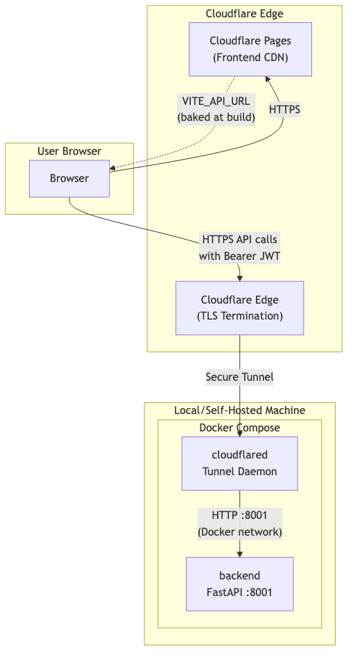
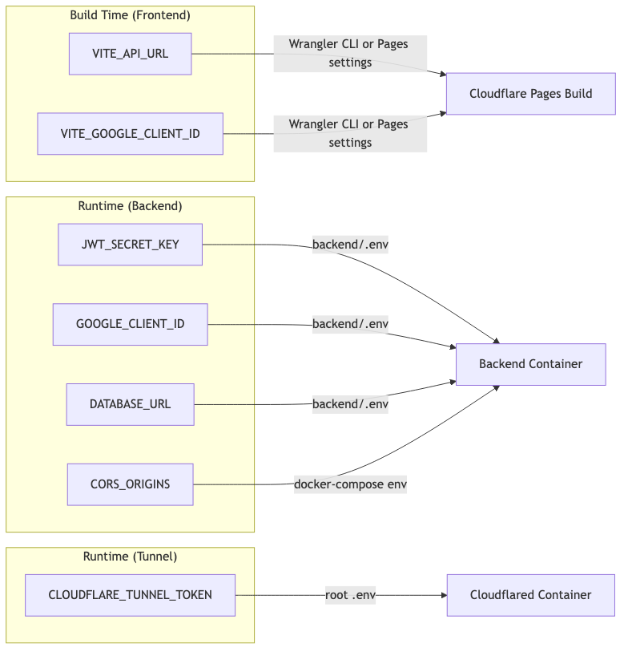

# Design Document: Cloudflare Deployment

## Overview

This design covers the production deployment of LifeOS using Cloudflare infrastructure. The architecture splits into two deployment targets:

1. **Frontend** — Static assets built by Vite, deployed to Cloudflare Pages via Wrangler CLI
2. **Backend** — FastAPI app running in Docker on a local/self-hosted machine, exposed to the internet through a Cloudflare Tunnel (no inbound ports required)

The existing codebase already has Docker Compose orchestration with `backend` and `cloudflared` services, JWT-based auth (HS256, 7-day expiry), CORS middleware driven by `CORS_ORIGINS` env var, and a non-root Dockerfile. This design focuses on the configuration files, deployment artifacts, and wiring needed to make the production deployment work end-to-end.

### Key Design Decisions

- **Cloudflare Pages over self-hosted Nginx**: The frontend is currently containerized with Nginx (`frontend/Dockerfile` + `nginx.conf`). For production, Cloudflare Pages provides global CDN, automatic HTTPS, and zero-config SPA routing — eliminating the need to run a frontend container. The Nginx config remains useful for local development.
- **Wrangler CLI for deploys**: Using `wrangler pages deploy` gives a repeatable, scriptable deployment without needing CI/CD initially. A `deploy` script in `package.json` chains build + deploy.
- **`_headers` and `_redirects` files**: Cloudflare Pages uses these static files (placed in the build output) to configure response headers and SPA fallback routing at the edge.
- **No changes to backend auth logic**: The existing `backend/auth.py` already enforces JWT validation on protected routes and returns proper 401 responses. No code changes needed — only environment configuration.

## Architecture



### Request Flow

1. User loads `https://lifeos.pages.dev` → Cloudflare Pages serves static assets
2. Frontend JS makes API calls to `https://api.lifeos.example.com` (the tunnel hostname baked into `VITE_API_URL`)
3. Cloudflare edge terminates TLS, forwards request through the tunnel to the `cloudflared` container
4. `cloudflared` proxies to `http://backend:8001` on the Docker network
5. Backend validates JWT from `Authorization: Bearer <token>` header, processes request, returns response
6. CORS middleware only allows `Access-Control-Allow-Origin` for origins in `CORS_ORIGINS`

## Components and Interfaces

### 1. Frontend Build Artifacts (new files)

| File | Location | Purpose |
|------|----------|---------|
| `wrangler.toml` | `frontend/wrangler.toml` | Cloudflare Pages project config (project name, build command, output dir, compatibility date) |
| `_headers` | `frontend/public/_headers` | Security headers applied at Cloudflare edge (X-Content-Type-Options, X-Frame-Options, Referrer-Policy, Cache-Control for assets) |
| `_redirects` | `frontend/public/_redirects` | SPA fallback: all routes → `/index.html` with 200 status |
| `deploy` script | `frontend/package.json` | New npm script: `"deploy": "npm run build && npx wrangler pages deploy dist"` |

### 2. Docker Compose (existing, minor updates)

The existing `docker-compose.yml` already defines both services correctly. The only change needed is ensuring `CORS_ORIGINS` defaults to the production domain when deploying:

```yaml
environment:
  CORS_ORIGINS: ${CORS_ORIGINS:-http://localhost:5173,http://localhost:3000}
```

The operator sets `CORS_ORIGINS=https://lifeos.pages.dev` in the root `.env` file for production.

### 3. Backend (no code changes)

All backend components are already correctly implemented:

- **CORS middleware** (`main.py`): Reads `CORS_ORIGINS` env var, splits by comma, applies to `CORSMiddleware`
- **Auth enforcement** (`auth.py`): `get_current_user` dependency validates JWT on protected routes, returns 401 with `WWW-Authenticate: Bearer` on failure
- **Health check** (`main.py`): `GET /` returns 200
- **Non-root user** (`Dockerfile`): Runs as `appuser`

### 4. Environment Variable Flow



## Data Models

No new data models are introduced. This feature is purely infrastructure and deployment configuration. The existing models (User, JWT tokens, etc.) are unchanged.

### Configuration File Schemas

**`frontend/wrangler.toml`**:
```toml
name = "lifeos"                          # Cloudflare Pages project name
pages_build_output_dir = "./dist"        # Vite build output
compatibility_date = "2025-06-01"        # Cloudflare Workers compatibility date

[build]
command = "npm run build"
```

**`frontend/public/_headers`**:
```
/*
  X-Content-Type-Options: nosniff
  X-Frame-Options: DENY
  Referrer-Policy: strict-origin-when-cross-origin

/assets/*
  Cache-Control: public, max-age=31536000, immutable
```

**`frontend/public/_redirects`**:
```
/*  /index.html  200
```

## Error Handling

| Scenario | Handling |
|----------|----------|
| Missing `CLOUDFLARE_TUNNEL_TOKEN` | `cloudflared` container fails to start; Docker Compose logs show auth error. Operator must set token in `.env`. |
| Missing `JWT_SECRET_KEY` | Backend raises `RuntimeError` at startup and refuses to start (existing behavior in `auth.py`). |
| Tunnel connection lost | `cloudflared` container restarts automatically via `restart: unless-stopped`. Cloudflare edge returns 502 to clients during reconnection. |
| Backend health check fails | Docker Compose marks backend as unhealthy after 3 retries (30s). `cloudflared` won't start due to `depends_on: condition: service_healthy`. |
| Invalid/expired JWT on API request | Backend returns HTTP 401 with `{"detail": "Could not validate credentials"}` and `WWW-Authenticate: Bearer` header (existing behavior). |
| CORS violation (wrong origin) | Backend CORS middleware omits `Access-Control-Allow-Origin` header; browser blocks the response. No backend code change needed. |
| Wrangler deploy without auth | `wrangler pages deploy` prompts for Cloudflare login or fails if no API token is configured. |
| Frontend build fails (TS errors) | `tsc -b && vite build` exits non-zero; deploy script aborts before uploading. |

## Testing Strategy

### Why Property-Based Testing Does Not Apply

This feature is entirely about infrastructure configuration, deployment pipelines, and environment wiring. There are no pure functions with varying inputs, no data transformations, and no business logic being added or modified. The acceptance criteria test:

- Static file presence and content (configuration files)
- Docker Compose service definitions (declarative YAML)
- Environment variable propagation (deployment config)
- Security header values (static configuration)
- CLI command behavior (external tool integration)

These are best validated with example-based tests, smoke tests, and integration checks — not property-based testing.

### Test Approach

**1. Configuration File Validation (Unit/Example Tests)**
- Verify `frontend/wrangler.toml` contains required fields (project name, build command, output dir, compatibility date)
- Verify `frontend/public/_headers` contains all required security headers (X-Content-Type-Options, X-Frame-Options, Referrer-Policy) and cache headers for `/assets/*`
- Verify `frontend/public/_redirects` contains the SPA fallback rule
- Verify `frontend/package.json` has a `deploy` script

**2. Docker Compose Validation (Smoke Tests)**
- Verify `docker-compose.yml` defines `backend` and `cloudflared` services
- Verify backend uses `expose` (not `ports`) for port 8001
- Verify both services have `restart: unless-stopped`
- Verify `cloudflared` depends on backend health check
- Verify backend runs as non-root user in Dockerfile

**3. Environment Variable Documentation (Example Tests)**
- Verify `.env.example` documents `CLOUDFLARE_TUNNEL_TOKEN` and `CORS_ORIGINS`
- Verify `backend/.env.example` documents `JWT_SECRET_KEY`, `GOOGLE_CLIENT_ID`, `DATABASE_URL`
- Verify `.gitignore` excludes `.env` files

**4. Backend Auth & CORS (Existing Tests — No New Tests Needed)**
- JWT validation and 401 responses are already tested in `backend/tests/test_security.py`
- CORS middleware behavior is driven by `CORS_ORIGINS` env var — no code changes, so existing tests cover this

**5. Integration Smoke Test (Manual/CI)**
- Deploy frontend to Cloudflare Pages, verify site loads at production URL
- Start Docker Compose with production `.env`, verify tunnel connects
- Make authenticated API call from deployed frontend, verify end-to-end flow
- Make unauthenticated API call, verify 401 response
- Make API call from unauthorized origin, verify CORS rejection
