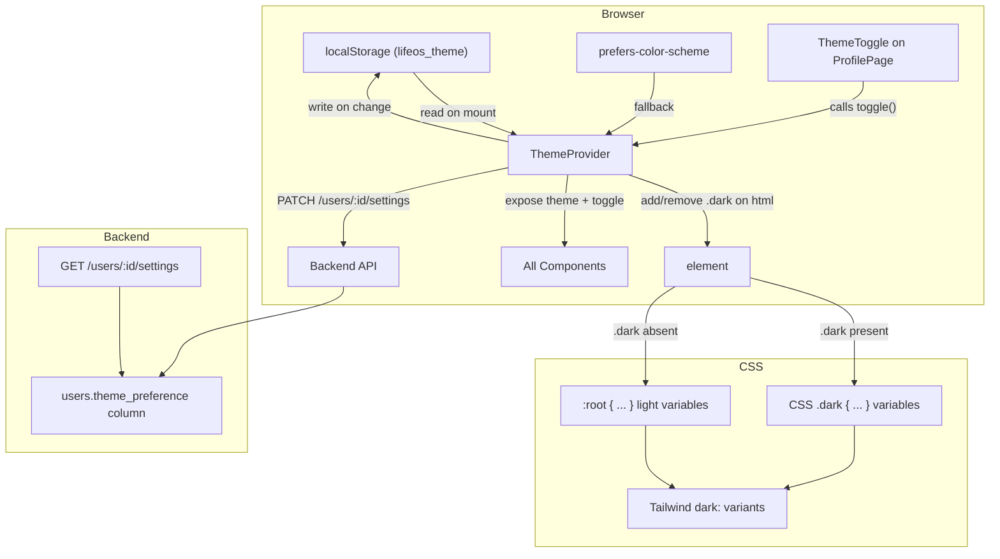
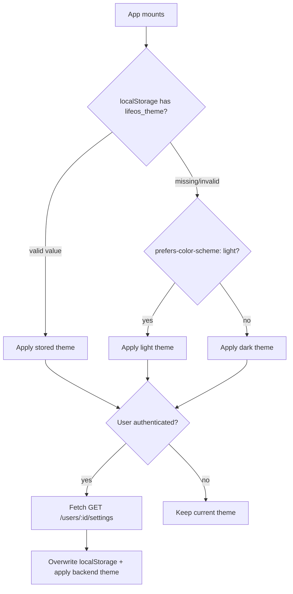

# Design Document: Dark/Light Mode

## Overview

This feature replaces the hardcoded dark-only theme with a dual-theme system supporting both dark and light modes. The implementation uses Tailwind CSS v4's `dark:` variant (driven by the `dark` class on `<html>`), CSS custom properties defined in `index.css`, and a new `ThemeProvider` React context.

The current codebase defines CSS variables only under `:root` with dark values. The design adds a light-mode palette under `:root` and moves the existing dark palette under `.dark`, so Tailwind's `darkMode: 'class'` strategy works out of the box. Components that use hardcoded dark classes (e.g., `bg-black/60`, `text-white`, `bg-white/5`) are migrated to use theme-aware CSS custom properties or `dark:` variants.

Theme preference is persisted in two layers: `localStorage` for instant hydration on page load, and a new `theme_preference` column on the backend `User` model for cross-device sync. On first visit with no stored preference, the system's `prefers-color-scheme` media query is respected.

## Architecture



The theme flows top-down: `ThemeProvider` determines the active theme from localStorage → backend → system preference (in priority order), sets the `dark` class on `<html>`, and exposes `theme` and `toggleTheme` via context. All components consume theme through CSS custom properties and Tailwind's `dark:` prefix. The backend stores the preference for cross-device sync but is not in the critical rendering path — localStorage ensures instant theme application.

## Components and Interfaces

### Backend Changes

**`backend/models.py` — User model update**

Add a `theme_preference` column:

```python
class User(Base):
    # ... existing columns ...
    theme_preference = Column(String, default="dark")
```

**`backend/schemas.py` — New schemas**

```python
class UserSettingsOut(BaseModel):
    theme_preference: str
    model_config = ConfigDict(from_attributes=True)

class UserSettingsUpdate(BaseModel):
    theme_preference: Optional[str] = None

    @field_validator("theme_preference")
    @classmethod
    def validate_theme(cls, v: Optional[str]) -> Optional[str]:
        if v is not None and v not in ("dark", "light"):
            raise ValueError("theme_preference must be 'dark' or 'light'")
        return v
```

**`backend/routers/users.py` — New settings endpoints**

```
GET   /users/{user_id}/settings  → returns UserSettingsOut
PATCH /users/{user_id}/settings  → accepts UserSettingsUpdate, returns UserSettingsOut
```

The PATCH endpoint updates only the provided fields. If `theme_preference` is provided, it updates the column. Returns the full settings object.

**`backend/migrations/` — Alembic migration**

Add `theme_preference` column to `users` table with default `"dark"` and server_default for existing rows.

### Frontend Changes

**`frontend/src/contexts/ThemeContext.tsx`** (new)

```typescript
type Theme = 'dark' | 'light';

interface ThemeContextType {
  theme: Theme;
  toggleTheme: () => void;
}
```

Initialization logic (in order of priority):
1. Read `lifeos_theme` from `localStorage`. If valid (`"dark"` or `"light"`), use it.
2. If invalid or missing, check `window.matchMedia('(prefers-color-scheme: light)')`. If matches, use `"light"`, otherwise `"dark"`.
3. After auth, fetch `GET /users/:id/settings` and overwrite localStorage + apply the backend value.

On toggle:
1. Flip theme state.
2. Add/remove `dark` class on `document.documentElement`.
3. Write to `localStorage` under key `lifeos_theme`.
4. Fire `PATCH /users/:id/settings` with new value (fire-and-forget, log errors to console).

Transition handling:
- On toggle, add a `theme-transitioning` class to `<html>` before changing theme, which enables `transition: background-color 200ms, color 200ms`. Remove it after 200ms. This prevents transitions on initial page load.

**`frontend/src/App.tsx` — Wrap with ThemeProvider**

```tsx
<AuthProvider>
  <ThemeProvider>
    <BrowserRouter>...</BrowserRouter>
  </ThemeProvider>
</AuthProvider>
```

The `ThemeProvider` is placed inside `AuthProvider` so it can access the authenticated user for backend sync.

**`frontend/src/index.css` — Dual-theme CSS variables**

Move existing dark palette from `:root` to `.dark` selector. Define new light palette under `:root`:

```css
@layer base {
  :root {
    --background: 0 0% 98%;
    --foreground: 240 10% 10%;
    --card: 0 0% 100%;
    --card-foreground: 240 10% 10%;
    --popover: 0 0% 100%;
    --popover-foreground: 240 10% 10%;
    --primary: 160 84% 39%;
    --primary-foreground: 0 0% 100%;
    --secondary: 240 5% 92%;
    --secondary-foreground: 240 10% 10%;
    --muted: 240 5% 90%;
    --muted-foreground: 240 5% 40%;
    --accent: 190 90% 40%;
    --accent-foreground: 0 0% 100%;
    --destructive: 0 84% 60%;
    --destructive-foreground: 0 0% 100%;
    --border: 240 5% 85%;
    --input: 240 5% 85%;
    --ring: 160 84% 39%;
    --radius: 1rem;
  }

  .dark {
    --background: 240 10% 2%;
    --foreground: 0 0% 98%;
    /* ... existing dark values ... */
  }
}
```

Update `.glass-panel`, `.glass-button`, and `.text-gradient` component classes to use CSS custom properties that resolve differently per theme:

```css
.glass-panel {
  @apply bg-card/80 backdrop-blur-2xl border border-border shadow-lg relative overflow-hidden;
}

.glass-button {
  @apply bg-secondary/50 hover:bg-secondary/80 border border-border shadow-sm hover:shadow-md transition-all duration-300 active:scale-95;
}
```

**`frontend/src/pages/ProfilePage.tsx` — Appearance section**

Add a new "Appearance" settings section between "Reminder Settings" and "Session" with a `ThemeToggle` control:
- Displays sun icon (☀️) when current theme is `dark` (indicating "switch to light").
- Displays moon icon (🌙) when current theme is `light` (indicating "switch to dark").
- Includes `aria-label` describing the action (e.g., "Switch to light mode").

**`frontend/src/api/index.ts` — New API functions**

```typescript
export const getUserSettings = async (userId: number): Promise<{ theme_preference: string }> => {
  const res = await api.get(`/users/${userId}/settings`);
  return res.data;
};

export const updateUserSettings = async (
  userId: number,
  settings: { theme_preference?: string }
): Promise<{ theme_preference: string }> => {
  const res = await api.patch(`/users/${userId}/settings`, settings);
  return res.data;
};
```

**Component theme migration pattern:**

All components replace hardcoded dark classes with theme-aware equivalents:

| Hardcoded class | Theme-aware replacement |
|---|---|
| `bg-[#030303]` | `bg-background` |
| `bg-black/60` | `bg-card/60` |
| `text-white` | `text-foreground` |
| `text-neutral-400` | `text-muted-foreground` |
| `text-neutral-500` | `text-muted-foreground` |
| `border-white/10` | `border-border` |
| `bg-white/5`, `bg-white/[0.03]` | `bg-secondary/50` |
| `hover:bg-white/5` | `hover:bg-secondary/50` |
| `bg-black/80` | `bg-popover` |

Components to migrate: Layout, Sidebar, ProfileMenu, NotificationCenter, ProfilePage, MarkdownEditor, ConfirmModal, CustomDropdown, QuickCaptureButton, TagChip, TagSelector, PriorityBadge, ProgressBar, and all page components (Dashboard, GoalsPage, HabitsPage, JournalPage, KanbanBoard, VaultPage, AnalyticsPage, WeeklyReviewPage, ExportPage, LoginPage).

## Data Models

### User Table — Updated Column

| Column | Type | Constraints |
|---|---|---|
| theme_preference | String | Default `"dark"`, not null |

Valid values: `"dark"`, `"light"`.

### UserSettingsOut Schema

```python
class UserSettingsOut(BaseModel):
    theme_preference: str  # "dark" or "light"
```

### UserSettingsUpdate Schema

```python
class UserSettingsUpdate(BaseModel):
    theme_preference: Optional[str] = None  # validated to "dark" or "light"
```

### localStorage Key

| Key | Value | Default |
|---|---|---|
| `lifeos_theme` | `"dark"` or `"light"` | `"dark"` |

### Theme Initialization Priority




## Correctness Properties

*A property is a characteristic or behavior that should hold true across all valid executions of a system — essentially, a formal statement about what the system should do. Properties serve as the bridge between human-readable specifications and machine-verifiable correctness guarantees.*

### Property 1: Dark class synchronization

*For any* theme value (either `"dark"` or `"light"`), the `dark` CSS class on the `<html>` element should be present if and only if the current theme is `"dark"`. When the theme is `"light"`, the `dark` class must be absent.

**Validates: Requirements 1.4, 1.5**

### Property 2: Toggle is self-inverse

*For any* initial theme value, toggling the theme twice should return the theme to its original value. That is, `toggle(toggle(theme)) === theme`.

**Validates: Requirements 2.2**

### Property 3: Toggle renders correct icon and accessible label

*For any* theme value, the Theme_Toggle should display a sun icon when the theme is `"dark"` and a moon icon when the theme is `"light"`. The `aria-label` should describe switching to the opposite theme (e.g., "Switch to light mode" when current theme is `"dark"`).

**Validates: Requirements 2.3, 2.4**

### Property 4: Theme preference localStorage round-trip

*For any* valid theme value, after toggling to that theme, reading `localStorage.getItem("lifeos_theme")` should return that same theme value. Conversely, setting `localStorage` to a valid theme value and mounting the ThemeProvider should initialize the theme to that value.

**Validates: Requirements 1.2, 3.1, 3.2**

### Property 5: Invalid localStorage fallback

*For any* string that is not `"dark"` or `"light"`, if `localStorage` contains that string under the key `lifeos_theme`, the ThemeProvider should initialize the theme to `"dark"` and overwrite `localStorage` with `"dark"`.

**Validates: Requirements 3.3**

### Property 6: Backend settings round-trip

*For any* valid theme value (`"dark"` or `"light"`), sending a `PATCH /users/{user_id}/settings` with `{ "theme_preference": value }` followed by a `GET /users/{user_id}/settings` should return `{ "theme_preference": value }`.

**Validates: Requirements 4.2, 4.3**

### Property 7: Backend theme_preference validation

*For any* string that is not `"dark"` or `"light"`, sending a `PATCH /users/{user_id}/settings` with `{ "theme_preference": invalid_string }` should return a 422 validation error and the stored preference should remain unchanged.

**Validates: Requirements 4.2**

### Property 8: System preference detection fallback

*For any* system color scheme preference (`"light"` or `"dark"`), when no `lifeos_theme` key exists in `localStorage` and no backend preference is available, the ThemeProvider should initialize the theme to match the system preference.

**Validates: Requirements 8.1, 8.2, 8.3**

## Error Handling

| Scenario | Layer | Behavior |
|---|---|---|
| PATCH settings fails (network error) | Frontend | Theme applied locally, error logged to console, no user disruption |
| GET settings fails on login | Frontend | Keep localStorage/system-detected theme, log error |
| Invalid `theme_preference` in PATCH body | Backend (Pydantic) | Returns 422 validation error |
| `localStorage` contains invalid theme value | Frontend (ThemeProvider) | Falls back to `"dark"`, overwrites invalid value |
| `localStorage` unavailable (private browsing) | Frontend (ThemeProvider) | Falls back to system preference or `"dark"`, theme not persisted locally |
| User not found for settings endpoints | Backend (Router) | Returns 404 Not Found |
| Missing `theme_preference` in PATCH body | Backend | No-op, returns current settings unchanged |

## Testing Strategy

### Unit Tests

- **ThemeProvider initialization**: Verify default to dark when no localStorage, verify reading from localStorage, verify system preference fallback.
- **ThemeToggle rendering**: Verify sun icon in dark mode, moon icon in light mode, correct aria-label.
- **ProfilePage Appearance section**: Verify the section renders with the toggle control.
- **Backend schema validation**: Verify `UserSettingsUpdate` rejects invalid theme values, accepts valid ones.
- **Backend settings endpoints**: Verify GET returns current preference, PATCH updates it, PATCH with invalid value returns 422.
- **CSS variable structure**: Verify `:root` and `.dark` selectors define expected variables (manual/visual review).

### Property-Based Tests

Property-based tests verify universal correctness properties across randomized inputs. Use `hypothesis` (Python) for backend properties and `fast-check` (TypeScript) for frontend properties.

Each property test must:
- Run a minimum of 100 iterations
- Reference the design property in a comment tag

**Backend property tests** (using `hypothesis`):

- **Feature: dark-light-mode, Property 6: Backend settings round-trip** — Generate random valid theme values, PATCH then GET, verify round-trip.
- **Feature: dark-light-mode, Property 7: Backend theme_preference validation** — Generate arbitrary strings not in `{"dark", "light"}`, PATCH with them, verify 422 error and preference unchanged.

**Frontend property tests** (using `fast-check`):

- **Feature: dark-light-mode, Property 1: Dark class synchronization** — Generate random theme values, apply them, verify `<html>` class matches.
- **Feature: dark-light-mode, Property 2: Toggle is self-inverse** — Generate random initial themes, toggle twice, verify return to original.
- **Feature: dark-light-mode, Property 3: Toggle renders correct icon and accessible label** — Generate random theme values, render toggle, verify icon and aria-label.
- **Feature: dark-light-mode, Property 4: Theme preference localStorage round-trip** — Generate random valid themes, toggle, verify localStorage matches.
- **Feature: dark-light-mode, Property 5: Invalid localStorage fallback** — Generate arbitrary non-"dark"/"light" strings, set in localStorage, mount provider, verify fallback to dark.
- **Feature: dark-light-mode, Property 8: System preference detection fallback** — Generate random system preferences, clear localStorage, mount provider, verify theme matches system preference.
