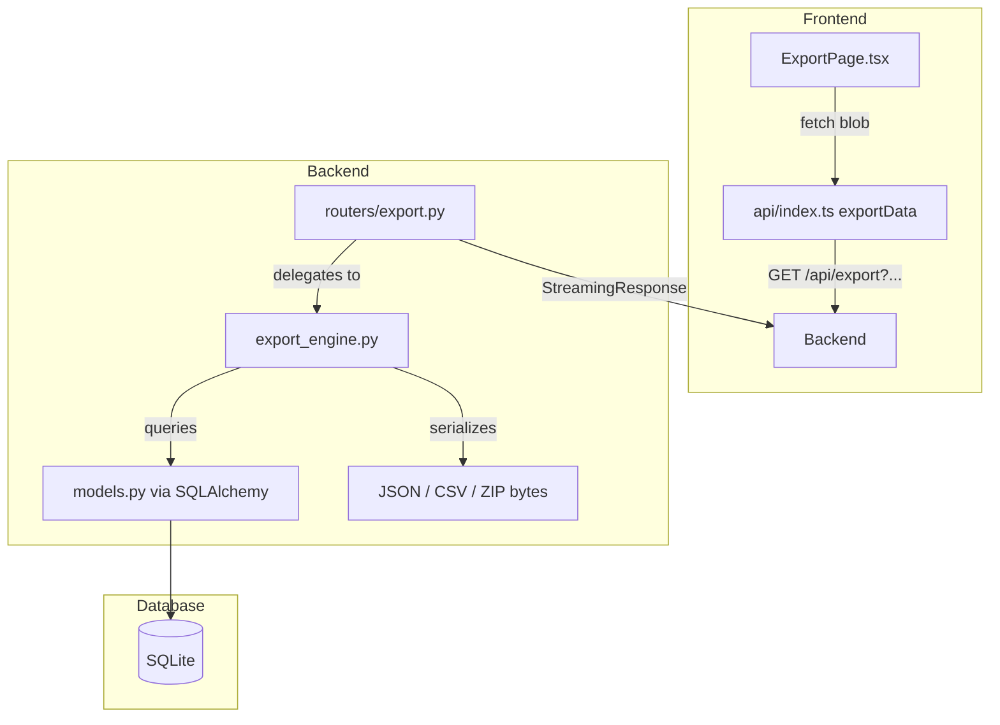

# Design Document: Data Export

## Overview

The Data Export feature allows users to download their LifeOS data (tasks, goals, habits, journal entries, notes) as JSON or CSV files. The backend provides a single `GET /api/export` endpoint that queries the user's data, applies optional date range filters, and serializes the result into the requested format. JSON exports produce a single `.json` file. CSV exports produce a single `.csv` file when one data type is selected, or a `.zip` archive containing one CSV per data type when multiple are selected. The frontend adds an Export Page with data type checkboxes, format selector, date range picker, and a download button that triggers a blob download.

The design follows existing codebase patterns: a new FastAPI router module for the endpoint, a dedicated `export_engine.py` for data querying and serialization, and a new React page component with supporting API function.

## Architecture



Data flow:
1. User configures export options on the Export Page and clicks "Export".
2. Frontend calls `GET /api/export` with query params: `user_id`, `format`, `types` (comma-separated), optional `start_date` and `end_date`.
3. The router validates params and delegates to `export_engine.py`.
4. The export engine queries each requested data type from the database, applies date filtering on `created_at`, and serializes to the requested format.
5. The response is returned as a `StreamingResponse` with appropriate `Content-Type` and `Content-Disposition` headers.
6. The frontend receives the blob, creates an object URL, and triggers a browser download.

## Components and Interfaces

### Backend Changes

**`backend/export_engine.py`** (new module)

Core export logic, separated from the router for testability.

```python
from datetime import date, datetime
from typing import List, Optional, Dict, Any
import csv
import io
import json
import zipfile

EXPORTABLE_TYPES = {"tasks", "goals", "habits", "journal", "notes"}

def query_export_data(
    db: Session,
    user_id: int,
    data_types: List[str],
    start_date: Optional[date] = None,
    end_date: Optional[date] = None,
) -> Dict[str, List[Any]]:
    """Query requested data types with optional date filtering on created_at."""

def serialize_tasks(tasks: List[Task]) -> List[dict]:
    """Convert Task ORM objects to export dicts, including subtasks and tags."""

def serialize_goals(goals: List[Goal]) -> List[dict]:
    """Convert Goal ORM objects to export dicts."""

def serialize_habits(habits: List[Habit]) -> List[dict]:
    """Convert Habit ORM objects to export dicts, including logs."""

def serialize_journal(entries: List[JournalEntry]) -> List[dict]:
    """Convert JournalEntry ORM objects to export dicts."""

def serialize_notes(notes: List[Note]) -> List[dict]:
    """Convert Note ORM objects to export dicts."""

def build_json_export(data: Dict[str, List[dict]], user_id: int) -> bytes:
    """Build JSON export with metadata envelope. Returns UTF-8 bytes."""

def build_csv_single(data_type: str, records: List[dict]) -> bytes:
    """Build a single CSV file with UTF-8 BOM. Returns bytes."""

def build_csv_zip(data: Dict[str, List[dict]]) -> bytes:
    """Build a ZIP archive containing one CSV per data type. Returns bytes."""
```

**CSV Column Definitions** (used by `build_csv_single` and `build_csv_zip`):

```python
CSV_COLUMNS = {
    "tasks": ["id", "title", "description", "status", "priority", "energy_level",
              "estimated_minutes", "actual_minutes", "target_date", "created_at",
              "task_type", "tags"],
    "goals": ["id", "title", "description", "status", "category", "priority",
              "target_date", "created_at", "progress"],
    "habits": ["id", "title", "target_x", "target_y_days", "start_date",
               "current_streak", "frequency_type", "repeat_interval", "repeat_days"],
    "journal": ["id", "entry_date", "content", "mood", "created_at"],
    "notes": ["id", "title", "content", "folder", "created_at", "updated_at"],
}
```

**`backend/routers/export.py`** (new router)

```python
router = APIRouter(prefix="/users/{user_id}/export", tags=["export"])

@router.get("/")
def export_data(
    user_id: int,
    format: str = "json",           # "json" or "csv"
    types: str = "",                 # comma-separated: "tasks,goals,habits"
    start_date: Optional[str] = None,  # ISO date YYYY-MM-DD
    end_date: Optional[str] = None,    # ISO date YYYY-MM-DD
    db: Session = Depends(get_db),
):
    # 1. Parse and validate types
    # 2. Parse and validate dates
    # 3. Call export_engine.query_export_data(...)
    # 4. Serialize based on format
    # 5. Return StreamingResponse with correct Content-Type and Content-Disposition
```

Response headers by scenario:
| Scenario | Content-Type | Content-Disposition filename |
|----------|-------------|------------------------------|
| JSON | `application/json` | `lifeos-export-{YYYY-MM-DD}.json` |
| CSV, single type | `text/csv; charset=utf-8` | `lifeos-export-{YYYY-MM-DD}.csv` |
| CSV, multiple types | `application/zip` | `lifeos-export-{YYYY-MM-DD}.zip` |

**`backend/main.py`** — Add `app.include_router(export.router)`.

### Frontend Changes

**`frontend/src/api/index.ts`** — New function:

```typescript
export const exportData = async (
  userId: number,
  format: 'json' | 'csv',
  types: string[],
  startDate?: string,
  endDate?: string,
): Promise<Blob> => {
  const params = new URLSearchParams({
    format,
    types: types.join(','),
  });
  if (startDate) params.set('start_date', startDate);
  if (endDate) params.set('end_date', endDate);

  const response = await axios.get(
    `${API_BASE}/users/${userId}/export?${params.toString()}`,
    { responseType: 'blob' }
  );
  return response.data;
};
```

**`frontend/src/pages/ExportPage.tsx`** (new page)

Component state:
- `selectedTypes: Set<string>` — checked data types (default: empty)
- `format: 'json' | 'csv'` — export format (default: `'json'`)
- `startDate: string` — optional start date
- `endDate: string` — optional end date
- `loading: boolean` — download in progress
- `error: string | null` — error message

UI layout:
1. Page title "Export Data"
2. Data type checkboxes: Tasks, Goals, Habits, Journal, Notes + "Select All" toggle
3. Format selector: radio buttons for JSON / CSV
4. Date range: two date inputs (optional start, optional end)
5. Validation message if start > end
6. Export button (disabled when no types selected or date validation error)
7. Loading spinner overlay during download
8. Error toast on failure

Download logic:
```typescript
const handleExport = async () => {
  setLoading(true);
  setError(null);
  try {
    const blob = await exportData(user.id, format, [...selectedTypes], startDate, endDate);
    const ext = format === 'json' ? 'json' : (selectedTypes.size > 1 ? 'zip' : 'csv');
    const filename = `lifeos-export-${new Date().toISOString().slice(0, 10)}.${ext}`;
    const url = URL.createObjectURL(blob);
    const a = document.createElement('a');
    a.href = url;
    a.download = filename;
    a.click();
    URL.revokeObjectURL(url);
  } catch (err) {
    setError('Export failed. Please try again.');
  } finally {
    setLoading(false);
  }
};
```

**`frontend/src/App.tsx`** — Add route: `<Route path="/export" element={<ExportPage />} />`

**`frontend/src/components/Sidebar.tsx`** — Add navigation entry with `Download` icon from lucide-react:
```typescript
{ name: 'Export Data', icon: Download, path: '/export' }
```

## Data Models

### JSON Export Structure

```json
{
  "metadata": {
    "exported_at": "2025-01-15T10:30:00Z",
    "user_id": 1,
    "format": "json"
  },
  "tasks": [
    {
      "id": 1,
      "title": "Complete report",
      "description": "Q4 summary",
      "status": "InProgress",
      "priority": "High",
      "energy_level": "Medium",
      "estimated_minutes": 60,
      "actual_minutes": null,
      "target_date": "2025-01-20",
      "created_at": "2025-01-10T08:00:00",
      "task_type": "manual",
      "subtasks": [
        { "id": 1, "title": "Gather data", "is_complete": 1 }
      ],
      "tags": ["work", "urgent"]
    }
  ],
  "goals": [
    {
      "id": 1,
      "title": "Ship v2",
      "description": "Release version 2",
      "status": "Active",
      "category": "Project",
      "priority": "High",
      "target_date": "2025-03-01",
      "created_at": "2025-01-01T00:00:00",
      "progress": 45
    }
  ],
  "habits": [
    {
      "id": 1,
      "title": "Morning run",
      "target_x": 5,
      "target_y_days": 7,
      "start_date": "2025-01-01",
      "current_streak": 3,
      "frequency_type": "flexible",
      "repeat_interval": 1,
      "repeat_days": null,
      "logs": [
        { "log_date": "2025-01-14", "status": "Done" }
      ]
    }
  ],
  "journal": [
    {
      "id": 1,
      "entry_date": "2025-01-14",
      "content": "Good day overall.",
      "mood": 4,
      "created_at": "2025-01-14T20:00:00"
    }
  ],
  "notes": [
    {
      "id": 1,
      "title": "Meeting notes",
      "content": "# Agenda\n- Item 1",
      "folder": "Project",
      "created_at": "2025-01-10T09:00:00",
      "updated_at": "2025-01-12T14:00:00"
    }
  ]
}
```

### CSV Column Mappings

**tasks.csv**: `id, title, description, status, priority, energy_level, estimated_minutes, actual_minutes, target_date, created_at, task_type, tags`
- `tags` column contains semicolon-separated tag names (e.g. `"work;urgent"`)

**goals.csv**: `id, title, description, status, category, priority, target_date, created_at, progress`
- `progress` is an integer 0-100

**habits.csv**: `id, title, target_x, target_y_days, start_date, current_streak, frequency_type, repeat_interval, repeat_days`
- Habit logs are not included in CSV (flat format limitation)

**journal.csv**: `id, entry_date, content, mood, created_at`

**notes.csv**: `id, title, content, folder, created_at, updated_at`

All CSV files use UTF-8 encoding with BOM (`\xef\xbb\xbf`) prefix for Excel compatibility.

### Serialization Functions — Field Mapping from ORM Models

| Data Type | ORM Model | Special Handling |
|-----------|-----------|-----------------|
| tasks | `Task` | `subtasks` → nested list of `{id, title, is_complete}` (JSON only); `tags` → list of tag names (JSON) or semicolon-joined string (CSV) |
| goals | `Goal` | `progress` computed from related tasks via `recalculate_goal_progress` or stored snapshot |
| habits | `Habit` | `logs` → nested list of `{log_date, status}` (JSON only) |
| journal | `JournalEntry` | Direct field mapping |
| notes | `Note` | Direct field mapping |


## Correctness Properties

*A property is a characteristic or behavior that should hold true across all valid executions of a system — essentially, a formal statement about what the system should do. Properties serve as the bridge between human-readable specifications and machine-verifiable correctness guarantees.*

### Property 1: JSON export contains exactly the selected data types

*For any* non-empty subset of data types and any user with data, the JSON export should contain a `metadata` object with `exported_at`, `user_id`, and `format` fields, plus exactly one top-level key per selected data type, each mapping to an array. No unselected data types should appear as keys.

**Validates: Requirements 2.3, 5.1, 5.2**

### Property 2: CSV ZIP contains one file per selected data type

*For any* subset of 2 or more data types, the CSV export should be a valid ZIP archive containing exactly one `.csv` file per selected data type, named `{type}.csv`. No extra files should be present and no selected types should be missing.

**Validates: Requirements 2.4**

### Property 3: Date range filtering correctness

*For any* set of records with arbitrary `created_at` timestamps and *for any* combination of optional start date and end date (where start ≤ end when both provided), every record in the export should have `created_at` within the inclusive range `[start_date, end_date]`. When no dates are provided, all records should be included. When only start is provided, all records with `created_at >= start_date` should be included. When only end is provided, all records with `created_at <= end_date` should be included.

**Validates: Requirements 3.2, 3.3, 3.4, 3.5**

### Property 4: User data isolation

*For any* two distinct users each with their own data, exporting data for user A should return only records belonging to user A. None of user B's records should appear in user A's export, regardless of which data types are selected.

**Validates: Requirements 4.3**

### Property 5: Serialized records contain all required fields

*For any* record of any data type, the serialized output (whether JSON dict or CSV row) should contain all fields specified in the requirements for that type. Specifically: tasks must have `id, title, description, status, priority, energy_level, estimated_minutes, actual_minutes, target_date, created_at, task_type, tags`; goals must have `id, title, description, status, category, priority, target_date, created_at, progress`; habits must have `id, title, target_x, target_y_days, start_date, current_streak, frequency_type, repeat_interval, repeat_days`; journal entries must have `id, entry_date, content, mood, created_at`; notes must have `id, title, content, folder, created_at, updated_at`.

**Validates: Requirements 5.3, 5.4, 5.5, 5.6, 5.7, 6.2, 6.3, 6.4, 6.5, 6.6**

### Property 6: CSV structure — BOM and correct headers

*For any* data type, the CSV output bytes should start with the UTF-8 BOM (`\xef\xbb\xbf`), followed by a header row whose columns match exactly the specified column list for that data type. The number of columns in each data row should equal the number of header columns.

**Validates: Requirements 6.1, 6.7**

### Property 7: Filename pattern matches format and type count

*For any* export request with a valid format and non-empty set of data types, the `Content-Disposition` header filename should match the pattern `lifeos-export-{YYYY-MM-DD}.{ext}` where `ext` is `json` when format is JSON, `csv` when format is CSV with exactly one type, and `zip` when format is CSV with multiple types.

**Validates: Requirements 7.3**

### Property 8: Export includes all records regardless of status

*For any* set of tasks with statuses in {Todo, InProgress, Done} and task types in {manual, habit, recurring}, and *for any* set of goals with statuses in {Active, Completed, Archived}, the export should include all records without filtering by status or type. The count of exported records should equal the count of records in the database for that user (within the date range, if specified).

**Validates: Requirements 9.1, 9.2, 9.3**

### Property 9: Nested data completeness

*For any* task with N subtasks, the JSON export should include exactly N subtask objects nested within that task. *For any* habit with M log entries, the JSON export should include exactly M log objects nested within that habit.

**Validates: Requirements 9.4, 9.5**

## Error Handling

| Scenario | Layer | Behavior |
|----------|-------|----------|
| No data types selected | Frontend | Export button disabled, no request sent |
| Start date after end date | Frontend | Validation error message displayed, export prevented |
| No valid data types in query params | Backend (Router) | Returns HTTP 422 with descriptive error |
| Invalid format value (not json/csv) | Backend (Router) | Returns HTTP 422 with descriptive error |
| Invalid date format in query params | Backend (Router) | Returns HTTP 422 with descriptive error |
| User not found / unauthorized | Backend (Router) | Returns HTTP 401/404 |
| Database query failure | Backend (Engine) | Returns HTTP 500, logs error |
| Empty result set (no records match) | Backend (Engine) | Returns valid export file with empty arrays (JSON) or header-only CSV |
| Network error during download | Frontend | Error message displayed, loading indicator hidden |
| Blob creation failure | Frontend | Error message displayed via catch block |

## Testing Strategy

### Unit Tests

- **Export engine serializers**: Verify each `serialize_*` function produces correct field mappings for sample records.
- **CSV BOM**: Verify `build_csv_single` output starts with UTF-8 BOM bytes.
- **CSV header correctness**: Verify each data type's CSV starts with the expected header row.
- **JSON metadata**: Verify `build_json_export` includes `metadata` with correct fields.
- **ZIP structure**: Verify `build_csv_zip` produces a valid ZIP with correct filenames.
- **Date parsing**: Verify the router correctly parses ISO date strings and rejects invalid formats.
- **Empty types validation**: Verify the router returns 422 when no valid types are provided.
- **ExportPage rendering**: Verify all UI elements are present (checkboxes, format selector, date inputs, button).
- **ExportPage button disabled state**: Verify button is disabled when no types selected.
- **ExportPage date validation**: Verify error message when start > end.
- **Select All toggle**: Verify clicking Select All checks all 5 types.

### Property-Based Tests

Property-based tests verify universal correctness properties across randomized inputs. Use `hypothesis` (Python) for backend properties and `fast-check` (TypeScript) for frontend properties.

Each property test must:
- Run a minimum of 100 iterations
- Reference the design property in a comment tag

**Backend property tests** (using `hypothesis`):

- **Feature: data-export, Property 1: JSON export contains exactly the selected data types** — Generate random non-empty subsets of data types and mock data, call `build_json_export`, verify the JSON keys match `{"metadata"} ∪ selected_types`.
- **Feature: data-export, Property 2: CSV ZIP contains one file per selected data type** — Generate random subsets of size ≥ 2, call `build_csv_zip`, verify the ZIP contains exactly `{type}.csv` for each selected type.
- **Feature: data-export, Property 3: Date range filtering correctness** — Generate random records with random `created_at` timestamps and random start/end date combinations, call `query_export_data`, verify all returned records fall within the specified range.
- **Feature: data-export, Property 4: User data isolation** — Generate data for two users, call `query_export_data` for one user, verify no records from the other user appear.
- **Feature: data-export, Property 5: Serialized records contain all required fields** — Generate random records for each data type, call the appropriate `serialize_*` function, verify all required fields are present as keys.
- **Feature: data-export, Property 6: CSV structure — BOM and correct headers** — Generate random data for each data type, call `build_csv_single`, verify BOM prefix and header row columns match the spec.
- **Feature: data-export, Property 7: Filename pattern matches format and type count** — Generate random format and type count combinations, verify the generated filename matches the expected pattern.
- **Feature: data-export, Property 8: Export includes all records regardless of status** — Generate tasks with random statuses/types and goals with random statuses, call `query_export_data`, verify the count matches the total records for that user.
- **Feature: data-export, Property 9: Nested data completeness** — Generate tasks with random numbers of subtasks and habits with random numbers of logs, serialize them, verify the nested array lengths match.
