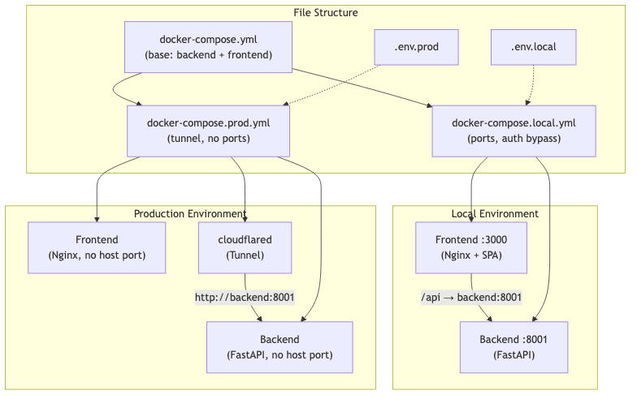

# Design Document: Docker Environment Separation

## Overview

This design restructures the LifeOS Docker Compose setup from a single monolithic `docker-compose.yml` into a layered base + override pattern. A shared base file defines common services (backend, frontend), while environment-specific override files add or modify services per environment (local dev, production). Each environment gets its own `.env` file and example template.

The key changes:
- Refactor `docker-compose.yml` into a base with only shared service definitions
- Add `docker-compose.local.yml` override for local dev (no tunnel, ports exposed, auth bypassed)
- Add `docker-compose.prod.yml` override for production (tunnel service, no exposed ports)
- Add Nginx API proxy config for the frontend container in local mode
- Add `.env.local.example` and `.env.prod.example` templates
- Update documentation with environment-specific commands

## Architecture



### Docker Compose Override Mechanism

Docker Compose natively supports merging multiple files via `-f` flags. The base file defines service structure; override files add/modify specific keys. This is the standard pattern recommended by Docker documentation.

```bash
# Local
docker compose -f docker-compose.yml -f docker-compose.local.yml --env-file .env.local up -d --build

# Production
docker compose -f docker-compose.yml -f docker-compose.prod.yml --env-file .env.prod up -d --build
```

## Components and Interfaces

### 1. `docker-compose.yml` (Base)

Defines backend and frontend services with build contexts, healthcheck, and restart policy. No ports exposed, no environment-specific values.

```yaml
services:
  backend:
    build:
      context: ./backend
    container_name: lifeos-backend
    env_file:
      - ./backend/.env
    healthcheck:
      test: ["CMD", "curl", "-f", "http://localhost:8001/"]
      interval: 10s
      timeout: 5s
      retries: 3
      start_period: 10s
    restart: unless-stopped

  frontend:
    build:
      context: ./frontend
    container_name: lifeos-frontend
    restart: unless-stopped
```

### 2. `docker-compose.local.yml` (Local Override)

Exposes ports, sets local env vars, passes build arg for API URL, and mounts the local Nginx config with API proxying.

```yaml
services:
  backend:
    ports:
      - "8001:8001"
    environment:
      BYPASS_GOOGLE_AUTH: "true"
      CORS_ORIGINS: "http://localhost:3000,http://localhost:5173,http://localhost:5176"

  frontend:
    build:
      args:
        VITE_API_URL: "http://localhost:3000"
    ports:
      - "3000:80"
    volumes:
      - ./frontend/nginx.local.conf:/etc/nginx/conf.d/default.conf:ro
    depends_on:
      backend:
        condition: service_healthy
```

### 3. `docker-compose.prod.yml` (Production Override)

Adds the tunnel service, locks down auth, sets CORS from env file, no host ports.

```yaml
services:
  backend:
    environment:
      BYPASS_GOOGLE_AUTH: "false"
      CORS_ORIGINS: ${CORS_ORIGINS}

  cloudflared:
    image: cloudflare/cloudflared:latest
    container_name: lifeos-tunnel
    command: tunnel --no-autoupdate run
    environment:
      TUNNEL_TOKEN: ${CLOUDFLARE_TUNNEL_TOKEN}
    depends_on:
      backend:
        condition: service_healthy
    restart: unless-stopped
```

### 4. `frontend/nginx.local.conf` (Local Nginx with API Proxy)

Extends the existing `nginx.conf` with an `/api` proxy pass to the backend container. This allows the frontend container to proxy API requests internally on the Docker network, so the browser only talks to `localhost:3000`.

```nginx
server {
    listen 80;
    server_name _;
    root /usr/share/nginx/html;
    index index.html;

    gzip on;
    gzip_types text/plain text/css application/json application/javascript text/xml application/xml application/xml+rss text/javascript image/svg+xml;
    gzip_min_length 256;
    gzip_vary on;

    location /assets/ {
        expires 1y;
        add_header Cache-Control "public, immutable";
    }

    # Proxy API requests to backend container
    location /api/ {
        proxy_pass http://backend:8001/api/;
        proxy_set_header Host $host;
        proxy_set_header X-Real-IP $remote_addr;
        proxy_set_header X-Forwarded-For $proxy_add_x_forwarded_for;
        proxy_set_header X-Forwarded-Proto $scheme;
    }

    location / {
        try_files $uri $uri/ /index.html;
    }
}
```

### 5. Environment File Templates

**`.env.local.example`**:
```dotenv
# LifeOS — Local Development Environment
# Copy to .env.local:  cp .env.local.example .env.local
# No Cloudflare token needed for local development.
```

**`.env.prod.example`**:
```dotenv
# LifeOS — Production Environment
# Copy to .env.prod:  cp .env.prod.example .env.prod

CLOUDFLARE_TUNNEL_TOKEN=
CORS_ORIGINS=https://lifeos.pages.dev
```

## Data Models

No data model changes. This feature only modifies Docker infrastructure configuration files.

## Error Handling

| Scenario | Handling |
|----------|----------|
| Missing `CLOUDFLARE_TUNNEL_TOKEN` in prod | `cloudflared` container fails to start; `docker compose logs cloudflared` shows auth error. Documented in env template comments. |
| Backend healthcheck fails | Frontend and tunnel `depends_on` with `service_healthy` prevents dependent containers from starting until backend is ready. |
| Wrong env file used | Each compose command explicitly specifies `--env-file`, preventing accidental cross-environment variable leakage. |
| Frontend can't reach backend (local) | Nginx proxy uses Docker internal DNS (`backend:8001`). If backend isn't healthy, the `depends_on` condition blocks frontend start. |
| Port conflict on host | User gets a clear Docker bind error. Documented ports (3000, 8001) can be changed in the override file. |

## Testing Strategy

Property-based testing is not applicable to this feature. The changes are entirely Docker Compose configuration, Nginx config, Dockerfiles, and environment file templates — declarative infrastructure with no programmatic logic to test with generated inputs.

### Manual Verification

1. **Local environment smoke test**: Run `docker compose -f docker-compose.yml -f docker-compose.local.yml --env-file .env.local up -d --build`, verify backend responds on `localhost:8001`, frontend loads on `localhost:3000`, and `/api` proxy works.
2. **Production environment smoke test**: Run with prod override and a valid tunnel token, verify tunnel connects and backend is reachable through the tunnel.
3. **No token required locally**: Start local environment without `CLOUDFLARE_TUNNEL_TOKEN` set anywhere — should work without errors.
4. **Frontend API proxy**: From the browser at `localhost:3000`, verify API calls to `/api/` are proxied to the backend.
5. **Environment isolation**: Confirm local override doesn't start `cloudflared`, and prod override doesn't expose host ports.

### Validation Checklist

- [ ] `docker compose config` with base + local override produces valid merged config
- [ ] `docker compose config` with base + prod override produces valid merged config
- [ ] Local env starts without any tunnel-related env vars
- [ ] Prod env requires `CLOUDFLARE_TUNNEL_TOKEN`
- [ ] Frontend container serves SPA and proxies `/api` in local mode
- [ ] Documentation accurately describes commands for both environments
