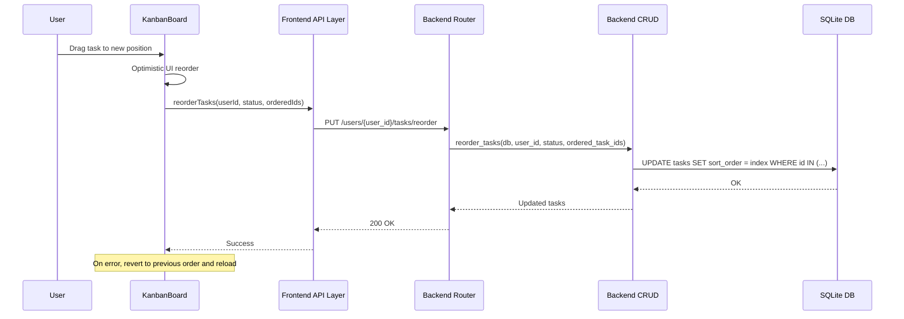

# Design Document: Drag-and-Drop Task Reorder

## Overview

This feature adds persistent drag-and-drop task reordering to the LifeOS Kanban board. Currently, tasks within a column are sorted by priority (High → Medium → Low → None) and can only be dragged between columns to change status. This design introduces a `sort_order` integer field on the Task model, a dedicated reorder API endpoint, and updated frontend logic so users can manually arrange tasks within and across columns with their order persisting across sessions.

The core flow:
1. User drags a task to a new position within a column (or to a position in another column).
2. Frontend optimistically reorders the UI and sends the new ordered list of task IDs to the backend.
3. Backend assigns consecutive `sort_order` values (0, 1, 2, ...) to the tasks in the provided order.
4. On page reload, tasks with non-zero `sort_order` values are sorted by `sort_order` instead of priority.

## Architecture

The feature follows the existing layered architecture of the LifeOS app:



For cross-column drags, the frontend issues two calls: one `updateTask` to change the status, and one `reorderTasks` to set the position in the destination column.

### Design Decisions

1. **Full-list reorder strategy**: The reorder endpoint receives the complete ordered list of task IDs for a column rather than a single "move task X to position Y" command. This avoids race conditions and ensures the backend always has the authoritative order. The trade-off is slightly larger payloads, but column sizes in a personal productivity app are small.

2. **Consecutive 0-based sort_order**: Rather than using gap-based ordering (e.g., 1000, 2000, 3000), we assign consecutive integers starting from 0. This is simpler and avoids the need for periodic re-indexing. Since reorder always sends the full list, there's no insertion-between-gaps scenario.

3. **sort_order=0 as default / priority-sort fallback**: New tasks get `sort_order=0`. When all tasks in a column have `sort_order=0`, the column falls back to priority sort. Once any task has a non-zero `sort_order` (i.e., the user has reordered), the entire column switches to `sort_order`-based sorting. This preserves the existing behavior for users who never reorder.

4. **Optimistic UI with rollback**: The frontend immediately reflects the drag result, then calls the API. On failure, it reverts to the previous state and reloads from the server. This provides a snappy UX.

## Components and Interfaces

### Backend Components

#### 1. `ReorderRequest` Schema (backend/schemas.py)

```python
class ReorderRequest(BaseModel):
    status: str
    ordered_task_ids: List[int]
```

#### 2. `reorder_tasks` CRUD Function (backend/crud.py)

```python
def reorder_tasks(db: Session, user_id: int, status: str, ordered_task_ids: List[int]) -> List[models.Task]:
    """
    Assigns consecutive sort_order values (0-based) to tasks in the given order.
    Validates all task IDs belong to the user.
    Returns the updated tasks.
    """
```

#### 3. Reorder Endpoint (backend/routers/tasks.py)

```python
@router.put("/reorder")
def reorder_tasks_endpoint(
    user_id: int,
    request: ReorderRequest,
    db: Session = Depends(get_db)
) -> List[schemas.Task]:
```

#### 4. Migration Script (backend/migrate_sort_order.py)

Adds `sort_order INTEGER DEFAULT 0` column to the `tasks` table for existing databases.

### Frontend Components

#### 1. `reorderTasks` API Function (frontend/src/api/index.ts)

```typescript
export const reorderTasks = async (
  userId: number,
  status: string,
  orderedTaskIds: number[]
): Promise<Task[]> => {
  const res = await api.put(`/users/${userId}/tasks/reorder`, {
    status,
    ordered_task_ids: orderedTaskIds,
  });
  return res.data;
};
```

#### 2. Updated `Task` Interface (frontend/src/types.ts)

Add `sort_order?: number` to the existing `Task` interface.

#### 3. Sort Logic Update (frontend/src/pages/KanbanBoard.tsx)

The `getTasksByStatus` function will be updated to check if any task in the column has a non-zero `sort_order`. If so, sort by `sort_order` ascending. Otherwise, fall back to `sortByPriority`.

#### 4. Updated `onDragEnd` Handler (frontend/src/pages/KanbanBoard.tsx)

The handler will be split into two paths:
- **Same-column**: Reorder the local task array, update `sort_order` values optimistically, call `reorderTasks`.
- **Cross-column**: Update the task's status locally, insert at the drop index in the destination column, call `updateTask` for status change + `reorderTasks` for destination column ordering.

Both paths include rollback on error.

#### 5. Filter-Aware Reorder Logic

When filters are active, the reorder operation only sends the visible (filtered) task IDs. Hidden tasks retain their existing `sort_order` values. The merge logic interleaves hidden tasks at their original relative positions when filters are cleared.

## Data Models

### Task Table Changes

| Column | Type | Default | Description |
|--------|------|---------|-------------|
| sort_order | Integer | 0 | Display position within a column. Lower values appear first. |

### ReorderRequest Schema

| Field | Type | Required | Description |
|-------|------|----------|-------------|
| status | string | Yes | The column/status being reordered (e.g., "Todo", "InProgress") |
| ordered_task_ids | List[int] | Yes | Task IDs in the desired display order |

### Frontend Task Interface Addition

```typescript
interface Task {
  // ... existing fields ...
  sort_order?: number;  // Display position within column
}
```

### Sort Order Assignment Example

Before reorder:
| Task ID | sort_order | status |
|---------|-----------|--------|
| 10 | 0 | Todo |
| 20 | 0 | Todo |
| 30 | 0 | Todo |

After `reorderTasks(userId, "Todo", [30, 10, 20])`:
| Task ID | sort_order | status |
|---------|-----------|--------|
| 30 | 0 | Todo |
| 10 | 1 | Todo |
| 20 | 2 | Todo |


## Correctness Properties

*A property is a characteristic or behavior that should hold true across all valid executions of a system — essentially, a formal statement about what the system should do. Properties serve as the bridge between human-readable specifications and machine-verifiable correctness guarantees.*

### Property 1: Default sort_order for new tasks

*For any* task created without an explicit sort_order, the stored sort_order value SHALL be 0.

**Validates: Requirements 1.1, 1.3, 6.3**

### Property 2: Reorder assigns consecutive 0-based indices

*For any* valid list of task IDs submitted to the reorder endpoint, after the operation completes, each task's sort_order SHALL equal its 0-based index position in the submitted list, producing consecutive values [0, 1, 2, ...].

**Validates: Requirements 2.2, 8.1, 8.2**

### Property 3: Invalid task IDs produce 404

*For any* task ID in the `ordered_task_ids` list that either does not exist or does not belong to the specified user, the reorder endpoint SHALL return a 404 error and make no changes.

**Validates: Requirements 2.3, 2.5**

### Property 4: Reorder round trip (persistence)

*For any* column of tasks, if the reorder endpoint is called with a permutation of the task IDs, then fetching the tasks again should return them with sort_order values matching the submitted order.

**Validates: Requirements 3.2, 4.4**

### Property 5: Cross-column drag updates status and position

*For any* task moved from one column to another at a given drop index, the task's status SHALL match the destination column, and the task SHALL appear at the specified index in the destination column's ordered task list after reordering.

**Validates: Requirements 5.1, 5.2, 8.3**

### Property 6: Sorting strategy — sort_order vs priority fallback

*For any* column of tasks, if at least one task has a non-zero sort_order, the column SHALL be sorted by sort_order ascending. If all tasks have sort_order equal to 0, the column SHALL be sorted by priority (High → Medium → Low → None).

**Validates: Requirements 6.1, 6.2**

### Property 7: Filtered reorder preserves hidden task order

*For any* reorder operation performed while filters are active, the reorder payload SHALL contain only the visible (filtered) task IDs in their new order, and the sort_order values of hidden (filtered-out) tasks SHALL remain unchanged.

**Validates: Requirements 7.2**

### Property 8: Filter merge interleaving

*For any* set of tasks where some were reordered while others were hidden by filters, clearing the filters SHALL display all tasks sorted by their sort_order values, with previously hidden tasks appearing at their original relative positions interleaved with the reordered visible tasks.

**Validates: Requirements 7.3**

## Error Handling

### Backend Errors

| Scenario | Response | Behavior |
|----------|----------|----------|
| Task ID not found | 404 Not Found | No sort_order changes applied; transaction rolled back |
| Task ID belongs to different user | 404 Not Found | Same as above — treated as "not found" for security |
| Empty `ordered_task_ids` list | 200 OK | No-op; return empty list |
| Invalid request body (missing fields) | 422 Unprocessable Entity | Pydantic validation error |
| Database error | 500 Internal Server Error | Transaction rolled back |

The reorder CRUD function should validate all task IDs before making any changes (all-or-nothing). If any ID is invalid, no sort_order values are updated.

### Frontend Error Recovery

| Scenario | Behavior |
|----------|----------|
| Same-column reorder API fails | Revert task list to pre-drag state; reload tasks from server |
| Cross-column status update fails | Revert task to original column and position; reload from server |
| Cross-column reorder API fails | Revert task to original column and position; reload from server |
| Network timeout | Same as API failure — revert and reload |

The frontend stores a snapshot of the task list before each drag operation. On any error, it restores this snapshot and calls `loadTasks()` to ensure consistency with the server.

## Testing Strategy

### Property-Based Testing

Use `hypothesis` (Python) for backend property tests and `fast-check` (TypeScript) for frontend property tests. Each property test should run a minimum of 100 iterations.

Each property-based test MUST be tagged with a comment referencing the design property:
```
# Feature: drag-drop-task-reorder, Property {number}: {property_text}
```

**Backend property tests** (using `hypothesis` + `pytest`):
- Property 1: Generate random TaskCreate payloads without sort_order → verify stored sort_order is 0
- Property 2: Generate random permutations of task ID lists → call reorder → verify each task's sort_order equals its list index
- Property 3: Generate task ID lists containing IDs from other users or non-existent IDs → verify 404 response
- Property 4: Generate random task lists, reorder them, fetch again → verify sort_order values match the submitted order

**Frontend property tests** (using `fast-check` + `vitest`):
- Property 6: Generate random task arrays with varying sort_order values → verify the sorting function picks the correct strategy
- Property 7: Generate random task arrays with filters → simulate reorder → verify only visible IDs are in the payload and hidden tasks are unchanged
- Property 8: Generate random task arrays, apply filter, reorder visible, clear filter → verify correct interleaving

### Unit Tests

Unit tests complement property tests by covering specific examples and edge cases:

**Backend unit tests:**
- Reorder with empty list returns 200 (edge case from 2.4)
- Reorder endpoint exists and accepts correct request shape (example from 2.1)
- Migration script adds sort_order column (example from 1.4)
- Task response schema includes sort_order field (example from 1.2)

**Frontend unit tests:**
- Same-column drag calls reorderTasks with correct payload (example from 4.2)
- Cross-column drag calls updateTask + reorderTasks (example from 5.3)
- API error during same-column reorder reverts state (example from 4.3)
- API error during cross-column move reverts state (example from 5.4)
- New task appears in priority-sorted position when sort_order is 0

### Test Configuration

- Backend: `pytest` with `hypothesis` — run via `.venv/bin/python -m pytest`
- Frontend: `vitest` with `fast-check` — run via `npx vitest --run`
- Minimum 100 iterations for all property-based tests
- Each property test references its design document property number in a comment tag
