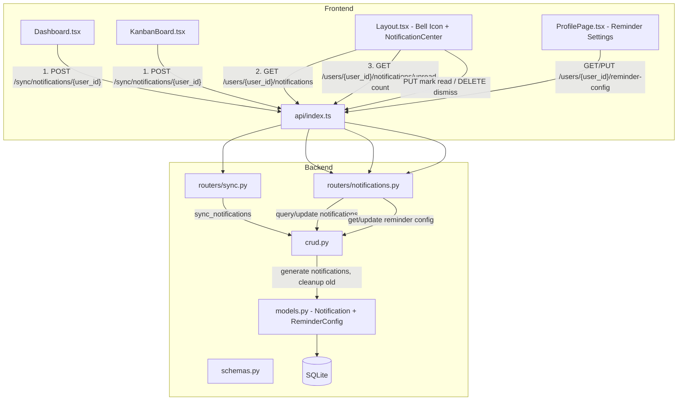

# Design Document: Due Date Reminders / Notifications

## Overview

This feature adds an in-app notification system to LifeOS that alerts users about upcoming, due-today, and overdue task deadlines. Currently, tasks have a `target_date` field but users receive no alerts — they must manually check the Kanban board or Dashboard to spot approaching deadlines.

The design introduces two new database models (`Notification` and `ReminderConfig`), a notification generation engine that runs via the existing sync-on-load pattern, REST API endpoints for notification CRUD, a Notification Center dropdown in the app header, and visual deadline indicators on the Dashboard and Kanban board.

### Key Design Decisions

1. **Sync-on-load generation**: Following the established `sync_habit_tasks` and `sync_recurring_tasks` patterns, notifications are generated on-demand when the Dashboard or Kanban board loads via `POST /sync/notifications/{user_id}`. This avoids background scheduler infrastructure while ensuring notifications are fresh on every page visit.

2. **Separate tables for Notification and ReminderConfig**: Unlike the single-table approach used for recurring tasks, notifications and reminder settings are distinct concerns with different lifecycles. Notifications are transient records that get created, read, dismissed, and cleaned up. ReminderConfig is a long-lived per-user settings record. Separate tables keep the schema clean.

3. **Deduplication by (task_id, type, date)**: The engine checks for existing notifications of the same type for the same task on the current date before creating new ones. This makes the sync endpoint idempotent — calling it multiple times per day produces no duplicates.

4. **Cascade delete from tasks**: When a task is deleted, all its linked notifications are cascade-deleted. This prevents orphaned notification records and keeps the notification list accurate.

5. **Notification Center in Layout**: The bell icon and dropdown are placed in the `Layout.tsx` component (not the Sidebar) so they appear on every authenticated page without duplicating code.

## Architecture



## Components and Interfaces

### Backend Components

#### 1. Models (`backend/models.py`)

Two new SQLAlchemy models:

- **Notification**: Stores individual notification records with type, message, read/dismissed status, and foreign keys to users and tasks.
- **ReminderConfig**: Stores per-user reminder preferences (lead time, due-date toggle, overdue toggle).

#### 2. Schemas (`backend/schemas.py`)

Pydantic models for API serialization:

- `NotificationOut` — response schema for notification records
- `NotificationSyncResponse` — response from the sync endpoint (`{ created: int }`)
- `UnreadCountResponse` — response from unread-count endpoint (`{ count: int }`)
- `ReminderConfigOut` — response schema for reminder config
- `ReminderConfigUpdate` — request schema for updating reminder config

#### 3. CRUD Functions (`backend/crud.py`)

New functions added to the existing crud module:

- `sync_notifications(db, user_id)` — the notification generation engine. Queries tasks with non-null `target_date` and status != "Done", evaluates each against the user's `ReminderConfig`, creates notifications where none exist for today, and runs cleanup.
- `get_user_notifications(db, user_id)` — returns non-dismissed notifications ordered by `created_at` desc.
- `get_unread_count(db, user_id)` — returns count of unread, non-dismissed notifications.
- `mark_notification_read(db, notification_id)` — sets `is_read = True`.
- `mark_all_notifications_read(db, user_id)` — bulk update `is_read = True`.
- `dismiss_notification(db, notification_id)` — sets `dismissed = True`.
- `get_reminder_config(db, user_id)` — returns config, creating default if none exists.
- `update_reminder_config(db, user_id, config)` — updates reminder preferences.
- `cleanup_notifications(db)` — deletes dismissed notifications older than 30 days and read overdue notifications for completed tasks.

#### 4. Routers

**`backend/routers/notifications.py`** (new file):
- `GET /users/{user_id}/notifications` — list non-dismissed notifications
- `GET /users/{user_id}/notifications/unread-count` — unread count
- `PUT /users/{user_id}/notifications/{notification_id}/read` — mark one as read
- `PUT /users/{user_id}/notifications/read-all` — mark all as read
- `DELETE /users/{user_id}/notifications/{notification_id}` — dismiss one
- `GET /users/{user_id}/reminder-config` — get reminder config
- `PUT /users/{user_id}/reminder-config` — update reminder config

**`backend/routers/sync.py`** (extended):
- `POST /sync/notifications/{user_id}` — trigger notification generation

#### 5. Main App (`backend/main.py`)

Register the new `notifications` router.

### Frontend Components

#### 1. NotificationCenter (`frontend/src/components/NotificationCenter.tsx`)

New component rendered in `Layout.tsx`:
- Bell icon with unread count badge
- Dropdown panel with notification list
- Color-coded by type: cyan (upcoming), amber (due_today), rose (overdue)
- Click notification → mark as read + navigate to Kanban board
- "Mark all as read" button
- Per-notification dismiss button
- Empty state message

#### 2. Layout Changes (`frontend/src/components/Layout.tsx`)

- Import and render `NotificationCenter` in the header area
- Pass user context for API calls

#### 3. Dashboard Changes (`frontend/src/pages/Dashboard.tsx`)

- Call `POST /sync/notifications/{user_id}` on page load (alongside existing syncs)
- Display overdue task count badge in KPI cards
- Add rose-colored overdue indicator and amber due-today indicator on action item tasks

#### 4. KanbanBoard Changes (`frontend/src/pages/KanbanBoard.tsx`)

- Call `POST /sync/notifications/{user_id}` on page load
- Display deadline badges on task cards: rose "Overdue", amber "Due Today", cyan "Due Soon"
- No badge when task has no `target_date` or status is "Done"

#### 5. ProfilePage Changes (`frontend/src/pages/ProfilePage.tsx`)

- Add "Reminder Settings" section
- Dropdown for `remind_days_before` (0, 1, 2, 3, 5, 7)
- Toggles for `remind_on_due_date` and `remind_when_overdue`
- Load current config on mount, persist changes via API

#### 6. Types (`frontend/src/types.ts`)

New interfaces:
- `Notification` — mirrors backend schema
- `ReminderConfig` — mirrors backend schema
- `NotificationSyncResponse`

#### 7. API Functions (`frontend/src/api/index.ts`)

New exports:
- `syncNotifications(userId)`
- `getNotifications(userId)`
- `getUnreadCount(userId)`
- `markNotificationRead(userId, notificationId)`
- `markAllNotificationsRead(userId)`
- `dismissNotification(userId, notificationId)`
- `getReminderConfig(userId)`
- `updateReminderConfig(userId, config)`


## Data Models

### Notification Table

| Column      | Type         | Constraints                                    |
|-------------|--------------|------------------------------------------------|
| id          | Integer      | Primary key, auto-increment                    |
| user_id     | Integer      | Foreign key → users.id, NOT NULL               |
| task_id     | Integer      | Foreign key → tasks.id, NOT NULL, CASCADE DELETE|
| type        | String       | NOT NULL, one of: "upcoming", "due_today", "overdue" |
| message     | String       | NOT NULL                                       |
| is_read     | Boolean      | Default: false                                 |
| dismissed   | Boolean      | Default: false                                 |
| created_at  | DateTime     | Default: utcnow                                |

SQLAlchemy model:

```python
class Notification(Base):
    __tablename__ = "notifications"
    id = Column(Integer, primary_key=True, index=True)
    user_id = Column(Integer, ForeignKey("users.id"), nullable=False)
    task_id = Column(Integer, ForeignKey("tasks.id", ondelete="CASCADE"), nullable=False)
    type = Column(String, nullable=False)  # "upcoming", "due_today", "overdue"
    message = Column(String, nullable=False)
    is_read = Column(Integer, default=0)  # 0 = unread, 1 = read (SQLite boolean)
    dismissed = Column(Integer, default=0)  # 0 = active, 1 = dismissed
    created_at = Column(DateTime, default=datetime.utcnow)

    user = relationship("User", back_populates="notifications")
    task = relationship("Task", back_populates="notifications")
```

### ReminderConfig Table

| Column              | Type    | Constraints                      |
|---------------------|---------|----------------------------------|
| id                  | Integer | Primary key, auto-increment      |
| user_id             | Integer | Foreign key → users.id, UNIQUE   |
| remind_days_before  | Integer | Default: 1                       |
| remind_on_due_date  | Integer | Default: 1 (true)                |
| remind_when_overdue | Integer | Default: 1 (true)                |

SQLAlchemy model:

```python
class ReminderConfig(Base):
    __tablename__ = "reminder_configs"
    id = Column(Integer, primary_key=True, index=True)
    user_id = Column(Integer, ForeignKey("users.id"), unique=True, nullable=False)
    remind_days_before = Column(Integer, default=1)
    remind_on_due_date = Column(Integer, default=1)  # SQLite boolean
    remind_when_overdue = Column(Integer, default=1)  # SQLite boolean

    user = relationship("User", back_populates="reminder_config")
```

### Relationship Additions to Existing Models

**User model** — add:
```python
notifications = relationship("Notification", back_populates="user")
reminder_config = relationship("ReminderConfig", back_populates="user", uselist=False)
```

**Task model** — add:
```python
notifications = relationship("Notification", back_populates="task", cascade="all, delete-orphan")
```

### Pydantic Schemas

```python
class NotificationOut(BaseModel):
    id: int
    user_id: int
    task_id: int
    type: str
    message: str
    is_read: bool
    dismissed: bool
    created_at: datetime
    model_config = ConfigDict(from_attributes=True)

class NotificationSyncResponse(BaseModel):
    created: int

class UnreadCountResponse(BaseModel):
    count: int

class ReminderConfigOut(BaseModel):
    user_id: int
    remind_days_before: int
    remind_on_due_date: bool
    remind_when_overdue: bool
    model_config = ConfigDict(from_attributes=True)

class ReminderConfigUpdate(BaseModel):
    remind_days_before: Optional[int] = None
    remind_on_due_date: Optional[bool] = None
    remind_when_overdue: Optional[bool] = None
```

### Notification Engine Logic (Pseudocode)

```
function sync_notifications(db, user_id):
    config = get_or_create_reminder_config(db, user_id)
    today = date.today()
    created_count = 0

    tasks = query tasks WHERE user_id = user_id
                          AND target_date IS NOT NULL
                          AND status != "Done"

    for task in tasks:
        days_until = (task.target_date - today).days

        # Upcoming reminder
        if config.remind_days_before > 0 AND days_until == config.remind_days_before:
            if not exists_notification(task.id, "upcoming", today):
                create_notification(task, "upcoming", f"'{task.title}' is due in {days_until} day(s)")
                created_count += 1

        # Due today reminder
        if config.remind_on_due_date AND days_until == 0:
            if not exists_notification(task.id, "due_today", today):
                create_notification(task, "due_today", f"'{task.title}' is due today")
                created_count += 1

        # Overdue reminder
        if config.remind_when_overdue AND days_until < 0:
            if not exists_notification(task.id, "overdue", today):
                days_overdue = abs(days_until)
                create_notification(task, "overdue", f"'{task.title}' is {days_overdue} day(s) overdue")
                created_count += 1

    # Cleanup
    delete dismissed notifications older than 30 days
    delete read "overdue" notifications for tasks with status "Done"

    return { created: created_count }
```

### Frontend TypeScript Interfaces

```typescript
export interface Notification {
  id: number;
  user_id: number;
  task_id: number;
  type: 'upcoming' | 'due_today' | 'overdue';
  message: string;
  is_read: boolean;
  dismissed: boolean;
  created_at: string;
}

export interface ReminderConfig {
  user_id: number;
  remind_days_before: number;
  remind_on_due_date: boolean;
  remind_when_overdue: boolean;
}

export interface NotificationSyncResponse {
  created: number;
}
```


## Correctness Properties

*A property is a characteristic or behavior that should hold true across all valid executions of a system — essentially, a formal statement about what the system should do. Properties serve as the bridge between human-readable specifications and machine-verifiable correctness guarantees.*

### Property 1: Notification data round-trip

*For any* valid Notification record (with valid user_id, task_id, type in {"upcoming", "due_today", "overdue"}, and arbitrary message string), creating it in the database and reading it back should produce an equivalent record with all fields preserved. The same applies to ReminderConfig records.

**Validates: Requirements 1.1, 2.1**

### Property 2: Cascade delete removes all linked notifications

*For any* Task that has one or more Notifications linked to it, deleting that Task should result in zero Notifications existing with that task_id.

**Validates: Requirements 1.4**

### Property 3: Default ReminderConfig auto-creation

*For any* user who has no ReminderConfig, when the notification engine runs (or when `get_reminder_config` is called), a ReminderConfig should be created with default values: `remind_days_before=1`, `remind_on_due_date=true`, `remind_when_overdue=true`.

**Validates: Requirements 2.2**

### Property 4: ReminderConfig update round-trip

*For any* valid ReminderConfig update (with `remind_days_before` in {0,1,2,3,5,7} and boolean toggles), persisting the update and then reading the config back should return the updated values.

**Validates: Requirements 2.3, 9.3**

### Property 5: ReminderConfig validation

*For any* integer value for `remind_days_before`, the system should accept it if and only if it is in the set {0, 1, 2, 3, 5, 7}. All other integer values should be rejected.

**Validates: Requirements 2.4**

### Property 6: Engine filters only eligible tasks

*For any* set of tasks belonging to a user, the notification engine should only generate notifications for tasks where `target_date` is not null AND `status` is not "Done". Tasks with null `target_date` or status "Done" should never receive notifications.

**Validates: Requirements 3.1, 3.7**

### Property 7: Engine generates correct notification type

*For any* task with a non-null `target_date` and status != "Done", and *for any* valid ReminderConfig:
- If `target_date - today == remind_days_before` and `remind_days_before > 0`, the engine should create an "upcoming" notification.
- If `target_date == today` and `remind_on_due_date` is true, the engine should create a "due_today" notification.
- If `target_date < today` and `remind_when_overdue` is true, the engine should create an "overdue" notification.
- If none of these conditions match, no notification should be created for that task.

**Validates: Requirements 3.2, 3.3, 3.4**

### Property 8: Notification message includes task title

*For any* notification generated by the engine, the `message` field should contain the title of the task it references.

**Validates: Requirements 3.5**

### Property 9: Engine idempotence

*For any* user with any set of tasks and any ReminderConfig, running the notification engine twice on the same day should produce the same set of notifications as running it once. The second run should return `created: 0`.

**Validates: Requirements 3.6, 4.2**

### Property 10: Notification list returns non-dismissed, ordered by created_at descending

*For any* set of notifications for a user (with mixed dismissed/non-dismissed status and various created_at timestamps), the GET notifications endpoint should return only non-dismissed notifications, and they should be ordered by `created_at` descending.

**Validates: Requirements 5.1**

### Property 11: Mark-read correctness

*For any* set of unread notifications, marking a single notification as read should set only that notification's `is_read` to true. Marking all as read should set every notification's `is_read` to true for that user.

**Validates: Requirements 5.2, 5.3**

### Property 12: Dismiss sets dismissed flag

*For any* non-dismissed notification, calling the dismiss endpoint should set `dismissed` to true, and the notification should no longer appear in the notification list.

**Validates: Requirements 5.4**

### Property 13: Unread count accuracy

*For any* set of notifications for a user, the unread count endpoint should return a number equal to the count of notifications where `is_read` is false AND `dismissed` is false.

**Validates: Requirements 5.5**

### Property 14: Deadline badge assignment correctness

*For any* task with a `target_date` and status != "Done", and *for any* `remind_days_before` value:
- If `target_date < today`: badge should be "Overdue" (rose).
- If `target_date == today`: badge should be "Due Today" (amber).
- If `0 < (target_date - today).days <= remind_days_before`: badge should be "Due Soon" (cyan).
- If `target_date` is null or status is "Done": no badge should be displayed.

**Validates: Requirements 6.2, 8.1, 8.2, 8.3, 8.4**

### Property 15: Cleanup removes old dismissed notifications

*For any* set of dismissed notifications with various `created_at` timestamps, after the engine runs cleanup, no dismissed notification older than 30 days should remain in the database.

**Validates: Requirements 10.1**

### Property 16: Cleanup removes read overdue notifications for completed tasks

*For any* set of notifications where `type` is "overdue", `is_read` is true, and the linked task's status is "Done", after the engine runs cleanup, none of these notifications should remain.

**Validates: Requirements 10.2**

## Error Handling

### Backend Errors

| Scenario | Handling |
|----------|----------|
| Sync called with non-existent user_id | Return 404 with message "User not found" |
| GET/PUT/DELETE notification with non-existent notification_id | Return 404 with message "Notification not found" |
| Notification belongs to different user than URL user_id | Return 404 (do not leak existence) |
| Invalid `remind_days_before` value (not in {0,1,2,3,5,7}) | Return 422 with validation error |
| Database connection failure during sync | Let FastAPI's default 500 handler respond; engine should not partially commit (use transaction) |
| Task deleted between engine query and notification creation | Foreign key constraint will prevent orphaned notification; catch IntegrityError and skip |

### Frontend Errors

| Scenario | Handling |
|----------|----------|
| Notification sync fails on page load | Log error to console, do not block page rendering. Notifications will be stale but the app remains usable. |
| Notification API calls fail (mark read, dismiss) | Show a brief toast/error message, revert optimistic UI update |
| Unread count fetch fails | Display no badge (default to 0), retry on next poll/navigation |
| Reminder config save fails | Show error message, keep form in dirty state so user can retry |

## Testing Strategy

### Property-Based Testing

Library: **Hypothesis** (Python) for backend property tests, **fast-check** (TypeScript) for frontend property tests.

Each property test must:
- Run a minimum of 100 iterations
- Reference its design document property with a comment tag
- Format: `# Feature: due-date-reminders, Property {N}: {title}`

Backend property tests focus on:
- Notification engine logic (Properties 6, 7, 8, 9)
- Data model round-trips (Properties 1, 4)
- Notification list filtering and ordering (Property 10)
- Unread count accuracy (Property 13)
- Cleanup logic (Properties 15, 16)

Frontend property tests focus on:
- Deadline badge assignment logic (Property 14)
- Notification badge display logic (Property 14, count > 0 shows badge)

### Unit Testing

Unit tests complement property tests by covering:
- Specific examples: a task due tomorrow with default config generates an "upcoming" notification
- Edge cases: task with target_date = today and remind_on_due_date = false generates no "due_today" notification
- API endpoint existence and response shapes (Requirements 4.1, 5.1-5.5)
- Foreign key constraints (Requirements 1.2, 1.3)
- Cascade delete behavior (Requirement 1.4)
- Default config creation (Requirement 2.2)
- UI component rendering: bell icon present, dropdown opens on click, empty state message

### Test File Organization

- `backend/tests/test_notification_engine.py` — property tests for engine logic + unit tests for edge cases
- `backend/tests/test_notification_api.py` — API endpoint integration tests
- `frontend/src/components/__tests__/NotificationCenter.test.tsx` — component rendering and interaction tests
- `frontend/src/utils/__tests__/deadlineBadge.test.ts` — property tests for badge assignment logic
