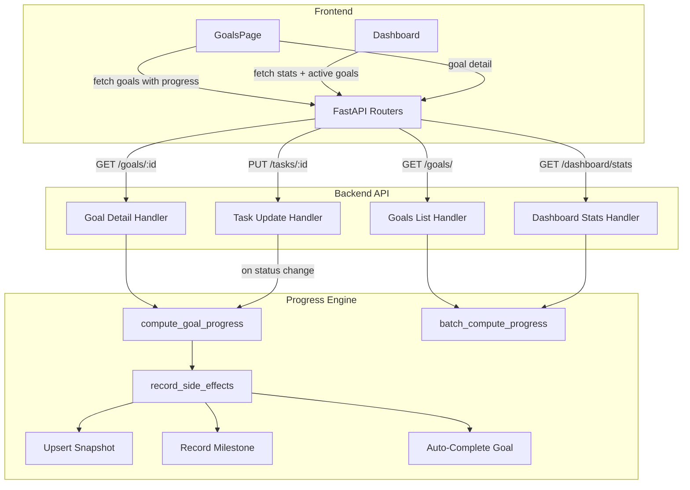

# Design Document: Goal Progress Tracking

## Overview

This feature enhances the existing LifeOS goal system with computed progress percentages, visual progress bars, auto-completion logic, progress history snapshots, and milestone tracking. The existing `compute_goal_progress` function in `backend/crud.py` provides a foundation — it already calculates a weighted average of habit success rates and task completion ratios. This design extends that into a full Progress Engine with side effects (snapshots, milestones, auto-status), batch-optimized API responses, and frontend progress bar components.

Key design decisions:
- **Progress is computed on-demand, not stored on the Goal row.** This avoids stale data and keeps the source of truth in task/habit status. Snapshots capture historical values separately.
- **Side effects (snapshots, milestones, auto-completion) trigger during progress recalculation**, which happens on task status changes and goal detail fetches.
- **Two new database tables** (`progress_snapshots`, `goal_milestones`) store historical data.
- **Batch progress computation** uses eager-loaded relationships to avoid N+1 queries on the goals list endpoint.

## Architecture



### Request Flow for Task Status Change

1. Client calls `PUT /users/{user_id}/tasks/{task_id}` with `{ status: "Done" }`
2. Task router delegates to `crud.update_task()`
3. After task update, if the task has a `goal_id` and the status field changed, the router calls `progress_engine.recalculate_goal_progress(db, goal_id)`
4. The engine computes the new progress percentage
5. The engine upserts today's `ProgressSnapshot`
6. The engine checks and records any newly crossed `GoalMilestone` thresholds
7. The engine checks auto-completion conditions and updates goal status if needed
8. Response returns the updated task

## Components and Interfaces

### Backend Components

#### 1. Progress Engine (`backend/progress_engine.py`)

New module containing all progress computation and side-effect logic.

```python
def compute_goal_progress(db: Session, goal_id: int) -> int:
    """Compute progress as integer 0-100. Weighted average of task ratio and habit success rate."""

def batch_compute_progress(db: Session, goal_ids: list[int]) -> dict[int, int]:
    """Compute progress for multiple goals in a single batch. Returns {goal_id: progress}."""

def recalculate_goal_progress(db: Session, goal_id: int) -> int:
    """Compute progress + trigger all side effects (snapshot, milestone, auto-complete). Returns progress."""

def _upsert_snapshot(db: Session, goal_id: int, progress: int) -> None:
    """Create or update today's ProgressSnapshot for the goal."""

def _check_milestones(db: Session, goal_id: int, progress: int) -> None:
    """Record any newly crossed milestone thresholds (25, 50, 75, 100)."""

def _check_auto_complete(db: Session, goal_id: int) -> None:
    """Auto-set goal to Completed if all linked tasks are Done. Revert to Active if not. Respect Archived."""
```

#### 2. Updated Routers

**`backend/routers/goals.py`** changes:
- `GET /goals/` — response includes `progress` field per goal via `batch_compute_progress`
- `GET /goals/{goal_id}` — response includes `progress`, `milestones`, `progress_history`

**`backend/routers/tasks.py`** changes:
- `PUT /tasks/{task_id}` — after updating, if `goal_id` is set and status changed, call `recalculate_goal_progress`

**`backend/routers/dashboard.py`** changes:
- `GET /dashboard/stats` — `goal_completion_percentage` becomes average progress across active goals; response includes `active_goals` with per-goal progress

#### 3. Updated Schemas (`backend/schemas.py`)

```python
class ProgressSnapshotOut(BaseModel):
    date: date
    progress: int

class GoalMilestoneOut(BaseModel):
    threshold: int
    achieved_at: datetime

class GoalWithProgress(Goal):
    progress: int = 0

class GoalDetailWithHistory(GoalDetail):
    progress: int = 0
    milestones: list[GoalMilestoneOut] = []
    progress_history: list[ProgressSnapshotOut] = []
```

### Frontend Components

#### 1. ProgressBar Component (`frontend/src/components/ProgressBar.tsx`)

Reusable progress bar with:
- Percentage fill width
- Green color at 100%, gradient otherwise
- Empty track visible at 0%
- Numeric label displayed alongside

```typescript
interface ProgressBarProps {
  progress: number; // 0-100
  showLabel?: boolean;
  size?: 'sm' | 'md';
}
```

#### 2. GoalsPage Updates

- Goal cards in the list show `ProgressBar` using the `progress` field from the list API
- Goal detail panel shows `milestones` and `progress_history` sections

#### 3. Dashboard Updates

- Active goal cards show `ProgressBar` using per-goal progress from stats
- "Goal Progress" KPI shows average progress across active goals

### Frontend Types Updates (`frontend/src/types.ts`)

```typescript
interface GoalWithProgress extends Goal {
  progress: number;
}

interface ProgressSnapshot {
  date: string;
  progress: number;
}

interface GoalMilestone {
  threshold: number;
  achieved_at: string;
}

interface GoalDetail extends Goal {
  habits: Habit[];
  tasks: Task[];
  progress: number;
  milestones: GoalMilestone[];
  progress_history: ProgressSnapshot[];
}
```

## Data Models

### New Tables

#### `progress_snapshots`

| Column    | Type    | Constraints                          |
|-----------|---------|--------------------------------------|
| id        | Integer | PK, auto-increment                   |
| goal_id   | Integer | FK → goals.id, NOT NULL              |
| date      | Date    | NOT NULL                             |
| progress  | Integer | NOT NULL, 0–100                      |

- Unique constraint on `(goal_id, date)` — at most one snapshot per goal per day.

#### `goal_milestones`

| Column      | Type     | Constraints                          |
|-------------|----------|--------------------------------------|
| id          | Integer  | PK, auto-increment                   |
| goal_id     | Integer  | FK → goals.id, NOT NULL              |
| threshold   | Integer  | NOT NULL (25, 50, 75, or 100)        |
| achieved_at | DateTime | NOT NULL, default now                |

- Unique constraint on `(goal_id, threshold)` — no duplicate milestones.

### SQLAlchemy Models (`backend/models.py`)

```python
class ProgressSnapshot(Base):
    __tablename__ = "progress_snapshots"
    id = Column(Integer, primary_key=True, index=True)
    goal_id = Column(Integer, ForeignKey("goals.id"), nullable=False)
    date = Column(Date, nullable=False)
    progress = Column(Integer, nullable=False)
    __table_args__ = (UniqueConstraint("goal_id", "date", name="uq_snapshot_goal_date"),)

class GoalMilestone(Base):
    __tablename__ = "goal_milestones"
    id = Column(Integer, primary_key=True, index=True)
    goal_id = Column(Integer, ForeignKey("goals.id"), nullable=False)
    threshold = Column(Integer, nullable=False)
    achieved_at = Column(DateTime, default=datetime.utcnow)
    __table_args__ = (UniqueConstraint("goal_id", "threshold", name="uq_milestone_goal_threshold"),)
```

### Migration

A migration script `backend/migrate_goal_progress.py` will:
- `upgrade()`: Create `progress_snapshots` and `goal_milestones` tables
- `downgrade()`: Drop both tables

No changes to existing tables are needed — progress is computed, not stored on the `goals` row.


## Correctness Properties

*A property is a characteristic or behavior that should hold true across all valid executions of a system — essentially, a formal statement about what the system should do. Properties serve as the bridge between human-readable specifications and machine-verifiable correctness guarantees.*

### Property 1: Progress computation is a weighted average

*For any* goal with an arbitrary set of linked tasks (each with status in {Todo, InProgress, Done}) and an arbitrary set of linked habits (each with a done-log count and expected count), the computed progress should equal `round(mean([task_done_ratio * 100, habit_success_rate * 100]))` where each component is included only if the corresponding collection is non-empty, and should equal 0 when both collections are empty.

**Validates: Requirements 1.1, 1.2, 1.3**

### Property 2: Progress recalculation reflects task status changes

*For any* goal with linked tasks, if a task's status changes (to "Done" or from "Done"), then the goal's progress computed immediately after the change should equal the progress derived from the updated task statuses — never the stale pre-change value.

**Validates: Requirements 1.4**

### Property 3: Auto-completion iff all tasks Done

*For any* non-Archived goal with at least one linked task, after recalculating progress: the goal status should be "Completed" if and only if every linked task has status "Done". If not all tasks are Done, the goal status should be "Active".

**Validates: Requirements 4.1, 4.2**

### Property 4: Archived status is never overridden by automation

*For any* goal with status "Archived", regardless of the statuses of its linked tasks (even if all are Done), the auto-completion logic should leave the goal status as "Archived".

**Validates: Requirements 4.3**

### Property 5: At most one snapshot per goal per day with latest value

*For any* goal and any sequence of progress changes occurring on the same calendar day, there should be exactly one ProgressSnapshot for that (goal, day) pair, and its progress value should equal the most recent computed progress.

**Validates: Requirements 5.1, 5.2**

### Property 6: Progress history is ordered by date descending

*For any* goal with multiple ProgressSnapshots, the list returned by the detail endpoint should be sorted by date in descending order (most recent first).

**Validates: Requirements 5.3**

### Property 7: Milestone invariant — valid thresholds with no duplicates

*For any* goal, the set of recorded milestones should be a subset of {25, 50, 75, 100}, and there should be at most one milestone record per threshold value.

**Validates: Requirements 6.1, 6.4**

### Property 8: Milestones are recorded when thresholds are crossed

*For any* goal whose progress transitions from below a milestone threshold to at or above it, a milestone record for that threshold should exist after the recalculation. If the threshold was already achieved previously, no new record is created.

**Validates: Requirements 6.2**

### Property 9: Progress field is a bounded integer

*For any* goal returned by the goals list API, the `progress` field should be an integer in the range [0, 100].

**Validates: Requirements 7.1**

### Property 10: Dashboard active goals are sorted by priority and limited to 3

*For any* set of user goals, the dashboard active goals list should contain at most 3 goals, all with status "Active", sorted by priority (High < Medium < Low in sort order).

**Validates: Requirements 3.3**

### Property 11: Dashboard KPI is average progress of active goals

*For any* set of active goals with known progress values, the dashboard "Goal Progress" KPI should equal the arithmetic mean of those progress values (rounded), or 0 if there are no active goals.

**Validates: Requirements 3.4**

## Error Handling

| Scenario | Layer | Handling |
|----------|-------|----------|
| Goal has no linked tasks or habits | Progress Engine | Returns 0. No snapshot or milestone created for 0→0 transitions. |
| Habit with `target_y_days = 0` | Progress Engine | Guard against division by zero — treat expected count as 0, skip habit from average. |
| Concurrent snapshot upsert (same goal, same day) | Database | Unique constraint on `(goal_id, date)` prevents duplicates. Use INSERT ON CONFLICT UPDATE. |
| Duplicate milestone insert | Database | Unique constraint on `(goal_id, threshold)`. Use INSERT ON CONFLICT DO NOTHING. |
| Auto-complete on Archived goal | Progress Engine | Check `goal.status != "Archived"` before any status change. |
| Task update for task with no `goal_id` | Task Router | Skip progress recalculation — no goal to update. |
| Goal deleted while snapshots/milestones exist | Database | CASCADE delete on FK from `progress_snapshots` and `goal_milestones` to `goals`. |
| Batch progress computation with empty goal list | Progress Engine | Return empty dict. |
| Progress exceeds 100 due to habit over-completion | Progress Engine | Clamp to 100 via `min(value, 100)`. |

## Testing Strategy

### Property-Based Testing

Use **Hypothesis** (Python) for backend property tests. Each property test runs a minimum of 100 iterations with generated inputs.

All property tests live in `backend/tests/test_progress_properties.py`.

Each test must be tagged with a comment referencing the design property:
```python
# Feature: goal-progress-tracking, Property 1: Progress computation is a weighted average
```

**Generators needed:**
- Random task sets: list of tasks with random statuses from {Todo, InProgress, Done}
- Random habit sets: list of habits with random done counts and expected counts
- Random goal configurations: combinations of task sets and habit sets
- Random milestone threshold sequences: sequences of progress values crossing thresholds

**Properties to implement:**
1. Progress computation weighted average (Property 1)
2. Progress recalculation reflects changes (Property 2)
3. Auto-completion iff all tasks Done (Property 3)
4. Archived status protection (Property 4)
5. Snapshot upsert invariant (Property 5)
6. Snapshot ordering (Property 6)
7. Milestone invariant (Property 7)
8. Milestone threshold crossing (Property 8)
9. Progress field bounds (Property 9)
10. Dashboard sorting and limit (Property 10)
11. Dashboard KPI average (Property 11)

### Unit Testing

Unit tests in `backend/tests/test_progress_engine.py` cover specific examples and edge cases:

- Goal with 0 tasks and 0 habits → progress is 0
- Goal with 3 tasks (2 Done, 1 Todo) → progress is 67
- Goal with 1 task Done → auto-completes to "Completed"
- Archived goal with all tasks Done → stays "Archived"
- Two progress changes in same day → one snapshot with latest value
- Progress crosses 50% → milestone recorded
- Progress drops below 50% then rises again → no duplicate milestone
- Habit with `target_y_days = 0` → excluded from average
- Progress clamped to 100 when habit over-completes

### Frontend Testing

Unit tests for the `ProgressBar` component using Vitest + React Testing Library:

- Renders correct width percentage
- Shows green style at 100%
- Shows empty track at 0%
- Displays numeric label when `showLabel` is true
