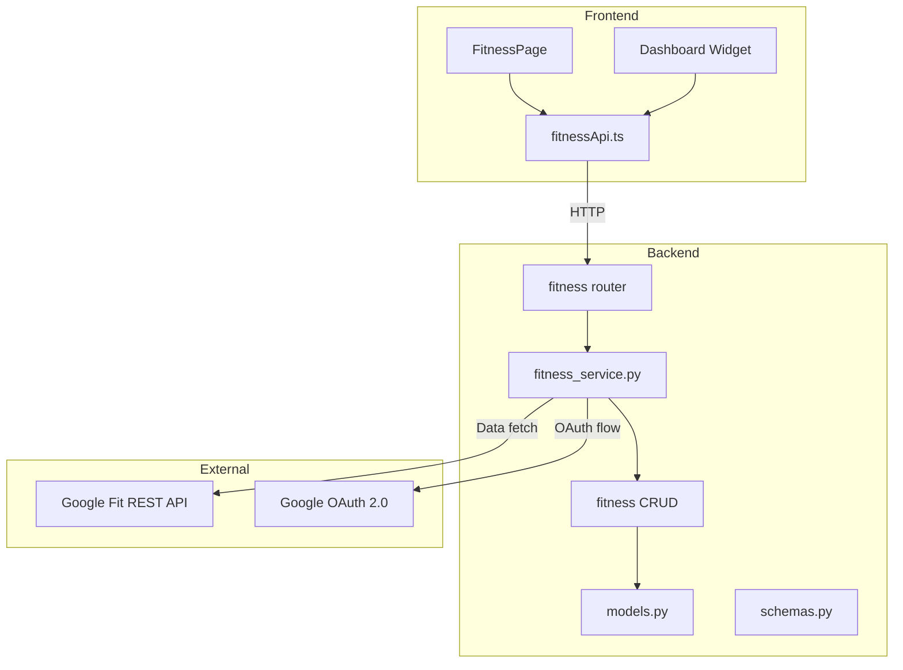
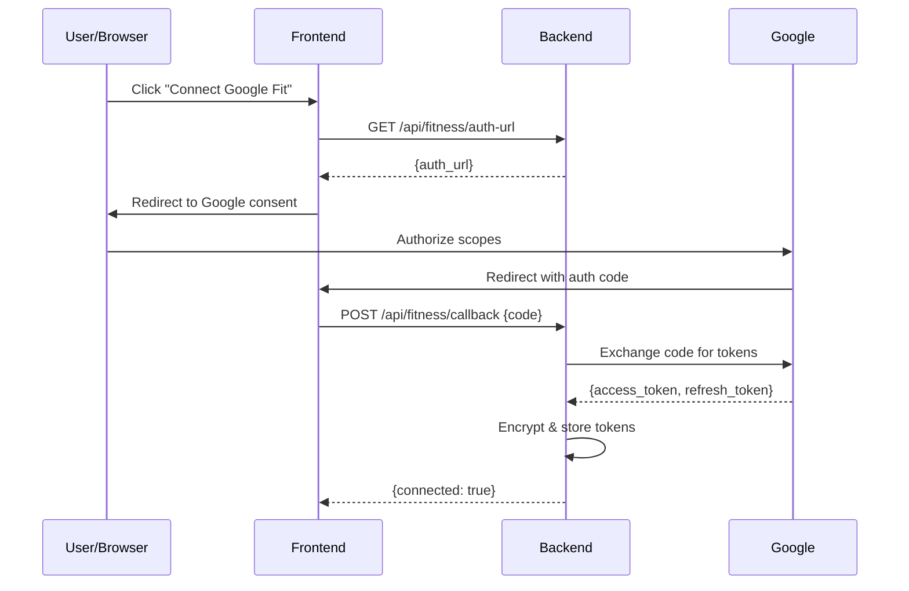
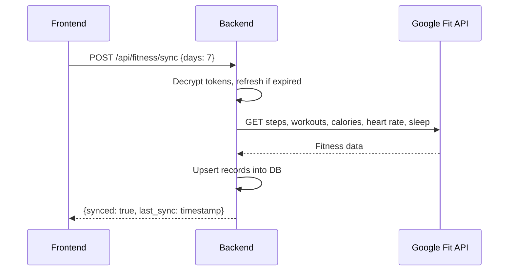

# Design Document: Google Fit Integration

## Overview

The Google Fit Integration adds the ability for LifeOS users to connect their Google Fit account via OAuth 2.0 and import fitness data (steps, workouts, calories, active minutes, heart rate, sleep) into the application. The data is stored locally in SQLite and displayed on a dedicated Fitness page and a Dashboard widget.

The integration follows the existing LifeOS architecture: a FastAPI backend with SQLAlchemy models, Pydantic schemas, and a router module, paired with a React/TypeScript frontend using axios for API calls.

### Key Design Decisions

1. **Dedicated fitness router** (`backend/routers/fitness.py`) — follows the existing pattern of one router per domain (goals, habits, tasks, etc.). Unlike the existing user-scoped routes (`/users/{user_id}/...`), the fitness endpoints use `/api/fitness/...` with JWT-based `get_current_user` dependency, since the OAuth flow is user-implicit.
2. **Google Fit REST API** — uses the `fitness.googleapis.com` REST API with `google-auth` and `requests` libraries (already partially in requirements.txt). No Google Fit SDK needed.
3. **Token encryption at rest** — access and refresh tokens are encrypted using `cryptography.fernet` before storage, with the Fernet key stored as an environment variable.
4. **Upsert pattern for sync** — step records and daily summaries use a unique constraint on `(user_id, date)` and are upserted during sync to avoid duplicates.

## Architecture



### Flow: OAuth Connection



### Flow: Data Sync



## Components and Interfaces

### Backend Components

#### 1. `backend/routers/fitness.py` — API Router

Endpoints (all require JWT auth via `get_current_user`):

| Method | Path | Description |
|--------|------|-------------|
| GET | `/api/fitness/auth-url` | Returns Google OAuth 2.0 authorization URL |
| POST | `/api/fitness/callback` | Exchanges auth code for tokens, creates connection |
| GET | `/api/fitness/connection` | Returns connection status for current user |
| DELETE | `/api/fitness/connection` | Revokes tokens and deletes connection |
| POST | `/api/fitness/sync` | Triggers sync for given day range |
| GET | `/api/fitness/summary` | Returns daily summaries for date range |
| GET | `/api/fitness/workouts` | Returns workout records for date range |
| GET | `/api/fitness/steps` | Returns step records for date range |

#### 2. `backend/fitness_service.py` — Business Logic

Responsibilities:
- Build Google OAuth URL with required scopes (`fitness.activity.read`, `fitness.body.read`, `fitness.sleep.read`)
- Exchange authorization code for tokens
- Refresh expired access tokens using refresh token
- Fetch data from Google Fit REST API (aggregate datasets)
- Encrypt/decrypt tokens using Fernet
- Orchestrate sync operations

#### 3. `backend/fitness_crud.py` — Database Operations

CRUD functions:
- `create_fitness_connection(db, user_id, encrypted_access_token, encrypted_refresh_token)`
- `get_fitness_connection(db, user_id)`
- `delete_fitness_connection(db, user_id)`
- `upsert_step_record(db, user_id, date, step_count)`
- `upsert_daily_summary(db, user_id, date, calories, active_minutes, avg_hr, min_hr, max_hr, sleep_minutes, sleep_start, sleep_end)`
- `upsert_workout_record(db, user_id, activity_type, start_time, end_time, duration_minutes, calories)`
- `get_step_records(db, user_id, start_date, end_date)`
- `get_daily_summaries(db, user_id, start_date, end_date)`
- `get_workout_records(db, user_id, start_date, end_date)`
- `update_last_sync(db, user_id, timestamp)`

### Frontend Components

#### 1. `frontend/src/pages/FitnessPage.tsx`

Main page at `/fitness`. Sections:
- Connection status banner (connect/disconnect)
- Date selector
- Steps section with daily count and 7-day trend chart
- Workouts list
- Calories & Active Minutes section
- Heart Rate section
- Sleep section
- Sync Now button with loading indicator

#### 2. `frontend/src/components/FitnessWidget.tsx`

Dashboard widget showing today's steps, calories, and active minutes. Shows "Connect Google Fit" prompt when not connected.

#### 3. `frontend/src/api/fitness.ts`

API client functions:
- `getAuthUrl()` → `GET /api/fitness/auth-url`
- `submitCallback(code)` → `POST /api/fitness/callback`
- `getConnectionStatus()` → `GET /api/fitness/connection`
- `disconnect()` → `DELETE /api/fitness/connection`
- `syncData(days)` → `POST /api/fitness/sync`
- `getSummary(startDate, endDate)` → `GET /api/fitness/summary`
- `getWorkouts(startDate, endDate)` → `GET /api/fitness/workouts`
- `getSteps(startDate, endDate)` → `GET /api/fitness/steps`

## Data Models

### New SQLAlchemy Models (in `backend/models.py`)

```python
class FitnessConnection(Base):
    __tablename__ = "fitness_connections"
    id = Column(Integer, primary_key=True, index=True)
    user_id = Column(Integer, ForeignKey("users.id"), unique=True, nullable=False)
    encrypted_access_token = Column(String, nullable=False)
    encrypted_refresh_token = Column(String, nullable=False)
    is_connected = Column(Integer, default=1)  # SQLite boolean
    last_sync_at = Column(DateTime, nullable=True)
    created_at = Column(DateTime, default=datetime.utcnow)
    updated_at = Column(DateTime, default=datetime.utcnow, onupdate=datetime.utcnow)

    user = relationship("User", backref="fitness_connection")

class StepRecord(Base):
    __tablename__ = "step_records"
    id = Column(Integer, primary_key=True, index=True)
    user_id = Column(Integer, ForeignKey("users.id"), nullable=False)
    date = Column(Date, nullable=False)
    step_count = Column(Integer, nullable=False, default=0)
    __table_args__ = (UniqueConstraint("user_id", "date", name="uq_step_user_date"),)

class WorkoutRecord(Base):
    __tablename__ = "workout_records"
    id = Column(Integer, primary_key=True, index=True)
    user_id = Column(Integer, ForeignKey("users.id"), nullable=False)
    activity_type = Column(String, nullable=False)
    start_time = Column(DateTime, nullable=False)
    end_time = Column(DateTime, nullable=False)
    duration_minutes = Column(Integer, nullable=False)
    calories_burned = Column(Integer, nullable=True, default=0)
    created_at = Column(DateTime, default=datetime.utcnow)

class DailySummary(Base):
    __tablename__ = "daily_summaries"
    id = Column(Integer, primary_key=True, index=True)
    user_id = Column(Integer, ForeignKey("users.id"), nullable=False)
    date = Column(Date, nullable=False)
    total_calories = Column(Integer, default=0)
    active_minutes = Column(Integer, default=0)
    avg_heart_rate = Column(Integer, nullable=True)
    min_heart_rate = Column(Integer, nullable=True)
    max_heart_rate = Column(Integer, nullable=True)
    sleep_duration_minutes = Column(Integer, nullable=True)
    sleep_start = Column(DateTime, nullable=True)
    sleep_end = Column(DateTime, nullable=True)
    __table_args__ = (UniqueConstraint("user_id", "date", name="uq_summary_user_date"),)
```

### New Pydantic Schemas (in `backend/schemas.py`)

```python
class FitnessConnectionStatus(BaseModel):
    is_connected: bool
    last_sync_at: Optional[datetime] = None

class FitnessAuthUrl(BaseModel):
    auth_url: str

class FitnessCallbackRequest(BaseModel):
    code: str

class FitnessSyncRequest(BaseModel):
    days: int = 7  # default sync last 7 days

class FitnessSyncResponse(BaseModel):
    synced: bool
    last_sync_at: Optional[datetime] = None

class StepRecordOut(BaseModel):
    date: date
    step_count: int
    model_config = ConfigDict(from_attributes=True)

class WorkoutRecordOut(BaseModel):
    id: int
    activity_type: str
    start_time: datetime
    end_time: datetime
    duration_minutes: int
    calories_burned: Optional[int] = 0
    model_config = ConfigDict(from_attributes=True)

class DailySummaryOut(BaseModel):
    date: date
    total_calories: int
    active_minutes: int
    avg_heart_rate: Optional[int] = None
    min_heart_rate: Optional[int] = None
    max_heart_rate: Optional[int] = None
    sleep_duration_minutes: Optional[int] = None
    sleep_start: Optional[datetime] = None
    sleep_end: Optional[datetime] = None
    model_config = ConfigDict(from_attributes=True)

class FitnessDashboardSummary(BaseModel):
    is_connected: bool
    step_count: Optional[int] = None
    total_calories: Optional[int] = None
    active_minutes: Optional[int] = None
```

### Frontend TypeScript Types (in `frontend/src/types.ts`)

```typescript
interface FitnessConnectionStatus {
  is_connected: boolean;
  last_sync_at: string | null;
}

interface StepRecord {
  date: string;
  step_count: number;
}

interface WorkoutRecord {
  id: number;
  activity_type: string;
  start_time: string;
  end_time: string;
  duration_minutes: number;
  calories_burned: number;
}

interface DailySummary {
  date: string;
  total_calories: number;
  active_minutes: number;
  avg_heart_rate: number | null;
  min_heart_rate: number | null;
  max_heart_rate: number | null;
  sleep_duration_minutes: number | null;
  sleep_start: string | null;
  sleep_end: string | null;
}

interface FitnessDashboardSummary {
  is_connected: boolean;
  step_count: number | null;
  total_calories: number | null;
  active_minutes: number | null;
}
```

## Correctness Properties

*A property is a characteristic or behavior that should hold true across all valid executions of a system — essentially, a formal statement about what the system should do. Properties serve as the bridge between human-readable specifications and machine-verifiable correctness guarantees.*

### Property 1: Token encryption round trip

*For any* valid access token and refresh token string pair, encrypting with the Fernet key and then decrypting should produce the original token values.

**Validates: Requirements 12.1**

### Property 2: Disconnect retains fitness data

*For any* user with a Fitness_Connection and any number of synced StepRecords, WorkoutRecords, and DailySummaries, disconnecting the Fitness_Connection should not delete or modify any of the previously synced fitness records.

**Validates: Requirements 2.3**

### Property 3: Step record upsert idempotence

*For any* user and date, syncing step data multiple times should result in exactly one StepRecord for that (user_id, date) pair, and the step_count should equal the value from the most recent sync.

**Validates: Requirements 3.3**

### Property 4: Step records contain required fields

*For any* step data returned from the Google Fit API, the resulting StepRecord stored in the database should contain a valid user_id, date, and non-negative step_count.

**Validates: Requirements 3.2**

### Property 5: Workout records contain required fields

*For any* workout session data returned from the Google Fit API, the resulting WorkoutRecord stored in the database should contain a valid user_id, activity_type, start_time, end_time, duration_minutes, and calories_burned.

**Validates: Requirements 4.2**

### Property 6: Daily summary contains all synced metric fields

*For any* synced daily summary, the DailySummary record should contain total_calories and active_minutes fields. When heart rate data is available, it should also contain avg_heart_rate, min_heart_rate, and max_heart_rate. When sleep data is available, it should also contain sleep_duration_minutes, sleep_start, and sleep_end.

**Validates: Requirements 5.2, 6.2, 7.2**

### Property 7: Sleep duration formatting

*For any* non-negative integer representing sleep duration in minutes, the formatting function should produce a string in "Xh Ym" format where X = minutes // 60 and Y = minutes % 60.

**Validates: Requirements 7.3**

### Property 8: Last sync timestamp updated after successful sync

*For any* successful Sync_Operation, the FitnessConnection's last_sync_at timestamp should be updated to a value that is greater than or equal to the timestamp before the sync started.

**Validates: Requirements 8.5**

### Property 9: Date range filtering returns correct records

*For any* date range query (start_date, end_date) on the steps, workouts, or summary endpoints, all returned records should have a date that falls within the requested range (inclusive) and should belong to the authenticated user.

**Validates: Requirements 9.6, 9.7, 9.8**

### Property 10: All fitness endpoints require authentication

*For any* fitness API endpoint, a request without a valid JWT token should return a 401 Unauthorized response.

**Validates: Requirements 9.9**

### Property 11: API responses never expose raw tokens

*For any* API response from the fitness connection status endpoint, the response body should contain only the connection status and last sync timestamp, and should never contain access_token or refresh_token values.

**Validates: Requirements 12.3**

## Error Handling

| Scenario | Backend Behavior | Frontend Behavior |
|----------|-----------------|-------------------|
| OAuth flow fails / user denies consent | Return 400 with error message | Display error toast, keep "Connect" button |
| Invalid authorization code in callback | Return 400 with descriptive error | Display error message |
| Access token expired during sync | Auto-refresh using refresh token, retry | Transparent to user |
| Refresh token invalid/revoked | Mark connection as disconnected, return 401 | Show "Reconnect" prompt |
| Google Fit API rate limit (429) | Return 503 with retry-after hint | Show "Try again later" message |
| Google Fit API unavailable (5xx) | Return 502 with error details | Show "Service unavailable" message |
| No fitness data for requested date range | Return empty array (200) | Show "No data" indicators per section |
| Database error during upsert | Return 500, log error | Show generic error message |
| Missing GOOGLE_FIT_CLIENT_ID env var | Raise startup warning, auth-url returns 503 | Show configuration error |
| Fernet key missing or invalid | Raise startup error | N/A (backend won't start) |

## Testing Strategy

### Property-Based Testing

Library: **Hypothesis** (already in `requirements.txt`)

Each correctness property maps to a single Hypothesis test with a minimum of 100 examples. Tests are tagged with the property they validate.

| Property | Test File | Description |
|----------|-----------|-------------|
| Property 1 | `backend/tests/test_fitness_properties.py` | Token encrypt/decrypt round trip |
| Property 2 | `backend/tests/test_fitness_properties.py` | Disconnect preserves fitness data |
| Property 3 | `backend/tests/test_fitness_properties.py` | Step record upsert idempotence |
| Property 4 | `backend/tests/test_fitness_properties.py` | Step record field validation |
| Property 5 | `backend/tests/test_fitness_properties.py` | Workout record field validation |
| Property 6 | `backend/tests/test_fitness_properties.py` | Daily summary field completeness |
| Property 7 | `backend/tests/test_fitness_properties.py` | Sleep duration formatting |
| Property 8 | `backend/tests/test_fitness_properties.py` | Last sync timestamp update |
| Property 9 | `backend/tests/test_fitness_properties.py` | Date range filtering correctness |
| Property 10 | `backend/tests/test_fitness_properties.py` | Authentication requirement |
| Property 11 | `backend/tests/test_fitness_properties.py` | Token exclusion from responses |

Each test must include a comment tag in the format:
`# Feature: google-fit-integration, Property {N}: {property_text}`

Configuration: `@settings(max_examples=100)`

### Unit Testing

Unit tests complement property tests by covering specific examples, edge cases, and integration points:

| Test Area | Test File | Cases |
|-----------|-----------|-------|
| OAuth flow | `backend/tests/test_fitness_api.py` | Auth URL generation, callback success, callback with invalid code |
| Connection management | `backend/tests/test_fitness_api.py` | Connect, disconnect, status check |
| Sync operations | `backend/tests/test_fitness_api.py` | Sync with mocked Google API, sync with expired token, sync with revoked refresh token |
| Data retrieval | `backend/tests/test_fitness_api.py` | Steps/workouts/summary with date range, empty results |
| Frontend components | `frontend/src/pages/__tests__/FitnessPage.test.tsx` | Connected state, disconnected state, loading state, empty data states |
| Dashboard widget | `frontend/src/components/__tests__/FitnessWidget.test.tsx` | Connected with data, disconnected prompt, navigation link |
| Sleep formatting | `frontend/src/utils/__tests__/formatSleepDuration.test.ts` | 0 minutes, 90 minutes, edge cases |
