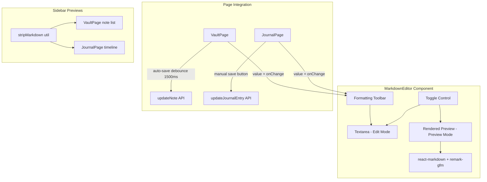

# Design Document: Markdown Support

## Overview

This feature replaces the plain `<textarea>` elements in VaultPage and JournalPage with a shared `MarkdownEditor` component that provides a formatting toolbar, edit/preview mode toggle, and rendered markdown output. The editor is a controlled component that accepts `value`/`onChange` props, making it a drop-in replacement for the existing textareas while preserving each page's save semantics (auto-save with 1500ms debounce on VaultPage, manual save on JournalPage).

Markdown content is stored as plain text in the existing `content` columns — no backend or database changes are needed. Rendering uses `react-markdown` with the `remark-gfm` plugin. A utility function strips markdown syntax for clean sidebar/timeline previews.

## Architecture

The feature is entirely frontend. It introduces one new reusable component, one rendering dependency, and one utility function. No new API calls, routes, or data model changes are required.



The `MarkdownEditor` is a pure controlled component — it owns no content state. Each host page continues to own its content state and save logic. The toolbar manipulates the textarea's selection range and calls `onChange` with the modified text.

## Components and Interfaces

### New Dependencies

- `react-markdown` — Renders markdown strings as React elements in Preview Mode.
- `remark-gfm` — Plugin for GitHub Flavored Markdown (tables, strikethrough, task lists).

### `MarkdownEditor` Component

**File:** `frontend/src/components/MarkdownEditor.tsx`

A controlled component that replaces `<textarea>` in both pages.

```typescript
interface MarkdownEditorProps {
  value: string;
  onChange: (value: string) => void;
  placeholder?: string;
  autoFocus?: boolean;
  className?: string;
}
```

**Internal state:**
- `mode: 'edit' | 'preview'` — defaults to `'edit'`
- `textareaRef: React.RefObject<HTMLTextAreaElement>` — for cursor/selection manipulation

**Structure:**
1. A header bar with the edit/preview toggle (two buttons or a segmented control).
2. The `FormattingToolbar` — visible only in edit mode.
3. The `<textarea>` — visible only in edit mode, receives `value`/`onChange`/`placeholder`/`autoFocus`.
4. The rendered preview container — visible only in preview mode, uses `<ReactMarkdown remarkPlugins={[remarkGfm]}>`.

The component passes `className` through to the outer wrapper so host pages can control sizing (e.g., `flex-1`).

### `FormattingToolbar` Component

**File:** Defined within `MarkdownEditor.tsx` (not exported separately — it's tightly coupled to the textarea ref).

**Buttons and their actions:**

| Button | Icon | Action |
|--------|------|--------|
| Heading | `Heading` | Insert `## ` at the beginning of the current line |
| Bold | `Bold` | Wrap selection with `**` or insert `****` with cursor between |
| Italic | `Italic` | Wrap selection with `*` or insert `**` with cursor between |
| Unordered List | `List` | Insert `- ` at the beginning of the current line |
| Ordered List | `ListOrdered` | Insert `1. ` at the beginning of the current line |
| Code | `Code` | Wrap selection with triple backtick fences, or insert empty fenced block |
| Link | `Link` | Insert `[text](url)` at cursor, or wrap selection as `[selection](url)` |

All icons come from `lucide-react` (already a dependency).

**Insertion logic:**
- The toolbar receives the `textareaRef` and the `onChange` callback.
- For wrapping formats (bold, italic, code): read `selectionStart`/`selectionEnd`, splice markers around the selected text, call `onChange` with the new string, then restore/adjust the selection range via `setSelectionRange`.
- For line-prefix formats (heading, lists): find the start of the current line from `selectionStart`, insert the prefix, call `onChange`.
- For link: if text is selected, wrap as `[selected](url)`, otherwise insert `[text](url)`.

### `stripMarkdown` Utility

**File:** `frontend/src/utils/stripMarkdown.ts`

A pure function that removes markdown syntax for sidebar previews.

```typescript
function stripMarkdown(text: string): string
```

Uses regex replacements to strip:
- Heading markers (`# `, `## `, etc.)
- Bold/italic markers (`**`, `*`)
- List prefixes (`- `, `1. `)
- Code fences (`` ``` ``)
- Inline code backticks
- Link syntax `[text](url)` → `text`
- Image syntax `` → `alt`

This is intentionally simple regex-based stripping rather than a full AST parse — it only needs to produce readable preview text for `line-clamp-1` / `line-clamp-2` displays.

### `MarkdownPreview` Styled Wrapper

**File:** Defined within `MarkdownEditor.tsx`.

A `<div>` wrapper around `<ReactMarkdown>` that applies dark-theme-consistent styles to rendered HTML elements using Tailwind's `prose` classes or manual class overrides on the `components` prop of `react-markdown`:

- Headings: white text, distinct sizes (h1 through h6)
- Bold: `font-bold text-white`
- Italic: `italic text-neutral-300`
- Lists: proper indentation, neutral-300 text, custom bullet/number colors
- Code inline: `bg-white/10 rounded px-1.5 py-0.5 font-mono text-sm text-amber-300`
- Code blocks: `bg-white/5 rounded-xl p-4 font-mono text-sm overflow-x-auto`
- Links: `text-fuchsia-400 hover:underline`, `target="_blank"` and `rel="noopener noreferrer"`
- Paragraphs: `text-neutral-200 leading-relaxed mb-4`

### VaultPage Integration

**File:** `frontend/src/pages/VaultPage.tsx`

Changes:
1. Import `MarkdownEditor` and `stripMarkdown`.
2. Replace the `<textarea>` in the editor section with `<MarkdownEditor value={editContent} onChange={handleContentChange} placeholder="Start writing..." autoFocus />`.
3. In the note list sidebar, change `{note.content || 'Empty note'}` to `{stripMarkdown(note.content) || 'Empty note'}`.
4. All existing functionality (title editing, folder selection, save button, close button, auto-save debounce) remains untouched.

### JournalPage Integration

**File:** `frontend/src/pages/JournalPage.tsx`

Changes:
1. Import `MarkdownEditor` and `stripMarkdown`.
2. Replace the `<textarea>` in the editor section with `<MarkdownEditor value={currentContent} onChange={setCurrentContent} placeholder="What's on your mind today?" autoFocus />`.
3. In the timeline sidebar, change `{entry.content}` to `{stripMarkdown(entry.content)}`.
4. All existing functionality (mood selector, date picker, smart prompts, save button, delete button) remains untouched.

## Data Models

No data model changes are required. Both `Note.content` and `JournalEntry.content` are already `string` fields that store plain text. Markdown is plain text — the same columns store it without any schema or backend modifications.

### MarkdownEditor Props Interface

```typescript
interface MarkdownEditorProps {
  value: string;
  onChange: (value: string) => void;
  placeholder?: string;
  autoFocus?: boolean;
  className?: string;
}
```

### Toolbar Action Types

```typescript
type FormatAction =
  | 'heading'
  | 'bold'
  | 'italic'
  | 'unordered-list'
  | 'ordered-list'
  | 'code'
  | 'link';

interface ToolbarAction {
  action: FormatAction;
  icon: LucideIcon;
  label: string;
}
```

### Mode State

```typescript
type EditorMode = 'edit' | 'preview';
```


## Correctness Properties

*A property is a characteristic or behavior that should hold true across all valid executions of a system — essentially, a formal statement about what the system should do. Properties serve as the bridge between human-readable specifications and machine-verifiable correctness guarantees.*

### Property 1: Controlled value rendering

*For any* string value passed as the `value` prop to the MarkdownEditor, the textarea in edit mode should contain exactly that string as its value.

**Validates: Requirements 1.1**

### Property 2: Wrapping format actions preserve selected text between markers

*For any* text string, any valid selection range (start ≤ end ≤ text.length), and any wrapping format action (bold, italic, code block), applying the format action should produce a result string where the originally selected text appears between the appropriate markers (`**`, `*`, or triple backtick fences), and the text outside the selection is unchanged.

**Validates: Requirements 2.2, 2.3, 2.7, 2.9**

### Property 3: Line-prefix format actions insert prefix at line start

*For any* text string, any valid cursor position, and any line-prefix format action (heading, unordered list, ordered list), applying the format action should produce a result string where the appropriate prefix (`## `, `- `, or `1. `) appears at the beginning of the line containing the cursor, and all other lines are unchanged.

**Validates: Requirements 2.4, 2.5, 2.6**

### Property 4: Link insertion places template at cursor

*For any* text string and any valid cursor position with no selection, applying the link format action should produce a result string where `[text](url)` is inserted at the cursor position, and the text before and after the cursor is unchanged. When text is selected, the selected text should appear as the link text in `[selected](url)`.

**Validates: Requirements 2.8**

### Property 5: Mode switch round-trip preserves content

*For any* markdown string set as the editor's value, switching from edit mode to preview mode and back to edit mode should result in the textarea containing the exact same string — no content is lost or modified during the mode transition.

**Validates: Requirements 3.3**

### Property 6: Strip markdown preserves readable text and removes syntax

*For any* markdown string, applying `stripMarkdown` should produce a result that (a) contains no markdown syntax markers (heading `#` prefixes, `**`, `*` wrapping, `- ` list prefixes, triple backtick fences, `[]()`link syntax), and (b) preserves all readable words that were present in the original text.

**Validates: Requirements 7.3**

## Error Handling

| Scenario | Behavior |
|----------|----------|
| Empty string passed as `value` | Editor renders empty textarea with placeholder text visible. Preview mode shows empty container. |
| Malformed markdown in content | `react-markdown` renders best-effort output. No crash — malformed syntax is displayed as plain text. |
| Extremely long content | Textarea and preview container are scrollable. No truncation of content. |
| Toolbar action with no textarea ref | Toolbar buttons are no-ops if the textarea ref is null (guard check before DOM manipulation). |
| `stripMarkdown` receives empty string | Returns empty string. No error thrown. |
| `stripMarkdown` receives non-markdown text | Returns the text unchanged — regex replacements only match markdown syntax patterns. |
| Missing `react-markdown` or `remark-gfm` | Build-time error. These are required dependencies — the app won't compile without them. |
| Clipboard/selection API unavailable | Toolbar uses `selectionStart`/`selectionEnd` on the textarea element directly (standard DOM API), not the Clipboard API. Works in all modern browsers. |

## Testing Strategy

### Unit Tests

Unit tests cover specific examples, edge cases, and rendering verification:

- **Component rendering**: MarkdownEditor renders textarea in edit mode, renders ReactMarkdown output in preview mode.
- **Default mode**: MarkdownEditor defaults to edit mode on mount.
- **Toolbar visibility**: Toolbar buttons are present in edit mode, hidden in preview mode.
- **Toolbar button set**: All 7 format buttons (heading, bold, italic, unordered list, ordered list, code, link) are rendered.
- **Placeholder**: Placeholder text appears when value is empty.
- **Markdown rendering examples**: Verify each markdown element renders the correct HTML element — h1-h6 for headings, `<strong>` for bold, `<em>` for italic, `<ul>`/`<ol>` for lists, `<code>` for inline code, `<pre>` for code blocks, `<a>` with `target="_blank"` for links, `<p>` for paragraphs.
- **Link target**: Rendered links have `target="_blank"` and `rel="noopener noreferrer"`.
- **VaultPage integration**: MarkdownEditor is rendered when editing a note; auto-save debounce fires after content change.
- **JournalPage integration**: MarkdownEditor is rendered when composing an entry; content state updates on change.
- **Sidebar preview stripping**: VaultPage note list and JournalPage timeline show stripped text.
- **stripMarkdown edge cases**: Empty string returns empty string. Plain text with no markdown returns unchanged. Nested markdown (e.g., bold inside heading) is fully stripped.

### Property-Based Tests

Property-based tests verify universal correctness properties across randomized inputs. Use `fast-check` (already in devDependencies) with `vitest`.

Each property test must:
- Run a minimum of 100 iterations
- Reference the design property in a comment tag

**Frontend property tests** (using `fast-check`):

- **Feature: markdown-support, Property 1: Controlled value rendering** — Generate arbitrary strings. Render MarkdownEditor with each string as `value`. Verify the textarea's value matches exactly.

- **Feature: markdown-support, Property 2: Wrapping format actions preserve selected text between markers** — Generate arbitrary text strings, valid selection ranges, and wrapping format types (bold/italic/code). Apply the format function and verify the selected text appears between the correct markers and surrounding text is unchanged.

- **Feature: markdown-support, Property 3: Line-prefix format actions insert prefix at line start** — Generate arbitrary multi-line text strings, valid cursor positions, and line-prefix format types (heading/unordered list/ordered list). Apply the format function and verify the correct prefix appears at the start of the cursor's line and other lines are unchanged.

- **Feature: markdown-support, Property 4: Link insertion places template at cursor** — Generate arbitrary text strings and valid cursor positions. Apply the link format function and verify `[text](url)` or `[selected](url)` appears at the correct position with surrounding text unchanged.

- **Feature: markdown-support, Property 5: Mode switch round-trip preserves content** — Generate arbitrary markdown strings. Set as editor value, toggle to preview mode, toggle back to edit mode. Verify textarea value is identical to the original string.

- **Feature: markdown-support, Property 6: Strip markdown preserves readable text and removes syntax** — Generate markdown strings containing random combinations of headings, bold, italic, lists, code, and links. Apply `stripMarkdown` and verify the result contains no markdown syntax markers and all readable words from the input are present.
