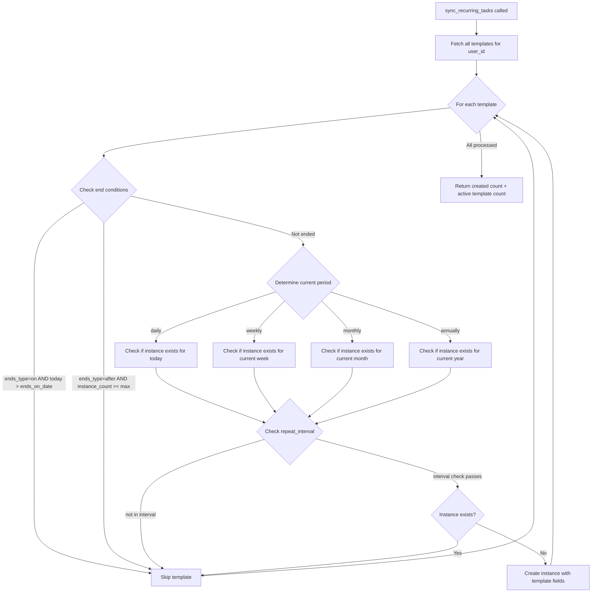
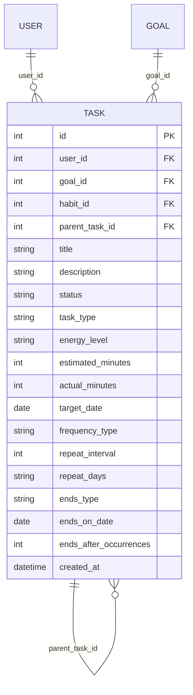

# Design Document: Recurring Tasks

## Overview

This feature adds native recurrence support to the LifeOS Task entity. Currently, users who want repeating tasks must create a habit, which is semantically incorrect. This design introduces a Task_Template / Task_Instance pattern: a Task with `task_type = "recurring"` and `parent_task_id = null` acts as a template that carries recurrence configuration, while generated instances (`parent_task_id != null`) appear on the Kanban board as actionable items.

The implementation extends the existing Task model with recurrence fields (mirroring the Habit recurrence schema), adds a self-referential `parent_task_id` foreign key, introduces a sync engine endpoint at `POST /sync/recurring-tasks/{user_id}`, and updates the frontend Kanban board to display recurring indicators and filter out templates.

### Key Design Decisions

1. **Single-table approach**: Reuse the existing `tasks` table rather than creating a separate `recurring_task_templates` table. This keeps the schema simple, avoids JOIN overhead, and leverages existing CRUD infrastructure. Templates and instances are distinguished by `parent_task_id` being null or populated.

2. **Mirror habit recurrence fields**: The recurrence fields (`frequency_type`, `repeat_interval`, `repeat_days`, `ends_type`, `ends_on_date`, `ends_after_occurrences`) are added directly to the Task model, matching the Habit model's field names and semantics. This ensures consistency and allows future unification.

3. **Sync-on-load pattern**: Following the existing `sync_habit_tasks` pattern, recurring task instances are generated on-demand when the Kanban board loads, not via a background scheduler. This avoids infrastructure complexity while ensuring instances are always current.

4. **Preserve completed work on template changes**: When a template is edited or deleted, instances with status "InProgress" or "Done" are preserved (orphaned to `task_type = "manual"` on deletion), ensuring users never lose tracked work.

## Architecture

```mermaid
flowchart TD
    subgraph Frontend
        KB[KanbanBoard.tsx]
        TM[TaskModal.tsx]
        API[api/index.ts]
    end

    subgraph Backend
        TR[routers/tasks.py]
        SR[routers/sync.py]
        CR[crud.py]
        MD[models.py]
        SC[schemas.py]
        DB[(SQLite)]
    end

    KB -->|"1. POST /sync/recurring-tasks/{user_id}"| API
    API --> SR
    SR -->|sync_recurring_tasks| CR
    CR -->|query templates, create instances| MD
    MD --> DB

    KB -->|"2. GET /users/{user_id}/tasks/"| API
    API --> TR
    TR -->|get_user_tasks (excludes templates)| CR

    TM -->|"POST /users/{user_id}/tasks/"| API
    API --> TR
    TR -->|create_user_task (validate recurrence)| CR

    TM -->|"PUT /users/{user_id}/tasks/{id}"| API
    API --> TR
    TR -->|update_task (propagate or regenerate)| CR

    KB -->|"DELETE /users/{user_id}/tasks/{id}"| API
    API --> TR
    TR -->|delete_task (cleanup instances)| CR
```

### Request Flow

1. **Page load**: KanbanBoard calls `POST /sync/recurring-tasks/{user_id}` → sync engine generates missing instances → then `GET /users/{user_id}/tasks/` returns instances (templates excluded).
2. **Create recurring task**: TaskModal submits `POST /users/{user_id}/tasks/` with `task_type: "recurring"` and recurrence fields → backend validates, persists template, generates first instance.
3. **Edit template**: TaskModal submits `PUT /users/{user_id}/tasks/{id}` → backend detects template, propagates field changes to Todo instances, or regenerates if recurrence config changed.
4. **Delete template**: `DELETE /users/{user_id}/tasks/{id}` → backend deletes Todo instances, orphans Done/InProgress instances, deletes template.
5. **Complete instance**: `PUT /users/{user_id}/tasks/{id}` with `status: "Done"` → only that instance is updated.

## Components and Interfaces

### Backend Components

#### 1. Model Layer (`backend/models.py`)

New columns on the `Task` model:

| Column | Type | Default | Description |
|--------|------|---------|-------------|
| `parent_task_id` | `Integer, ForeignKey("tasks.id")` | `null` | Links instance to template |
| `frequency_type` | `String` | `null` | daily, weekly, monthly, annually, custom |
| `repeat_interval` | `Integer` | `1` | Period multiplier |
| `repeat_days` | `String` | `null` | Comma-separated day numbers (0=Sun..6=Sat) |
| `ends_type` | `String` | `null` | never, on, after |
| `ends_on_date` | `Date` | `null` | End date for "on" type |
| `ends_after_occurrences` | `Integer` | `null` | Max instances for "after" type |

New relationships:
- `parent_task`: `relationship("Task", remote_side=[id], backref="instances")`

The `task_type` column gains a new valid value: `"recurring"` (alongside `"manual"` and `"habit"`).

#### 2. Schema Layer (`backend/schemas.py`)

**TaskCreate** — add optional recurrence fields:
```python
class TaskCreate(TaskBase):
    frequency_type: Optional[str] = None
    repeat_interval: Optional[int] = 1
    repeat_days: Optional[str] = None
    ends_type: Optional[str] = None
    ends_on_date: Optional[date] = None
    ends_after_occurrences: Optional[int] = None
```

**TaskUpdate** — add same recurrence fields as optional.

**Task** (response) — add:
```python
class Task(TaskBase):
    # ... existing fields ...
    parent_task_id: Optional[int] = None
    frequency_type: Optional[str] = None
    repeat_interval: Optional[int] = 1
    repeat_days: Optional[str] = None
    ends_type: Optional[str] = None
    ends_on_date: Optional[date] = None
    ends_after_occurrences: Optional[int] = None
```

**RecurringSyncResponse** — new schema:
```python
class RecurringSyncResponse(BaseModel):
    created: int
    active_templates: int
```

#### 3. CRUD Layer (`backend/crud.py`)

**New functions:**

- `validate_recurrence_config(task: TaskCreate) -> None`: Raises `ValueError` if weekly has no `repeat_days`, or "on" has no `ends_on_date`, or "after" has invalid `ends_after_occurrences`.

- `create_user_task` (modified): After persisting a recurring template, call `sync_recurring_tasks` to generate the first instance.

- `sync_recurring_tasks(db: Session, user_id: int) -> dict`: Core sync engine. For each active template:
  1. Check end conditions (date exceeded, occurrence count met)
  2. Determine if an instance exists for the current period based on `frequency_type`
  3. Account for `repeat_interval` (skip periods)
  4. Create instance copying template fields, setting `status = "Todo"`, `parent_task_id = template.id`

- `update_task` (modified): When updating a template:
  - If only detail fields changed (title, description, energy_level, estimated_minutes): propagate to all linked Todo instances.
  - If recurrence config changed: delete all linked Todo instances, then call `sync_recurring_tasks`.

- `delete_task` (modified): When deleting a template:
  1. Delete all linked instances with `status = "Todo"`
  2. Orphan instances with `status` in ("InProgress", "Done"): set `parent_task_id = null`, `task_type = "manual"`
  3. Delete the template record

- `get_user_tasks` (modified): Exclude templates from results by filtering out records where `task_type = "recurring"` AND `parent_task_id IS NULL`.

#### 4. Sync Router (`backend/routers/sync.py`)

New endpoint:
```python
@router.post("/recurring-tasks/{user_id}", response_model=schemas.RecurringSyncResponse)
def sync_recurring_tasks_endpoint(user_id: int, db: Session = Depends(get_db)):
    result = crud.sync_recurring_tasks(db, user_id)
    return result
```

#### 5. Tasks Router (`backend/routers/tasks.py`)

Modified endpoints:
- `create_task_for_user`: Add validation for recurrence config when `task_type = "recurring"`.
- `update_task`: Detect template vs instance, apply appropriate update logic.
- `delete_task`: Detect template vs instance, apply appropriate deletion logic.

### Frontend Components

#### 1. Types (`frontend/src/types.ts`)

Extend `Task` and `TaskCreate` interfaces:
```typescript
interface Task {
  // ... existing fields ...
  parent_task_id?: number | null;
  frequency_type?: string;
  repeat_interval?: number;
  repeat_days?: string;
  ends_type?: string;
  ends_on_date?: string;
  ends_after_occurrences?: number;
}

interface TaskCreate {
  // ... existing fields ...
  frequency_type?: string;
  repeat_interval?: number;
  repeat_days?: string;
  ends_type?: string;
  ends_on_date?: string;
  ends_after_occurrences?: number;
}
```

#### 2. API Layer (`frontend/src/api/index.ts`)

New function:
```typescript
export const syncRecurringTasks = async (userId: number): Promise<{ created: number; active_templates: number }> => {
  const res = await api.post(`/sync/recurring-tasks/${userId}`);
  return res.data;
};
```

#### 3. KanbanBoard (`frontend/src/pages/KanbanBoard.tsx`)

Changes:
- Call `syncRecurringTasks(userId)` on mount, before fetching tasks.
- Templates are already excluded server-side, so no client-side filtering needed.
- Render a recurring indicator (🔁 icon/badge) on task cards where `parent_task_id != null`.
- On clicking the recurring indicator, open the TaskModal in template-edit mode, fetching the parent template by `parent_task_id`.

#### 4. TaskModal (new or extended component)

- Add a "Recurring" toggle in the create form.
- When toggled on, show: frequency_type dropdown, repeat_interval input, repeat_days checkboxes (conditional on weekly), ends_type radio, ends_on_date picker (conditional), ends_after_occurrences input (conditional).
- When editing an instance: disable recurrence fields, show "Edit Template" link.
- When editing a template: enable all fields including recurrence config.

### Sync Engine Logic Detail



**Repeat interval logic**: For `repeat_interval > 1`, the sync engine counts the number of periods elapsed since the template's `created_at` date. If `elapsed_periods % repeat_interval != 0`, the current period is skipped. For weekly frequency, a "period" is a calendar week; for monthly, a calendar month; etc.

## Data Models

### Task Table (Extended)

```sql
-- New columns added to existing 'tasks' table
ALTER TABLE tasks ADD COLUMN parent_task_id INTEGER REFERENCES tasks(id) ON DELETE SET NULL;
ALTER TABLE tasks ADD COLUMN frequency_type VARCHAR;
ALTER TABLE tasks ADD COLUMN repeat_interval INTEGER DEFAULT 1;
ALTER TABLE tasks ADD COLUMN repeat_days VARCHAR;
ALTER TABLE tasks ADD COLUMN ends_type VARCHAR;
ALTER TABLE tasks ADD COLUMN ends_on_date DATE;
ALTER TABLE tasks ADD COLUMN ends_after_occurrences INTEGER;
```

### Entity Relationships



### Record Examples

**Template record:**
```json
{
  "id": 100,
  "user_id": 1,
  "title": "Weekly Review",
  "task_type": "recurring",
  "parent_task_id": null,
  "frequency_type": "weekly",
  "repeat_interval": 1,
  "repeat_days": "5",
  "ends_type": "never",
  "status": "Todo",
  "target_date": null
}
```

**Instance record:**
```json
{
  "id": 101,
  "user_id": 1,
  "title": "Weekly Review",
  "task_type": "recurring",
  "parent_task_id": 100,
  "frequency_type": null,
  "repeat_interval": null,
  "repeat_days": null,
  "ends_type": null,
  "status": "Todo",
  "target_date": "2025-01-17"
}
```

Instances do not carry recurrence config — it lives only on the template. This avoids data duplication and ensures the template is the single source of truth for scheduling.


## Correctness Properties

*A property is a characteristic or behavior that should hold true across all valid executions of a system — essentially, a formal statement about what the system should do. Properties serve as the bridge between human-readable specifications and machine-verifiable correctness guarantees.*

### Property 1: Template vs Instance Classification

*For any* Task with `task_type = "recurring"`, the task is a template if and only if `parent_task_id` is null, and an instance if and only if `parent_task_id` is not null. The `get_user_tasks` API must return instances but never templates.

**Validates: Requirements 1.4, 1.5, 6.3**

### Property 2: Recurrence Config Persistence Round-Trip

*For any* valid recurrence configuration (frequency_type, repeat_interval, repeat_days, ends_type, ends_on_date, ends_after_occurrences), creating a recurring task template and then reading it back should yield the same recurrence field values.

**Validates: Requirements 2.1**

### Property 3: Recurrence Validation Rejects Invalid Configs

*For any* task creation request with `task_type = "recurring"` where: (a) `frequency_type` is "weekly" and `repeat_days` is empty/null, or (b) `ends_type` is "on" and `ends_on_date` is missing, or (c) `ends_type` is "after" and `ends_after_occurrences` is missing or < 1 — the API shall reject the request with a validation error and no template shall be persisted.

**Validates: Requirements 2.2, 2.3, 2.4**

### Property 4: Template Creation Generates First Instance

*For any* valid recurring task template creation, immediately after creation, there shall exist exactly one Task_Instance linked to that template with `status = "Todo"` and a `target_date` within the current period.

**Validates: Requirements 2.5**

### Property 5: Sync Generates Instance for Current Period

*For any* active Task_Template (not ended) belonging to a user, after running the sync engine, there shall exist at least one Task_Instance for the current period (today for daily, current week for weekly, current month for monthly, current year for annually) — unless the repeat_interval causes the current period to be skipped.

**Validates: Requirements 3.1, 3.2, 3.3, 3.4, 3.5**

### Property 6: Sync Respects End Conditions

*For any* Task_Template where `ends_type = "on"` and today exceeds `ends_on_date`, or where `ends_type = "after"` and the existing instance count >= `ends_after_occurrences`, running the sync engine shall produce zero new instances for that template.

**Validates: Requirements 3.6, 3.7**

### Property 7: Generated Instance Fields Match Template

*For any* Task_Instance generated by the sync engine, its `title`, `description`, `goal_id`, `energy_level`, and `estimated_minutes` shall equal the corresponding fields on its parent Task_Template, and its `status` shall be "Todo".

**Validates: Requirements 3.8, 3.9**

### Property 8: Sync Respects Repeat Interval

*For any* Task_Template with `repeat_interval > 1`, the sync engine shall only generate instances for periods that are multiples of `repeat_interval` from the template's creation date. In non-matching periods, no instance shall be created.

**Validates: Requirements 3.10**

### Property 9: Template Detail Update Propagates to Todo Instances

*For any* Task_Template update that changes only detail fields (title, description, energy_level, estimated_minutes), all linked Task_Instances with `status = "Todo"` shall have their corresponding fields updated to match the new template values.

**Validates: Requirements 4.1**

### Property 10: Template Recurrence Config Update Regenerates Instances

*For any* Task_Template update that changes recurrence configuration fields, all previously linked Task_Instances with `status = "Todo"` shall be deleted, and new instances shall be generated according to the updated configuration.

**Validates: Requirements 4.2**

### Property 11: Template Update Preserves Non-Todo Instances

*For any* Task_Template update (detail or recurrence config), all linked Task_Instances with `status` in ("InProgress", "Done") shall remain unchanged in the database — their fields, status, and parent_task_id shall not be modified.

**Validates: Requirements 4.3**

### Property 12: Template Deletion Removes Template and Todo Instances

*For any* Task_Template deletion, the template record and all linked Task_Instances with `status = "Todo"` shall no longer exist in the database after the operation.

**Validates: Requirements 5.1, 5.3**

### Property 13: Template Deletion Orphans Completed Instances

*For any* Task_Template deletion, all linked Task_Instances with `status` in ("InProgress", "Done") shall have their `parent_task_id` set to null and `task_type` set to "manual", and shall continue to exist in the database.

**Validates: Requirements 5.2**

### Property 14: Sync Response Contains Accurate Counts

*For any* sync engine invocation, the returned `created` count shall equal the number of new Task_Instances actually inserted, and `active_templates` shall equal the number of non-ended Task_Templates belonging to the user.

**Validates: Requirements 8.2**

### Property 15: Instance Status Change Is Isolated

*For any* Task_Instance status change (to "InProgress" or "Done"), the parent Task_Template's fields and all sibling Task_Instances' fields and statuses shall remain unchanged.

**Validates: Requirements 9.1, 9.2**

### Property 16: Instance Deletion Is Isolated

*For any* single Task_Instance deletion, the parent Task_Template and all sibling Task_Instances shall continue to exist unchanged in the database.

**Validates: Requirements 9.3**

## Error Handling

### Backend Validation Errors

| Scenario | HTTP Status | Error Response |
|----------|-------------|----------------|
| Weekly frequency with empty repeat_days | 422 | `{"detail": "repeat_days is required for weekly frequency"}` |
| ends_type "on" with missing ends_on_date | 422 | `{"detail": "ends_on_date is required when ends_type is 'on'"}` |
| ends_type "after" with invalid ends_after_occurrences | 422 | `{"detail": "ends_after_occurrences must be >= 1 when ends_type is 'after'"}` |
| Invalid frequency_type value | 422 | `{"detail": "frequency_type must be one of: daily, weekly, monthly, annually, custom"}` |
| Template not found on update/delete | 404 | `{"detail": "Task not found"}` |
| Instance edit attempts to modify recurrence fields | 400 | `{"detail": "Cannot modify recurrence config on a task instance. Edit the template instead."}` |

### Sync Engine Error Handling

- If a template has corrupted recurrence data (e.g., invalid frequency_type), the sync engine logs a warning and skips that template rather than failing the entire sync.
- If instance creation fails for one template (e.g., DB constraint violation), the sync engine continues processing remaining templates and reports partial results.
- The sync endpoint always returns a response, even if zero instances were created.

### Frontend Error Handling

- If the sync endpoint fails, the Kanban board still loads existing tasks (graceful degradation). A toast notification informs the user that recurring task sync failed.
- Validation errors from the create/edit API are displayed inline in the TaskModal form fields.
- If fetching a parent template fails (e.g., it was deleted), the recurring indicator is hidden and the instance is treated as a regular task.

## Testing Strategy

### Property-Based Testing

**Library**: [Hypothesis](https://hypothesis.readthedocs.io/) for Python backend tests.

**Configuration**: Minimum 100 examples per property test (`@settings(max_examples=100)`).

**Tag format**: Each test is tagged with a comment: `# Feature: recurring-tasks, Property {N}: {title}`

Each correctness property (1–16) maps to a single property-based test. The generators will produce:
- Random valid recurrence configs (frequency_type, repeat_interval, repeat_days, ends_type, etc.)
- Random task detail fields (title, description, energy_level, estimated_minutes)
- Random sets of templates with varying instance counts and statuses
- Random dates for testing period boundaries and end conditions

Key generator strategies:
- `RecurrenceConfig`: generates valid combinations respecting constraints (e.g., weekly always has repeat_days)
- `InvalidRecurrenceConfig`: generates configs that violate at least one validation rule (for Property 3)
- `TaskTemplate`: generates a full template record with valid recurrence config
- `TaskInstanceSet`: generates a template with N instances in mixed statuses

### Unit Testing

Unit tests complement property tests by covering:
- Specific date boundary examples (e.g., monthly sync on Jan 31, leap year Feb 29)
- Integration tests for the full create → sync → list → update → delete lifecycle
- API endpoint response format verification
- Frontend component rendering (recurring indicator visibility, toggle behavior)
- Edge cases: template with 0 instances, template created today, template with ends_on_date = today

### Frontend Testing

- Component tests for TaskModal recurrence toggle and conditional field visibility
- Integration test: KanbanBoard calls sync before fetching tasks
- Recurring indicator renders only for tasks with `parent_task_id`
- Template editing modal shows all fields; instance editing modal restricts fields
