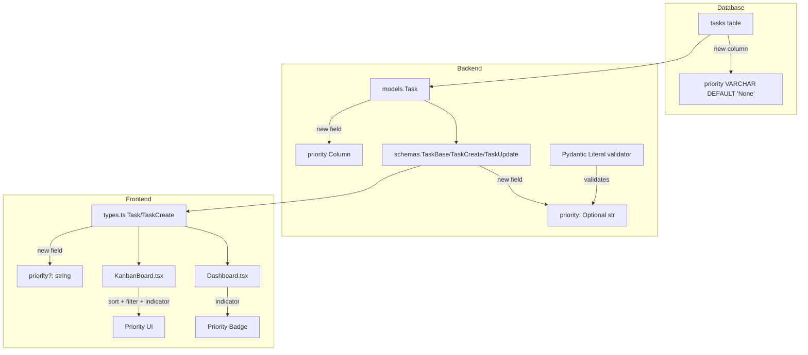

# Design Document: Task Priorities and Sorting

## Overview

This feature adds a `priority` field to the task data model across the full stack (database, backend API, frontend types, and UI). Users can assign one of four priority levels — High, Medium, Low, or None — when creating or editing tasks. Priority is surfaced through color-coded visual indicators on task cards in both the Kanban Board and Dashboard. Tasks within Kanban columns are sorted by descending priority, and a new priority filter allows users to focus on tasks of a specific importance level. The filter operates independently of (and composably with) the existing energy level filter.

The design follows the existing patterns in the codebase: SQLAlchemy model column + Pydantic schema field + FastAPI route passthrough on the backend, and TypeScript interface field + API call + React state on the frontend.

## Architecture

The feature touches every layer of the stack but introduces no new services, endpoints, or architectural patterns. It extends existing structures:



Data flows unchanged through the existing REST API. The backend validates priority values via a Pydantic `Literal` type. The frontend sorts and filters tasks client-side after fetching them from the API.

## Components and Interfaces

### Backend Changes

**`backend/models.py` — Task model**
- Add `priority = Column(String, default="None")` to the `Task` class.

**`backend/schemas.py` — Pydantic schemas**
- Define a shared type: `PriorityLevel = Literal["High", "Medium", "Low", "None"]`
- Add `priority: Optional[PriorityLevel] = "None"` to `TaskBase`.
- Add `priority: Optional[PriorityLevel] = None` to `TaskUpdate` (so omitting it doesn't reset to "None").
- The `Task` response schema inherits from `TaskBase`, so it automatically includes `priority`.

Pydantic's `Literal` type handles validation — any value outside the allowed set triggers a 422 response automatically, no custom validator needed.

**`backend/routers/tasks.py`**
- No changes needed. The existing create/update endpoints pass schema data through to CRUD functions, which use `model_dump()`. The new field flows through automatically.

**`backend/crud.py`**
- No changes needed. `create_user_task` uses `task.model_dump()` and `update_task` uses `task_update.model_dump(exclude_unset=True)`, both of which will include `priority` when present.

### Frontend Changes

**`frontend/src/types.ts`**
- Add `priority?: string` to `Task` interface.
- Add `priority?: string` to `TaskCreate` interface.

**`frontend/src/api/index.ts`**
- No changes needed. The existing `createTask` and `updateTask` functions pass the full object to the API.

**`frontend/src/components/PriorityBadge.tsx`** (new)
- A small presentational component that maps priority to a colored badge:
  - High → red icon/badge
  - Medium → amber/yellow icon/badge
  - Low → blue icon/badge
  - None → renders nothing
- Used by both KanbanBoard and Dashboard task cards.

**`frontend/src/utils/prioritySort.ts`** (new)
- A pure utility function `sortByPriority(tasks: Task[]): Task[]` that sorts tasks in descending priority order (High > Medium > Low > None), preserving relative order (stable sort) for tasks with the same priority.
- Uses a numeric weight map: `{ High: 0, Medium: 1, Low: 2, None: 3 }`.

**`frontend/src/utils/priorityFilter.ts`** (new)
- A pure utility function `filterByPriority(tasks: Task[], priority: string): Task[]` that returns only tasks matching the given priority, or all tasks if priority is "All".

**`frontend/src/pages/KanbanBoard.tsx`**
- Add `priorityFilter` state (default: "All").
- Add priority filter UI control next to the existing energy filter.
- Add priority selector (`<select>`) to the create/edit task modal.
- Update `getTasksByStatus` to apply both energy and priority filters, then sort by priority.
- Render `<PriorityBadge>` on each task card.
- After drag-and-drop, the destination column re-sorts automatically since sorting is applied on render.

**`frontend/src/pages/Dashboard.tsx`**
- Render `<PriorityBadge>` on each task entry in the "Action Items" section.

### Database Migration

**`backend/alembic/versions/xxx_add_task_priority.py`**
- `upgrade()`: Add `priority` column (String, server_default="None") to `tasks` table. Update all existing rows to "None".
- `downgrade()`: Drop the `priority` column.

## Data Models

### Task Priority Enum Values

| Value    | Sort Weight | Color   | Indicator |
|----------|-------------|---------|-----------|
| `"High"` | 0           | Red     | Red badge with arrow-up icon |
| `"Medium"` | 1         | Amber   | Amber badge with minus icon |
| `"Low"`  | 2           | Blue    | Blue badge with arrow-down icon |
| `"None"` | 3           | —       | No indicator rendered |

### Updated Task Model (SQLAlchemy)

```python
class Task(Base):
    __tablename__ = "tasks"
    # ... existing columns ...
    priority = Column(String, default="None")  # High, Medium, Low, None
```

### Updated Pydantic Schemas

```python
from typing import Literal

PriorityLevel = Literal["High", "Medium", "Low", "None"]

class TaskBase(BaseModel):
    # ... existing fields ...
    priority: Optional[PriorityLevel] = "None"

class TaskUpdate(BaseModel):
    # ... existing fields ...
    priority: Optional[PriorityLevel] = None
```

### Updated TypeScript Interfaces

```typescript
export interface Task {
  // ... existing fields ...
  priority?: string;  // 'High' | 'Medium' | 'Low' | 'None'
}

export interface TaskCreate {
  // ... existing fields ...
  priority?: string;
}
```

### Priority Sort Function Signature

```typescript
const PRIORITY_WEIGHT: Record<string, number> = {
  High: 0, Medium: 1, Low: 2, None: 3
};

function sortByPriority(tasks: Task[]): Task[] {
  return [...tasks].sort((a, b) => {
    const wa = PRIORITY_WEIGHT[a.priority ?? 'None'] ?? 3;
    const wb = PRIORITY_WEIGHT[b.priority ?? 'None'] ?? 3;
    return wa - wb;  // stable sort preserves creation order for equal priorities
  });
}
```

### Priority Filter Function Signature

```typescript
function filterByPriority(tasks: Task[], priority: string): Task[] {
  if (priority === 'All') return tasks;
  return tasks.filter(t => (t.priority ?? 'None') === priority);
}
```


## Correctness Properties

*A property is a characteristic or behavior that should hold true across all valid executions of a system — essentially, a formal statement about what the system should do. Properties serve as the bridge between human-readable specifications and machine-verifiable correctness guarantees.*

### Property 1: Invalid priority values are rejected

*For any* string that is not one of "High", "Medium", "Low", or "None", attempting to create or update a task with that string as the priority should result in a validation error (422), and no task data should be modified.

**Validates: Requirements 1.4, 3.4**

### Property 2: Priority round-trip persistence

*For any* valid priority value in {"High", "Medium", "Low", "None"}, creating a task with that priority or updating an existing task to that priority should persist the value and return a task object whose `priority` field equals the value that was sent.

**Validates: Requirements 2.4, 3.3**

### Property 3: Priority sort produces correct ordering with stability

*For any* list of tasks with arbitrary priority values, sorting by priority should produce a list where priority weights are in non-decreasing order (High=0 ≤ Medium=1 ≤ Low=2 ≤ None=3), and tasks with equal priority maintain their original relative order (stable sort).

**Validates: Requirements 5.1, 5.2**

### Property 4: Priority filter returns only matching tasks

*For any* list of tasks and any selected priority filter value from {"High", "Medium", "Low", "None"}, the filtered result should contain only tasks whose priority matches the selected value. When the filter is "All", all tasks should be returned unchanged.

**Validates: Requirements 6.2, 6.3**

### Property 5: Priority and energy filters compose as intersection

*For any* list of tasks, any priority filter value, and any energy filter value, applying both filters should produce the same result as the intersection of applying each filter independently — i.e., a task appears in the result if and only if it matches both the priority filter and the energy filter.

**Validates: Requirements 6.4, 6.5**

## Error Handling

| Scenario | Layer | Behavior |
|----------|-------|----------|
| Invalid priority value on create | Backend (Pydantic) | Returns 422 with validation error detail. No task created. |
| Invalid priority value on update | Backend (Pydantic) | Returns 422 with validation error detail. Existing task unchanged. |
| Missing priority field on create | Backend (Pydantic) | Defaults to "None". Task created successfully. |
| Missing priority field on update | Backend (Pydantic) | Field excluded from update (`exclude_unset=True`). Existing priority preserved. |
| Task with `null` priority from legacy data | Frontend | `PriorityBadge` treats `undefined`/`null` as "None" — renders nothing. Sort/filter functions default to weight 3 ("None"). |
| Migration failure | Database | Alembic migration is reversible. `downgrade()` drops the column. No data loss on rollback since priority is additive. |

## Testing Strategy

### Unit Tests

Unit tests cover specific examples, edge cases, and UI rendering:

- **Schema defaults**: Create a `TaskCreate` without priority → verify `priority` is "None".
- **PriorityBadge rendering**: Render with each priority value → verify correct color class / no render for "None".
- **Sort edge cases**: Empty list, single-element list, all same priority.
- **Filter edge case**: "All" filter returns full list unchanged.
- **Migration**: Verify column exists after upgrade, column removed after downgrade.

### Property-Based Tests

Property-based tests verify universal correctness properties across randomized inputs. Use `hypothesis` (Python) for backend properties and `fast-check` (TypeScript) for frontend properties.

Each property test must:
- Run a minimum of 100 iterations
- Reference the design property in a comment tag

**Backend property tests** (using `hypothesis`):

- **Feature: task-priorities, Property 1: Invalid priority values are rejected** — Generate arbitrary strings not in {"High", "Medium", "Low", "None"} and verify `TaskCreate`/`TaskUpdate` schema validation raises `ValidationError`.
- **Feature: task-priorities, Property 2: Priority round-trip persistence** — For each valid priority, create a task via the API and verify the returned `priority` matches. Update an existing task's priority and verify the returned value matches.

**Frontend property tests** (using `fast-check`):

- **Feature: task-priorities, Property 3: Priority sort produces correct ordering with stability** — Generate random arrays of task objects with random priorities. Sort them and verify non-decreasing weight order and stable relative ordering for equal priorities.
- **Feature: task-priorities, Property 4: Priority filter returns only matching tasks** — Generate random task arrays and a random priority filter value. Verify filtered results contain only matching tasks, and "All" returns the full list.
- **Feature: task-priorities, Property 5: Priority and energy filters compose as intersection** — Generate random task arrays with random priority and energy values, plus random filter selections. Verify the combined filter result equals the intersection of individual filters.
