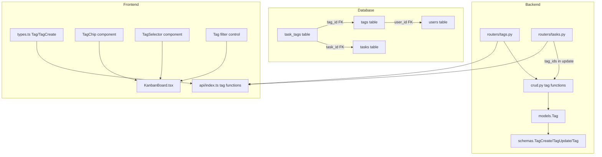

# Design Document: Task Tags

## Overview

This feature introduces user-scoped tags with optional colors that can be assigned to tasks via a many-to-many relationship. The backend adds a `Tag` model, a `task_tags` join table, dedicated tag CRUD endpoints, and extends the task update endpoint to accept `tag_ids`. The frontend adds tag types, a `TagChip` component, a tag selector in the task modal (with inline tag creation), a tag filter on the Kanban board, and tag display on task cards.

The design follows existing codebase patterns: SQLAlchemy model + Pydantic schema + FastAPI router on the backend, and TypeScript interface + API function + React component on the frontend.

## Architecture



Data flows through the existing REST API pattern. Tags are fetched once on Kanban board mount and cached in state. Tag filtering happens client-side. Tag assignment is sent as `tag_ids` in the task update/create payload.

## Components and Interfaces

### Backend Changes

**`backend/models.py` — New models**

- Add `task_tags` association table using `Table()` with `task_id` and `tag_id` columns as composite primary key.
- Add `Tag` model with `id`, `user_id`, `name` (String, max 30), `color` (String, nullable), and a `UniqueConstraint` on `(user_id, name)`.
- Add `tags` relationship to `Task` model: `tags = relationship("Tag", secondary=task_tags, backref="tasks")`.
- Add `tags` relationship to `User` model: `tags = relationship("Tag", back_populates="user")`.

**`backend/schemas.py` — New schemas**

```python
# Predefined color palette
TAG_COLORS = [
    "#ef4444",  # red
    "#f97316",  # orange
    "#eab308",  # yellow
    "#22c55e",  # green
    "#06b6d4",  # cyan
    "#3b82f6",  # blue
    "#8b5cf6",  # purple
    "#ec4899",  # pink
]

class TagBase(BaseModel):
    name: str  # max 30 chars, non-empty
    color: Optional[str] = None  # hex from TAG_COLORS or null

class TagCreate(TagBase):
    pass

class TagUpdate(BaseModel):
    name: Optional[str] = None
    color: Optional[str] = None

class TagOut(TagBase):
    id: int
    user_id: int
    model_config = ConfigDict(from_attributes=True)
```

- Add `tag_ids: Optional[List[int]] = None` to `TaskCreate` and `TaskUpdate`.
- Add `tags: Optional[List[TagOut]] = []` to the `Task` response schema.
- Add a validator on `TagCreate`/`TagUpdate` to ensure `name` is 1-30 chars and non-whitespace-only.
- Add a validator on `TagCreate`/`TagUpdate` to ensure `color` is either null or in `TAG_COLORS`.

**`backend/crud.py` — New CRUD functions**

```python
def create_tag(db, user_id, tag: TagCreate) -> Tag:
    # Check uniqueness of (user_id, name)
    # Create and return tag

def get_user_tags(db, user_id) -> List[Tag]:
    # Return all tags for user

def update_tag(db, tag_id, user_id, tag_update: TagUpdate) -> Tag:
    # Verify ownership, update fields, return tag

def delete_tag(db, tag_id, user_id) -> bool:
    # Verify ownership, delete tag (cascade removes task_tags)
```

- Modify `create_user_task` to accept optional `tag_ids` and create task_tag associations.
- Modify `update_task` to accept optional `tag_ids` and replace task_tag associations when provided.

**`backend/routers/tags.py` — New router**

```
POST   /users/{user_id}/tags          → create tag
GET    /users/{user_id}/tags          → list user tags
PUT    /users/{user_id}/tags/{tag_id} → update tag
DELETE /users/{user_id}/tags/{tag_id} → delete tag
```

**`backend/routers/tasks.py` — Modified**

- No new endpoints. The existing create and update endpoints handle `tag_ids` through the updated schemas and CRUD functions.
- Task responses now include `tags` field via the updated `Task` schema.

### Frontend Changes

**`frontend/src/types.ts`**

```typescript
export interface Tag {
  id: number;
  name: string;
  color: string | null;
}

export interface TagCreate {
  name: string;
  color?: string;
}

// Updated Task interface adds:
//   tags?: Tag[];

// Updated TaskCreate interface adds:
//   tag_ids?: number[];
```

**`frontend/src/api/index.ts`**

```typescript
// New tag API functions
export const getTags = async (userId: number): Promise<Tag[]> => { ... }
export const createTag = async (userId: number, tag: TagCreate): Promise<Tag> => { ... }
export const updateTag = async (userId: number, tagId: number, tag: Partial<TagCreate>): Promise<Tag> => { ... }
export const deleteTag = async (userId: number, tagId: number): Promise<void> => { ... }
```

**`frontend/src/components/TagChip.tsx`** (new)

- Renders a small colored chip with the tag name.
- Uses the tag's color as background (with opacity) or a default neutral if color is null.
- Accepts `tag: Tag` and optional `size: 'sm' | 'md'` props.

**`frontend/src/components/TagSelector.tsx`** (new)

- Multi-select dropdown showing all user tags as colored chips.
- Supports selecting/deselecting tags by clicking.
- Includes a text input for filtering existing tags and creating new ones inline.
- When the typed name doesn't match any existing tag, shows a "Create [name]" option.
- Calls `createTag` API on inline creation, then adds the new tag to the list and selects it.

**`frontend/src/utils/tagFilter.ts`** (new)

```typescript
export function filterByTags(tasks: Task[], selectedTagIds: number[]): Task[] {
  if (selectedTagIds.length === 0) return tasks;
  return tasks.filter(task =>
    task.tags?.some(tag => selectedTagIds.includes(tag.id))
  );
}
```

**`frontend/src/pages/KanbanBoard.tsx`**

- Add `tags` state (all user tags, fetched on mount).
- Add `selectedTagFilter` state (array of tag IDs, default empty = show all).
- Add tag filter UI control (multi-select chips) next to existing filters.
- Add `<TagSelector>` to the create/edit task modal.
- Update `getTasksByStatus` to apply `filterByTags` alongside existing filters.
- Render `<TagChip>` elements on each task card (max 3 + overflow indicator).

## Data Models

### Tag Table

| Column   | Type    | Constraints                          |
|----------|---------|--------------------------------------|
| id       | Integer | Primary key, auto-increment          |
| user_id  | Integer | Foreign key → users.id, not null     |
| name     | String  | Max 30 chars, not null               |
| color    | String  | Nullable, must be in TAG_COLORS      |

Unique constraint: `(user_id, name)`

### Task_Tags Join Table

| Column  | Type    | Constraints                    |
|---------|---------|--------------------------------|
| task_id | Integer | Foreign key → tasks.id, PK     |
| tag_id  | Integer | Foreign key → tags.id, PK      |

### Color Palette

| Color   | Hex       | Usage        |
|---------|-----------|--------------|
| Red     | `#ef4444` | Urgent/alert |
| Orange  | `#f97316` | Warning      |
| Yellow  | `#eab308` | Attention    |
| Green   | `#22c55e` | Personal     |
| Cyan    | `#06b6d4` | Info         |
| Blue    | `#3b82f6` | Work         |
| Purple  | `#8b5cf6` | Research     |
| Pink    | `#ec4899` | Creative     |

### Updated Task Response Schema

```python
class Task(TaskBase):
    # ... existing fields ...
    tags: Optional[List[TagOut]] = []
    model_config = ConfigDict(from_attributes=True)
```

### Updated TaskCreate/TaskUpdate Schemas

```python
class TaskCreate(TaskBase):
    # ... existing fields ...
    tag_ids: Optional[List[int]] = None

class TaskUpdate(BaseModel):
    # ... existing fields ...
    tag_ids: Optional[List[int]] = None
```

## Correctness Properties

### Property 1: Tag name uniqueness per user

*For any* user and *for any* valid tag name, creating a tag with that name when a tag with the same name already exists for that user should result in a 409 conflict error, and the total number of tags for that user should remain unchanged.

**Validates: Requirements 2.2, 1.2**

### Property 2: Tag name length validation

*For any* string longer than 30 characters, attempting to create a tag with that string as the name should result in a 422 validation error. *For any* string of 1-30 non-whitespace characters, tag creation should succeed.

**Validates: Requirements 2.3, 2.4**

### Property 3: Tag color validation

*For any* string that is not in the predefined Color_Palette set and is not null, attempting to create or update a tag with that string as the color should result in a 422 validation error. *For any* color in the Color_Palette, tag creation or update should succeed.

**Validates: Requirements 3.3**

### Property 4: Tag assignment round-trip

*For any* task and *for any* subset of the user's existing tag IDs, updating the task with that subset as `tag_ids` and then fetching the task should return a task whose `tags` list contains exactly the tags corresponding to those IDs (same set, regardless of order).

**Validates: Requirements 4.1, 4.3, 4.4**

### Property 5: Tag assignment idempotence

*For any* task and *for any* set of valid tag IDs, assigning the same `tag_ids` twice in succession should produce the same result — the task's tags after the second assignment should be identical to the tags after the first assignment.

**Validates: Requirements 4.1**

### Property 6: Tag filter returns only matching tasks

*For any* list of tasks with arbitrary tag assignments and *for any* non-empty set of selected tag IDs, the filtered result should contain only tasks that have at least one tag whose ID is in the selected set. When no tags are selected, all tasks should be returned.

**Validates: Requirements 7.2, 7.3**

### Property 7: Tag filter composes with priority and energy filters as intersection

*For any* list of tasks, any set of selected tag IDs, any priority filter value, and any energy filter value, applying all three filters should produce the same result as the intersection of applying each filter independently.

**Validates: Requirements 7.4, 7.5**

## Error Handling

| Scenario | Layer | Behavior |
|----------|-------|----------|
| Duplicate tag name for same user | Backend (CRUD) | Returns 409 Conflict |
| Tag name > 30 chars | Backend (Pydantic) | Returns 422 validation error |
| Empty/whitespace tag name | Backend (Pydantic) | Returns 422 validation error |
| Invalid color (not in palette) | Backend (Pydantic) | Returns 422 validation error |
| Tag not found or wrong user | Backend (Router) | Returns 404 Not Found |
| tag_ids contains ID not owned by user | Backend (CRUD) | Returns 422 validation error |
| Inline tag creation with duplicate name | Frontend | Shows error toast, does not add tag |
| Tag deleted while assigned to tasks | Backend (DB cascade) | Join table entries removed, task responses no longer include that tag |
| Task with null/undefined tags field | Frontend | TagChip renders nothing, filter treats as no tags |

## Testing Strategy

### Unit Tests

- **Tag schema validation**: Verify name length limits, whitespace rejection, color palette validation.
- **TagChip rendering**: Render with color, without color, verify correct styles.
- **TagSelector**: Render with tags, verify selection/deselection, verify inline create option appears.
- **Tag filter edge cases**: Empty tag selection returns all tasks, empty task list returns empty.
- **Migration**: Verify tables created on upgrade, dropped on downgrade.

### Property-Based Tests

Property-based tests verify universal correctness properties across randomized inputs. Use `hypothesis` (Python) for backend properties and `fast-check` (TypeScript) for frontend properties.

Each property test must:
- Run a minimum of 100 iterations
- Reference the design property in a comment tag

**Backend property tests** (using `hypothesis`):

- **Feature: task-tags, Property 1: Tag name uniqueness per user** — Generate arbitrary valid tag names, create a tag, attempt to create a duplicate, verify 409 or ValidationError.
- **Feature: task-tags, Property 2: Tag name length validation** — Generate strings of various lengths, verify that strings > 30 chars are rejected and strings of 1-30 non-whitespace chars are accepted by the schema.
- **Feature: task-tags, Property 3: Tag color validation** — Generate arbitrary hex strings not in TAG_COLORS, verify schema rejects them. Generate colors from TAG_COLORS, verify schema accepts them.

**Frontend property tests** (using `fast-check`):

- **Feature: task-tags, Property 4: Tag assignment round-trip** — Generate random tag ID subsets, simulate assignment and verify the returned tags match the input set.
- **Feature: task-tags, Property 5: Tag assignment idempotence** — Generate random tag ID sets, apply twice, verify identical results.
- **Feature: task-tags, Property 6: Tag filter returns only matching tasks** — Generate random task arrays with random tag assignments and random filter selections. Verify filtered results contain only tasks with at least one matching tag.
- **Feature: task-tags, Property 7: Tag filter composes with priority and energy filters as intersection** — Generate random task arrays with random tags, priorities, and energy levels, plus random filter selections. Verify combined filter equals intersection of individual filters.
