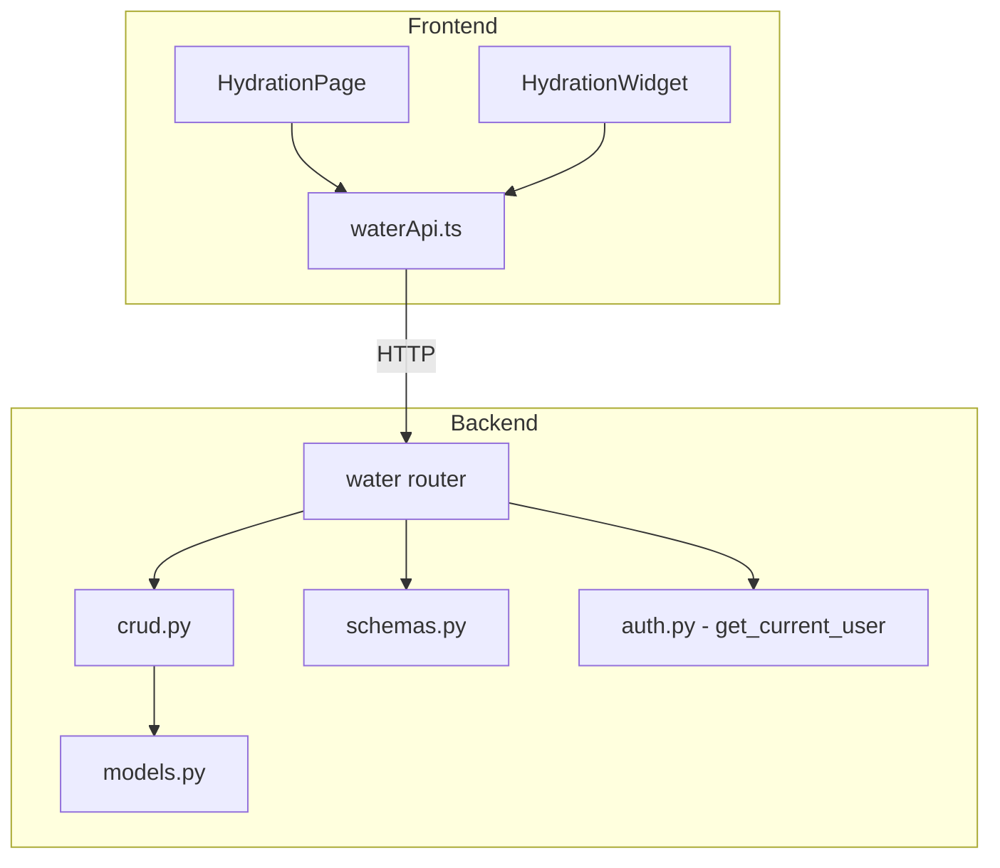
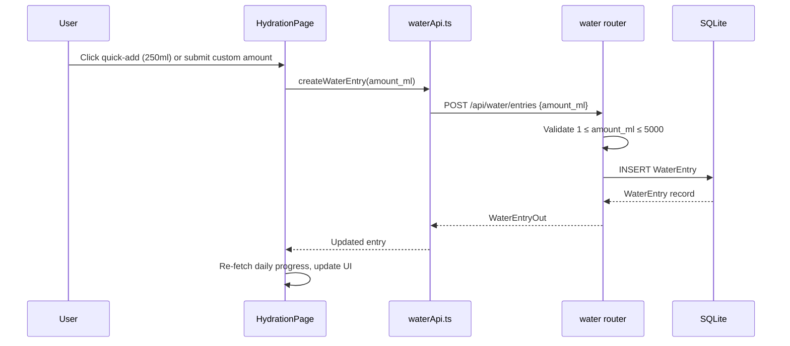
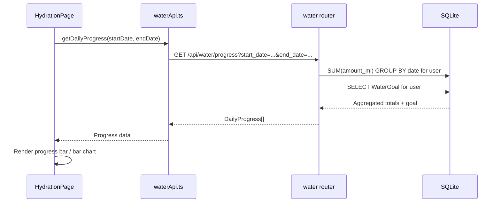

# Design Document: Water Intake Tracker

## Overview

The Water Intake Tracker adds daily hydration logging, goal-setting, and history visualization to LifeOS. Users can log water entries (with quick-add buttons or custom amounts), set a personal daily goal, view progress for any date, and review a 7-day bar chart of intake history. A Dashboard widget provides at-a-glance hydration status.

The feature follows the existing LifeOS architecture: a new FastAPI router (`backend/routers/water.py`) with JWT-based authentication via `get_current_user`, SQLAlchemy models for `WaterEntry` and `WaterGoal`, Pydantic schemas for validation, CRUD functions in `backend/crud.py`, and a React/TypeScript frontend page plus Dashboard widget.

### Key Design Decisions

1. **Dedicated water router** (`backend/routers/water.py`) — follows the fitness router pattern using `/api/water/...` paths with `get_current_user` dependency rather than the older `/users/{user_id}/...` pattern.
2. **Separate `WaterGoal` table** — stores one row per user for their daily goal. A default of 2000 ml is returned when no row exists, avoiding the need to seed data on user creation.
3. **Server-side daily progress aggregation** — the `/api/water/progress` endpoint computes totals by summing `WaterEntry` amounts grouped by date, keeping the frontend simple.
4. **Amount stored as integer milliliters** — avoids floating-point issues. Validation enforces 1–5000 ml per entry and 500–10000 ml for goals.

## Architecture



### Flow: Log Water Entry



### Flow: View Daily Progress



## Components and Interfaces

### Backend Components

#### 1. `backend/routers/water.py` — API Router

All endpoints require JWT auth via `get_current_user`.

| Method | Path | Request | Response | Description |
|--------|------|---------|----------|-------------|
| POST | `/api/water/entries` | `WaterEntryCreate` | `WaterEntryOut` | Create a new water entry |
| GET | `/api/water/entries` | `?date=YYYY-MM-DD` | `List[WaterEntryOut]` | Get entries for a specific date |
| DELETE | `/api/water/entries/{entry_id}` | — | `{message}` | Delete a water entry (owner check) |
| GET | `/api/water/progress` | `?start_date=...&end_date=...` | `List[DailyProgressOut]` | Get daily progress for date range |
| PUT | `/api/water/goal` | `WaterGoalUpdate` | `WaterGoalOut` | Set or update daily goal |
| GET | `/api/water/goal` | — | `WaterGoalOut` | Get current daily goal |

#### 2. CRUD Functions (added to `backend/crud.py`)

- `create_water_entry(db, user_id, entry: WaterEntryCreate) -> WaterEntry`
- `get_water_entries_by_date(db, user_id, date) -> List[WaterEntry]`
- `delete_water_entry(db, entry_id, user_id) -> bool`
- `get_daily_progress(db, user_id, start_date, end_date) -> List[DailyProgressOut]`
- `get_water_goal(db, user_id) -> WaterGoal | None`
- `upsert_water_goal(db, user_id, amount_ml) -> WaterGoal`

### Frontend Components

#### 1. `frontend/src/pages/HydrationPage.tsx`

Main page at `/hydration`. Two sections:

- **Daily Progress** — shows today's total, progress bar toward goal, quick-add buttons (250/500/750 ml), custom amount input, and a list of individual entries for the selected date with delete buttons.
- **History** — 7-day bar chart of daily totals with the goal shown as a reference line. Clicking a bar selects that date and shows its entries in the Daily Progress section.

#### 2. `frontend/src/components/HydrationWidget.tsx`

Dashboard widget showing:
- Today's total vs. daily goal
- Progress bar
- Quick-add 250 ml button
- "View Details" link to `/hydration`

#### 3. `frontend/src/api/water.ts`

API client functions:
- `createWaterEntry(amount_ml)` → `POST /api/water/entries`
- `getWaterEntries(date)` → `GET /api/water/entries?date=...`
- `deleteWaterEntry(entryId)` → `DELETE /api/water/entries/{entryId}`
- `getDailyProgress(startDate, endDate)` → `GET /api/water/progress?start_date=...&end_date=...`
- `getWaterGoal()` → `GET /api/water/goal`
- `updateWaterGoal(amount_ml)` → `PUT /api/water/goal`

## Data Models

### New SQLAlchemy Models (in `backend/models.py`)

```python
class WaterEntry(Base):
    __tablename__ = "water_entries"
    id = Column(Integer, primary_key=True, index=True)
    user_id = Column(Integer, ForeignKey("users.id"), nullable=False)
    amount_ml = Column(Integer, nullable=False)  # 1–5000
    timestamp = Column(DateTime, default=datetime.utcnow, nullable=False)

    user = relationship("User", backref="water_entries")

class WaterGoal(Base):
    __tablename__ = "water_goals"
    id = Column(Integer, primary_key=True, index=True)
    user_id = Column(Integer, ForeignKey("users.id"), unique=True, nullable=False)
    amount_ml = Column(Integer, nullable=False, default=2000)  # 500–10000
    updated_at = Column(DateTime, default=datetime.utcnow, onupdate=datetime.utcnow)

    user = relationship("User", backref="water_goal")
```

### New Pydantic Schemas (in `backend/schemas.py`)

```python
class WaterEntryCreate(BaseModel):
    amount_ml: int = Field(..., ge=1, le=5000)

class WaterEntryOut(BaseModel):
    id: int
    user_id: int
    amount_ml: int
    timestamp: datetime
    model_config = ConfigDict(from_attributes=True)

class WaterGoalUpdate(BaseModel):
    amount_ml: int = Field(..., ge=500, le=10000)

class WaterGoalOut(BaseModel):
    amount_ml: int
    model_config = ConfigDict(from_attributes=True)

class DailyProgressOut(BaseModel):
    date: date
    total_ml: int
    goal_ml: int
    percentage: float  # (total_ml / goal_ml) * 100, capped display at frontend
```

### Frontend TypeScript Types (in `frontend/src/types.ts`)

```typescript
export interface WaterEntry {
  id: number;
  user_id: number;
  amount_ml: number;
  timestamp: string;
}

export interface WaterGoal {
  amount_ml: number;
}

export interface DailyProgress {
  date: string;
  total_ml: number;
  goal_ml: number;
  percentage: number;
}
```

### Database Migration

A migration script `backend/migrations/migrate_water_intake.py` will create the `water_entries` and `water_goals` tables, following the existing migration pattern.


## Correctness Properties

*A property is a characteristic or behavior that should hold true across all valid executions of a system — essentially, a formal statement about what the system should do. Properties serve as the bridge between human-readable specifications and machine-verifiable correctness guarantees.*

### Property 1: Water entry creation preserves all required fields

*For any* valid amount between 1 and 5000 ml, creating a Water_Entry should produce a record with a non-null user_id matching the authenticated user, the exact amount_ml submitted, and a non-null timestamp.

**Validates: Requirements 1.1, 7.1, 10.1**

### Property 2: Entry amount validation rejects out-of-range values

*For any* integer amount less than 1 or greater than 5000, attempting to create a Water_Entry should be rejected with a validation error, and no entry should be persisted.

**Validates: Requirements 1.2**

### Property 3: Goal amount validation rejects out-of-range values

*For any* integer amount less than 500 or greater than 10000, attempting to set a Daily_Goal should be rejected with a validation error, and the existing goal should remain unchanged.

**Validates: Requirements 4.2**

### Property 4: Deleting an entry removes it from the database

*For any* Water_Entry that exists in the database, after deletion, querying for that entry should return no result, and the daily total for that date should decrease by the deleted entry's amount.

**Validates: Requirements 3.1, 7.3**

### Property 5: Entry access is scoped to the owning user

*For any* two distinct users A and B, Water_Entry records created by user A should never appear in query results for user B, and user B should receive a 403 error when attempting to delete user A's entries.

**Validates: Requirements 3.3, 10.3**

### Property 6: Goal set/get round trip

*For any* valid goal amount between 500 and 10000 ml, setting the Daily_Goal and then retrieving it should return the exact amount that was set.

**Validates: Requirements 4.1, 7.5, 7.6**

### Property 7: Date filtering returns only records within the requested range

*For any* date range (start_date, end_date) and any set of Water_Entry records across multiple dates, querying entries or daily progress for that range should return only records whose date falls within [start_date, end_date] inclusive.

**Validates: Requirements 7.2, 7.4**

### Property 8: Daily progress total equals sum of individual entries

*For any* user and date with one or more Water_Entry records, the total_ml in the Daily_Progress response should equal the arithmetic sum of all individual Water_Entry amount_ml values for that user and date.

**Validates: Requirements 10.2**

### Property 9: All water endpoints require authentication

*For any* water API endpoint, a request without a valid JWT token should return a 401 Unauthorized response.

**Validates: Requirements 7.7**

## Error Handling

| Scenario | Backend Behavior | Frontend Behavior |
|----------|-----------------|-------------------|
| Invalid amount_ml (< 1 or > 5000) | Return 422 with validation error details | Display inline validation message on input |
| Invalid goal amount (< 500 or > 10000) | Return 422 with validation error details | Display inline validation message on goal input |
| Delete entry not found | Return 404 | Show error toast |
| Delete entry owned by different user | Return 403 Forbidden | Show "not authorized" toast |
| Unauthenticated request | Return 401 Unauthorized | Redirect to login |
| Database error on insert/delete | Return 500, log error server-side | Show generic error toast |
| No entries for selected date | Return empty array (200) | Show "No entries yet" placeholder |
| No goal set for user | Return default 2000 ml (200) | Display default goal normally |
| Invalid date format in query params | Return 422 with validation error | Prevent via date picker UI controls |

## Testing Strategy

### Property-Based Testing

Library: **Hypothesis** (Python, for backend property tests)

Each correctness property maps to a single Hypothesis test with a minimum of 100 examples. Tests are tagged with the property they validate.

| Property | Test File | Description |
|----------|-----------|-------------|
| Property 1 | `backend/tests/test_water_properties.py` | Entry creation preserves required fields |
| Property 2 | `backend/tests/test_water_properties.py` | Entry amount validation rejects out-of-range |
| Property 3 | `backend/tests/test_water_properties.py` | Goal amount validation rejects out-of-range |
| Property 4 | `backend/tests/test_water_properties.py` | Delete removes entry from database |
| Property 5 | `backend/tests/test_water_properties.py` | Entry access scoped to owning user |
| Property 6 | `backend/tests/test_water_properties.py` | Goal set/get round trip |
| Property 7 | `backend/tests/test_water_properties.py` | Date filtering returns correct records |
| Property 8 | `backend/tests/test_water_properties.py` | Daily progress total equals sum of entries |
| Property 9 | `backend/tests/test_water_properties.py` | All endpoints require authentication |

Each test must include a comment tag in the format:
`# Feature: water-intake-tracker, Property {N}: {property_text}`

Configuration: `@settings(max_examples=100)`

### Unit Testing

Unit tests complement property tests by covering specific examples, edge cases, and integration points:

| Test Area | Test File | Cases |
|-----------|-----------|-------|
| Entry CRUD | `backend/tests/test_water_api.py` | Create entry, get entries by date, delete entry, delete nonexistent entry |
| Goal management | `backend/tests/test_water_api.py` | Set goal, get goal, get default goal (no row), update goal |
| Daily progress | `backend/tests/test_water_api.py` | Progress with entries, progress with no entries, progress across date range |
| Quick-add buttons | `frontend/src/pages/__tests__/HydrationPage.test.tsx` | 250/500/750 ml buttons present, clicking creates entry |
| Custom amount input | `frontend/src/pages/__tests__/HydrationPage.test.tsx` | Valid input accepted, boundary values (1, 5000) |
| Dashboard widget | `frontend/src/components/__tests__/HydrationWidget.test.tsx` | Shows total and goal, progress bar, quick-add button, "View Details" link |
| Default goal | `backend/tests/test_water_api.py` | Returns 2000 ml when no goal row exists |
| Sidebar link | `frontend/src/components/__tests__/Sidebar.test.tsx` | Hydration link present with correct path and icon |
