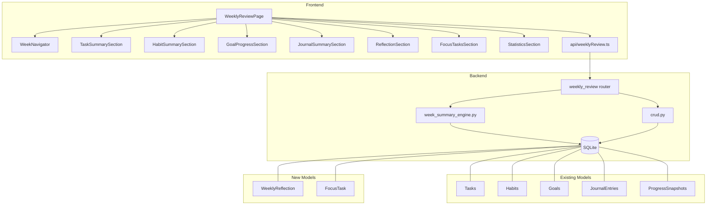

# Design Document: Weekly Review

## Overview

The Weekly Review feature adds a dedicated page to LifeOS where users can review their past week and plan the next one. It aggregates data from tasks, habits, goals, and journal entries into a single weekly summary view. Users can navigate between weeks, view statistics and trends, write reflections, and designate focus tasks for the upcoming week.

The feature introduces two new database models (`WeeklyReflection`, `FocusTask`), a backend `WeekSummaryEngine` service module, a new FastAPI router with endpoints for the weekly review data and CRUD operations, and a React `WeeklyReviewPage` with multiple sub-sections.

## Architecture



The frontend makes a single GET request to fetch the full weekly summary (tasks, habits, goals, journal, reflection, focus tasks, statistics). Mutations (reflection save, focus task add/remove, new task creation) use dedicated POST/PUT/DELETE endpoints. The `WeekSummaryEngine` is a pure service module that queries existing models and computes aggregated statistics — it does not own any models itself.

## Components and Interfaces

### Backend Components

#### 1. `WeekSummaryEngine` (`backend/week_summary_engine.py`)

A stateless service module with functions that accept a `db: Session`, `user_id: int`, and week boundary dates, then return computed summary dicts.

Key functions:
- `get_week_boundaries(week_identifier: str) -> tuple[date, date]` — Parses an ISO 8601 week string (e.g. "2025-W03") and returns `(monday, sunday)` dates.
- `get_current_week_identifier() -> str` — Returns the current week in "YYYY-Www" format.
- `compute_task_summary(db, user_id, monday, sunday) -> TaskSummaryData` — Queries tasks completed within the week, groups by day, computes completion rate.
- `compute_habit_summary(db, user_id, monday, sunday) -> HabitSummaryData` — Queries habit logs, computes adherence rates per habit considering frequency_type and repeat_days.
- `compute_goal_progress(db, user_id, monday, sunday) -> list[GoalProgressData]` — Uses ProgressSnapshot records to compute per-goal deltas for the week.
- `compute_journal_summary(db, user_id, monday, sunday) -> JournalSummaryData` — Queries journal entries, computes average mood.
- `compute_statistics(db, user_id, monday, sunday) -> StatisticsData` — Computes daily task counts, completion/habit rate comparisons with previous week, time tracking efficiency.
- `build_weekly_review(db, user_id, week_identifier) -> WeeklyReviewData` — Orchestrator that calls all compute functions and assembles the full response.

#### 2. Weekly Review Router (`backend/routers/weekly_review.py`)

Endpoints:
- `GET /users/{user_id}/weekly-review?week=2025-W03` — Returns full weekly review data. Defaults to current week if `week` is omitted.
- `PUT /users/{user_id}/weekly-review/{week}/reflection` — Create or update a weekly reflection.
- `POST /users/{user_id}/weekly-review/{week}/focus-tasks` — Add a focus task (body: `{task_id: int}`).
- `DELETE /users/{user_id}/weekly-review/{week}/focus-tasks/{task_id}` — Remove a focus task.
- `POST /users/{user_id}/weekly-review/{week}/focus-tasks/create` — Create a new task and auto-designate as focus task.

#### 3. CRUD additions (`backend/crud.py`)

New functions:
- `get_weekly_reflection(db, user_id, week_identifier) -> WeeklyReflection | None`
- `upsert_weekly_reflection(db, user_id, week_identifier, content) -> WeeklyReflection`
- `get_focus_tasks(db, user_id, week_identifier) -> list[FocusTask]`
- `add_focus_task(db, user_id, task_id, week_identifier) -> FocusTask`
- `remove_focus_task(db, user_id, task_id, week_identifier) -> None`
- `count_focus_tasks(db, user_id, week_identifier) -> int`

### Frontend Components

#### 1. `WeeklyReviewPage` (`frontend/src/pages/WeeklyReviewPage.tsx`)

Top-level page component. Manages the selected week state, fetches the weekly review data via the API, and renders all sub-sections.

#### 2. `WeekNavigator` (`frontend/src/components/weekly-review/WeekNavigator.tsx`)

Displays the current week identifier and date range (e.g. "2025-W03 · Jan 13 – Jan 19"). Previous/Next buttons. Next is disabled when on the current week.

#### 3. `TaskSummarySection`

Displays completed tasks grouped by day of the week. Each task shows title, priority badge, linked goal, and completion date.

#### 4. `HabitSummarySection`

Shows each active habit with adherence rate, streak count, and a 7-day status grid (Mon–Sun).

#### 5. `GoalProgressSection`

Lists active goals sorted by priority with current progress, weekly delta (positive/zero/negative indicator), and target date.

#### 6. `JournalSummarySection`

Lists journal entries from the week with date, mood indicator (1–5), and content preview (first 200 chars). Shows average mood. Prompt if no entries.

#### 7. `ReflectionSection`

Markdown editor (reuses existing `MarkdownEditor` component) for writing/editing the weekly reflection. Guided prompts displayed above the editor.

#### 8. `FocusTasksSection`

Allows selecting existing tasks as focus items (max 7). Shows current status of each focus task. Supports creating a new task inline.

#### 9. `StatisticsSection`

Bar chart of daily task completions (Mon–Sun). Summary cards for completion rate and habit adherence rate with week-over-week comparison. Time tracking efficiency card.

### Frontend API Layer (`frontend/src/api/weeklyReview.ts`)

```typescript
getWeeklyReview(userId: number, week?: string): Promise<WeeklyReviewData>
saveReflection(userId: number, week: string, content: string): Promise<WeeklyReflection>
addFocusTask(userId: number, week: string, taskId: number): Promise<FocusTask>
removeFocusTask(userId: number, week: string, taskId: number): Promise<void>
createFocusTask(userId: number, week: string, task: TaskCreate): Promise<FocusTask>
```


## Data Models

### New Database Models

#### `WeeklyReflection` (`backend/models.py`)

```python
class WeeklyReflection(Base):
    __tablename__ = "weekly_reflections"
    id = Column(Integer, primary_key=True, index=True)
    user_id = Column(Integer, ForeignKey("users.id"), nullable=False)
    week_identifier = Column(String, nullable=False)  # ISO 8601 format: "2025-W03"
    content = Column(Text, nullable=False, default="")
    created_at = Column(DateTime, default=datetime.utcnow)
    updated_at = Column(DateTime, default=datetime.utcnow, onupdate=datetime.utcnow)

    __table_args__ = (
        UniqueConstraint("user_id", "week_identifier", name="uq_reflection_user_week"),
    )

    user = relationship("User", back_populates="weekly_reflections")
```

#### `FocusTask` (`backend/models.py`)

```python
class FocusTask(Base):
    __tablename__ = "focus_tasks"
    id = Column(Integer, primary_key=True, index=True)
    user_id = Column(Integer, ForeignKey("users.id"), nullable=False)
    task_id = Column(Integer, ForeignKey("tasks.id"), nullable=False)
    week_identifier = Column(String, nullable=False)  # ISO 8601 format: "2025-W03"
    created_at = Column(DateTime, default=datetime.utcnow)

    __table_args__ = (
        UniqueConstraint("user_id", "task_id", "week_identifier", name="uq_focus_user_task_week"),
    )

    user = relationship("User", back_populates="focus_tasks")
    task = relationship("Task")
```

#### User model additions

Add relationships to the `User` model:
```python
weekly_reflections = relationship("WeeklyReflection", back_populates="user")
focus_tasks = relationship("FocusTask", back_populates="user")
```

### Pydantic Schemas (`backend/schemas.py`)

```python
class WeeklyReflectionIn(BaseModel):
    content: str

class WeeklyReflectionOut(BaseModel):
    id: int
    user_id: int
    week_identifier: str
    content: str
    created_at: datetime
    updated_at: datetime
    class Config:
        from_attributes = True

class FocusTaskIn(BaseModel):
    task_id: int

class FocusTaskOut(BaseModel):
    id: int
    user_id: int
    task_id: int
    week_identifier: str
    task_title: str
    task_status: str
    task_priority: str
    created_at: datetime
    class Config:
        from_attributes = True

class CompletedTaskOut(BaseModel):
    id: int
    title: str
    priority: str
    goal_title: Optional[str]
    completed_date: date

class HabitWeekSummary(BaseModel):
    habit_id: int
    title: str
    adherence_rate: float
    current_streak: int
    daily_status: dict[str, str]  # {"Mon": "Done", "Tue": "Missed", ...}

class GoalWeekProgress(BaseModel):
    goal_id: int
    title: str
    priority: str
    current_progress: int
    progress_delta: int
    target_date: Optional[date]

class JournalEntrySummary(BaseModel):
    id: int
    entry_date: date
    mood: Optional[int]
    content_preview: str

class DailyTaskCount(BaseModel):
    day: str  # "Mon", "Tue", etc.
    count: int

class WeekComparisonStats(BaseModel):
    completion_rate: float
    previous_completion_rate: float
    completion_rate_change: float
    habit_adherence_rate: float
    previous_habit_adherence_rate: float
    habit_adherence_rate_change: float
    total_estimated_minutes: int
    total_actual_minutes: int
    efficiency_ratio: float

class WeeklyReviewResponse(BaseModel):
    week_identifier: str
    week_start: date
    week_end: date
    completed_tasks: dict[str, list[CompletedTaskOut]]  # grouped by day name
    total_tasks: int
    completed_task_count: int
    completion_rate: float
    habits: list[HabitWeekSummary]
    overall_habit_adherence: float
    goals: list[GoalWeekProgress]
    journal_entries: list[JournalEntrySummary]
    average_mood: Optional[float]
    reflection: Optional[WeeklyReflectionOut]
    focus_tasks: list[FocusTaskOut]
    daily_task_counts: list[DailyTaskCount]
    comparison: WeekComparisonStats
```

### Frontend TypeScript Types (`frontend/src/types.ts`)

```typescript
interface WeeklyReflection {
  id: number;
  user_id: number;
  week_identifier: string;
  content: string;
  created_at: string;
  updated_at: string;
}

interface FocusTaskItem {
  id: number;
  user_id: number;
  task_id: number;
  week_identifier: string;
  task_title: string;
  task_status: string;
  task_priority: string;
  created_at: string;
}

interface CompletedTaskItem {
  id: number;
  title: string;
  priority: string;
  goal_title: string | null;
  completed_date: string;
}

interface HabitWeekSummary {
  habit_id: number;
  title: string;
  adherence_rate: number;
  current_streak: number;
  daily_status: Record<string, string>;
}

interface GoalWeekProgress {
  goal_id: number;
  title: string;
  priority: string;
  current_progress: number;
  progress_delta: number;
  target_date: string | null;
}

interface JournalEntrySummary {
  id: number;
  entry_date: string;
  mood: number | null;
  content_preview: string;
}

interface DailyTaskCount {
  day: string;
  count: number;
}

interface WeekComparisonStats {
  completion_rate: number;
  previous_completion_rate: number;
  completion_rate_change: number;
  habit_adherence_rate: number;
  previous_habit_adherence_rate: number;
  habit_adherence_rate_change: number;
  total_estimated_minutes: number;
  total_actual_minutes: number;
  efficiency_ratio: number;
}

interface WeeklyReviewData {
  week_identifier: string;
  week_start: string;
  week_end: string;
  completed_tasks: Record<string, CompletedTaskItem[]>;
  total_tasks: number;
  completed_task_count: number;
  completion_rate: number;
  habits: HabitWeekSummary[];
  overall_habit_adherence: number;
  goals: GoalWeekProgress[];
  journal_entries: JournalEntrySummary[];
  average_mood: number | null;
  reflection: WeeklyReflection | null;
  focus_tasks: FocusTaskItem[];
  daily_task_counts: DailyTaskCount[];
  comparison: WeekComparisonStats;
}
```


## Correctness Properties

*A property is a characteristic or behavior that should hold true across all valid executions of a system — essentially, a formal statement about what the system should do. Properties serve as the bridge between human-readable specifications and machine-verifiable correctness guarantees.*

### Property 1: Week boundary filtering

*For any* user and any week boundary (Monday–Sunday), the summary engine shall only include tasks, habit logs, and journal entries whose dates fall within that boundary. No record with a date outside the boundary shall appear in the summary output.

**Validates: Requirements 1.1, 1.2, 3.1**

### Property 2: Goal progress delta computation

*For any* goal with ProgressSnapshot records, the progress delta for a given week shall equal the progress value of the latest snapshot on or before Sunday minus the progress value of the latest snapshot on or before the previous Sunday. If no snapshot exists before the week, the start progress shall be 0.

**Validates: Requirements 1.3**

### Property 3: Week navigation round-trip

*For any* valid week identifier, navigating to the previous week and then to the next week shall return the original week identifier. Similarly, navigating next then previous shall return the original.

**Validates: Requirements 2.2, 2.3**

### Property 4: Week identifier to date range mapping

*For any* valid ISO 8601 week identifier, `get_week_boundaries` shall return a Monday and a Sunday that are exactly 6 days apart, where the Monday falls in the correct ISO week, and the returned dates are consistent with the week identifier.

**Validates: Requirements 2.4**

### Property 5: Completed tasks grouped by correct day

*For any* set of completed tasks within a week, each task shall appear in the day-of-week group that matches its completion date's weekday. The union of all day groups shall equal the full set of completed tasks (no duplicates, no omissions).

**Validates: Requirements 3.3**

### Property 6: Habit adherence rate computation

*For any* active habit and any week, the adherence rate shall equal the number of "Done" logs within the week divided by the expected completions. For daily habits, expected completions shall be 7. For habits with repeat_days, expected completions shall equal the count of configured days that fall within the week boundary.

**Validates: Requirements 4.2, 4.3, 4.4**

### Property 7: Goals sorted by priority

*For any* list of goals returned in the weekly review, the goals shall be sorted by priority in the order High, Medium, Low. No goal with a lower priority shall appear before a goal with a higher priority.

**Validates: Requirements 5.4**

### Property 8: Journal content preview truncation

*For any* journal entry, the content preview shall be at most 200 characters long and shall be a prefix of the original content. If the original content is 200 characters or fewer, the preview shall equal the original content.

**Validates: Requirements 6.1**

### Property 9: Average mood computation

*For any* set of journal entries with mood ratings within a week, the computed average mood shall equal the arithmetic mean of all non-null mood values. If no entries have mood ratings, the average mood shall be null.

**Validates: Requirements 6.3**

### Property 10: Reflection persistence round-trip

*For any* user, week identifier, and reflection content string, saving a reflection via the PUT endpoint and then retrieving it via the GET weekly review endpoint shall return the same content. Saving a second time with different content shall return the updated content (upsert behavior), and at most one reflection record shall exist per user-week combination.

**Validates: Requirements 7.3, 7.4, 7.5, 11.3, 11.4, 11.5**

### Property 11: Focus task add/remove round-trip

*For any* user, valid task, and week identifier, adding a focus task and then querying focus tasks shall include that task. Subsequently removing the focus task and querying shall not include that task. Adding the same task twice for the same week shall not create a duplicate.

**Validates: Requirements 8.2, 8.4, 12.6**

### Property 12: Focus task maximum limit invariant

*For any* user and week, the system shall never allow more than 7 focus tasks. After 7 focus tasks have been added, any additional add request shall be rejected with an HTTP 400 response, and the count shall remain at 7.

**Validates: Requirements 8.3, 12.4**

### Property 13: Focus task reflects current task status

*For any* focus task returned in the weekly review, the `task_status` field shall match the current status of the linked task in the tasks table.

**Validates: Requirements 8.5**

### Property 14: Daily task counts sum to total completed

*For any* weekly summary, the sum of all daily task completion counts (Monday through Sunday) shall equal the total completed task count reported in the summary.

**Validates: Requirements 9.1**

### Property 15: Week-over-week comparison change calculation

*For any* weekly summary with comparison statistics, the `completion_rate_change` shall equal `completion_rate - previous_completion_rate`, and the `habit_adherence_rate_change` shall equal `habit_adherence_rate - previous_habit_adherence_rate`.

**Validates: Requirements 9.2, 9.3, 9.4**

### Property 16: Time tracking efficiency computation

*For any* set of completed tasks with estimated and actual minutes within a week, `total_estimated_minutes` shall equal the sum of all estimated_minutes values, `total_actual_minutes` shall equal the sum of all actual_minutes values, and `efficiency_ratio` shall equal `total_actual_minutes / total_estimated_minutes` (or 0 if total_estimated is 0).

**Validates: Requirements 9.5**

### Property 17: Invalid week identifier validation

*For any* string that does not match the ISO 8601 week format `YYYY-Www` (where ww is 01–53), the GET weekly review endpoint shall return an HTTP 422 response.

**Validates: Requirements 10.3**

### Property 18: Non-existent task rejection for focus tasks

*For any* task_id that does not exist in the tasks table, the POST focus task endpoint shall return an HTTP 404 response and shall not create a focus task record.

**Validates: Requirements 12.5**


## Error Handling

### Backend Error Handling

| Scenario | HTTP Status | Response |
|---|---|---|
| User not found | 404 | `{"detail": "User not found"}` |
| Invalid week identifier format | 422 | `{"detail": "Invalid week format. Expected YYYY-Www (e.g. 2025-W03)"}` |
| Focus task limit exceeded (>7) | 400 | `{"detail": "Maximum of 7 focus tasks per week reached"}` |
| Task not found (focus task add) | 404 | `{"detail": "Task not found"}` |
| Focus task not found (delete) | 404 | `{"detail": "Focus task not found for this week"}` |
| Duplicate focus task | 409 | `{"detail": "Task is already a focus task for this week"}` |
| Empty reflection content | 422 | Pydantic validation error |
| Database error | 500 | `{"detail": "Internal server error"}` |

### Frontend Error Handling

- API errors are caught and displayed via toast notifications or inline error messages.
- Loading states are shown while fetching weekly review data.
- If the weekly review API returns an error, the page displays a retry prompt.
- Optimistic updates for focus task add/remove with rollback on failure.
- The reflection editor auto-saves on blur with debounce (500ms) to prevent data loss.

### Week Identifier Validation

The `get_week_boundaries` function validates the week identifier format using a regex pattern `^\d{4}-W(0[1-9]|[1-4]\d|5[0-3])$` and raises a `ValueError` for invalid formats. The router catches this and returns HTTP 422.

## Testing Strategy

### Property-Based Testing

Library: **Hypothesis** (Python) for backend property tests, **fast-check** (TypeScript) for frontend utility property tests.

Each property test must:
- Run a minimum of 100 iterations
- Reference the design property it validates via a comment tag
- Use the format: `# Feature: weekly-review, Property {N}: {title}`

Property tests cover:
- Week boundary filtering logic (Property 1)
- Goal progress delta computation (Property 2)
- Week navigation round-trip (Property 3)
- Week identifier to date range mapping (Property 4)
- Task grouping by day (Property 5)
- Habit adherence rate formula (Property 6)
- Goal priority sorting (Property 7)
- Journal content preview truncation (Property 8)
- Average mood computation (Property 9)
- Reflection persistence round-trip (Property 10)
- Focus task add/remove round-trip (Property 11)
- Focus task max-7 invariant (Property 12)
- Focus task status reflection (Property 13)
- Daily task count sum invariant (Property 14)
- Week-over-week comparison math (Property 15)
- Time tracking efficiency math (Property 16)
- Invalid week identifier rejection (Property 17)
- Non-existent task rejection (Property 18)

### Unit Testing

Unit tests complement property tests by covering specific examples and edge cases:

- **Edge cases**: Empty week (no data), week with only one type of data (e.g. tasks but no habits), habits with no logs, goals with no snapshots
- **Boundary cases**: First week of year (W01), last week of year (W52/W53), year boundary crossing
- **Integration tests**: Full API endpoint tests using FastAPI TestClient verifying the complete request/response cycle
- **Frontend component tests**: React Testing Library tests for WeekNavigator (disabled next button on current week), ReflectionSection (markdown editor integration), FocusTasksSection (max 7 enforcement in UI)

### Test File Organization

```
backend/tests/
  test_week_summary_engine.py      # Property + unit tests for computation logic
  test_weekly_review_api.py        # API endpoint integration tests
frontend/src/utils/__tests__/
  weekUtils.test.ts                # Property + unit tests for week navigation utilities
```
