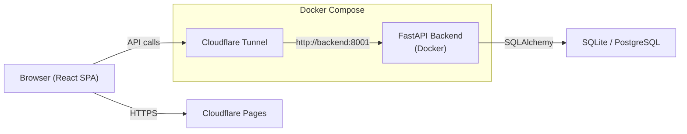
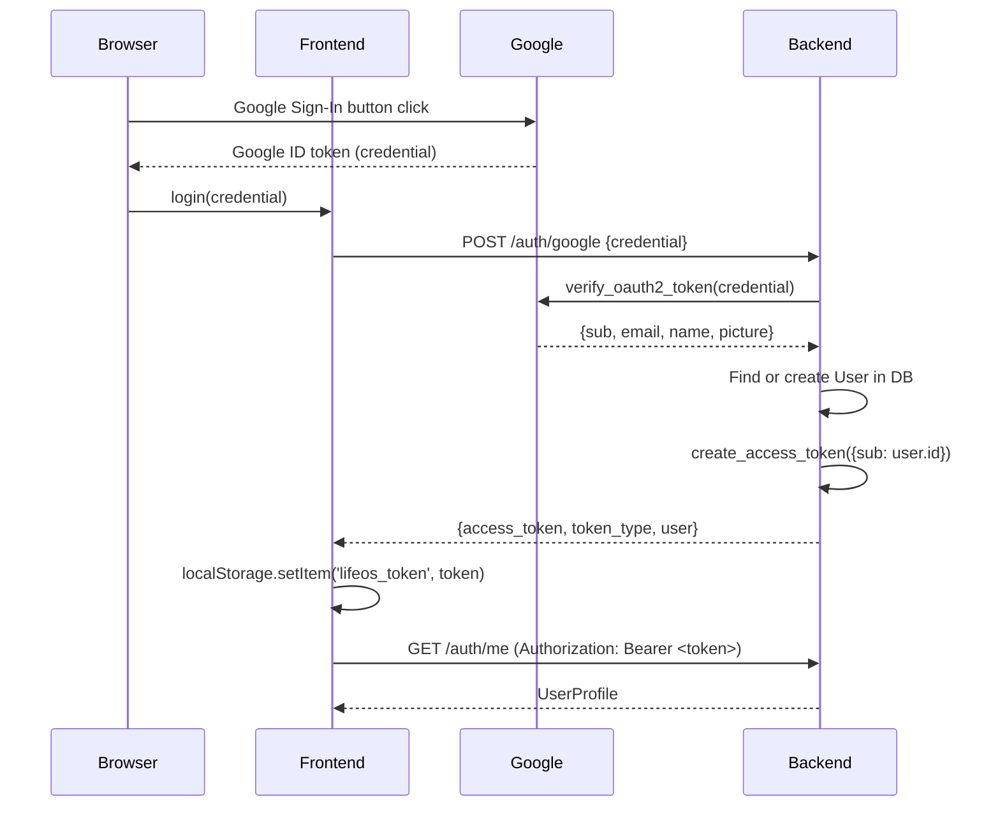
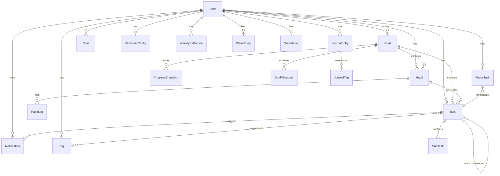
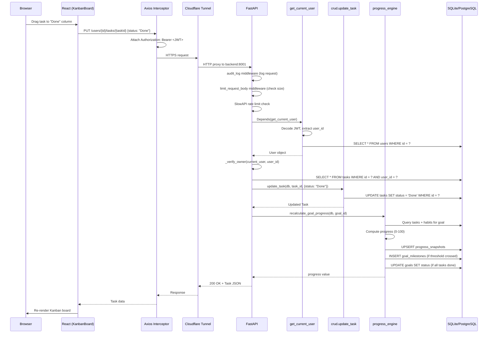

# LifeOS — Code Walkthrough

## High-Level Architecture

LifeOS is a full-stack personal management app. The frontend is a React SPA deployed to Cloudflare Pages. The backend is a FastAPI Python app running in Docker, exposed to the internet exclusively through a Cloudflare Tunnel (no open inbound ports).



The frontend is served as static files from Cloudflare Pages (`wrangler.toml` → `pages_build_output_dir = "./dist"`). API requests go through a Cloudflare Tunnel container (`cloudflared`) that proxies to the backend container on the internal Docker network.

---

## Backend Structure

### Entry Point: `backend/main.py`

The FastAPI app is created and configured in `main.py`. The startup sequence:

1. **Database tables** are created via `models.Base.metadata.create_all(bind=engine)`.
2. **Rate limiting** is attached using `slowapi`:
   ```python
   app.state.limiter = limiter
   app.add_exception_handler(RateLimitExceeded, rate_limit_exceeded_handler)
   app.add_middleware(SlowAPIMiddleware)
   ```
3. **Custom middleware** is registered (order matters — last added runs first):
   - `limit_request_body` — rejects requests with `Content-Length` > 1 MB (configurable via `MAX_REQUEST_BODY_BYTES` env var).
   - `audit_log` — logs every request's method, path, and client IP.
4. **16 routers** are registered covering all domains:
   ```python
   app.include_router(auth.router)       # /auth
   app.include_router(users.router)      # /users
   app.include_router(dashboard.router)  # /users/{user_id}/dashboard
   app.include_router(goals.router)      # /users/{user_id}/goals
   app.include_router(habits.router)     # /users/{user_id}/habits
   app.include_router(tasks.router)      # /users/{user_id}/tasks
   app.include_router(journal.router)    # /users/{user_id}/journal
   app.include_router(notes.router)      # /users/{user_id}/notes
   app.include_router(analytics.router)  # /analytics
   app.include_router(sync.router)       # /sync
   app.include_router(notifications.router) # /users/{user_id}/notifications
   app.include_router(tags.router)       # /users/{user_id}/tags
   app.include_router(weekly_review.router) # /users/{user_id}/weekly-review
   app.include_router(export.router)     # /users/{user_id}/export
   app.include_router(water.router)      # /api/water
   ```
5. **CORS** is configured last (runs first in the middleware stack):
   ```python
   CORS_ORIGINS = os.environ.get("CORS_ORIGINS", _default_origins).split(",")
   app.add_middleware(CORSMiddleware, allow_origins=[...], allow_credentials=True, ...)
   ```

### Dependency Injection Pattern

FastAPI's `Depends()` is used throughout for two core dependencies:

- **`get_db`** (from `database.py`) — yields a SQLAlchemy `Session`, auto-closes on request completion.
- **`get_current_user`** (from `auth.py`) — extracts the JWT from the `Authorization: Bearer <token>` header, decodes it, and returns the `User` ORM object. Raises `401` if invalid.

Every protected endpoint declares both:
```python
def create_goal(
    db: Session = Depends(get_db),
    current_user: models.User = Depends(get_current_user),
):
```

Additionally, most user-scoped routers include a `_verify_owner()` helper that compares `current_user.id` against the `user_id` path parameter, raising `403` if they don't match.

---

## Authentication Flow

### Step-by-Step: Google OAuth → JWT



1. **Google Sign-In**: The browser triggers Google's OAuth flow. Google returns an ID token (JWT signed by Google).

2. **Token exchange** (`POST /auth/google`): The backend calls `verify_google_token()` which uses `google.oauth2.id_token.verify_oauth2_token()` to validate the token against `GOOGLE_CLIENT_ID`. Returns user info (`sub`, `email`, `name`, `picture`).

3. **User resolution** (`auth.py` → `routers/auth.py`): Looks up user by `google_id` first, then by `email`. Creates a new user if neither exists. Links existing email accounts to Google on first OAuth login.

4. **JWT creation** (`auth.py:create_access_token`): Creates a HS256-signed JWT with `{"sub": str(user.id), "exp": now + 7 days}` using `JWT_SECRET_KEY`.

5. **Token storage**: The frontend stores the token in `localStorage` under `lifeos_token`.

6. **Request interceptor** (`AuthContext.tsx`): An Axios request interceptor attaches the token to every API call:
   ```typescript
   api.interceptors.request.use((config) => {
     const token = localStorage.getItem('lifeos_token');
     if (token) config.headers.Authorization = `Bearer ${token}`;
     return config;
   });
   ```

7. **Token validation** (`auth.py:get_current_user`): On each protected request, decodes the JWT, extracts `sub` (user ID), and queries the database for the user. Returns `401` if the token is invalid, expired, or the user doesn't exist.

---

## Data Layer

### Models (`backend/models.py`)

The database schema has 15 tables with the following entity relationships:



Key design decisions:
- **P.A.R.A. system**: Goals use `category` (Project, Area, Resource, Archive) following the PARA methodology. Notes also use a `folder` field with the same categories.
- **Habit-Task sync**: Creating a habit auto-creates a linked `Task` with `task_type="habit"`. The `sync_habit_tasks()` function ensures each habit has a current-period task.
- **Recurring tasks**: Tasks with `task_type="recurring"` and `parent_task_id=None` are templates. Instances are child tasks with `parent_task_id` pointing to the template.
- **Progress tracking**: `ProgressSnapshot` stores daily progress values per goal. `GoalMilestone` records when 25/50/75/100% thresholds are crossed.
- **Many-to-many tags**: The `task_tags` association table links tasks to user-scoped tags.

### Database Connection (`backend/database.py`)

```python
DATABASE_URL = os.environ.get("DATABASE_URL", "sqlite:///./lifeos.db")
engine = create_engine(DATABASE_URL, connect_args={"check_same_thread": False} if sqlite else {})
SessionLocal = sessionmaker(autocommit=False, autoflush=False, bind=engine)
```

- Defaults to SQLite for local development.
- Supports PostgreSQL via `DATABASE_URL` env var (used in production with Supabase).
- `check_same_thread=False` is only applied for SQLite to avoid threading issues with FastAPI's async workers.
- `get_db()` is a generator dependency that yields a session and closes it in `finally`.

### CRUD Patterns (`backend/crud.py`)

The CRUD layer follows consistent patterns:

- **Create**: `model_dump()` → ORM constructor → `db.add()` → `db.commit()` → `db.refresh()`.
- **Read**: `db.query(Model).filter(Model.user_id == user_id)` — always scoped to user.
- **Update**: `model_dump(exclude_unset=True)` → `setattr()` loop → `db.commit()`.
- **Delete**: Query → `db.delete()` → `db.commit()`.

Notable patterns:
- **Habit streak recalculation** (`recalculate_habit_streak`): Walks backwards from today through scheduled days, counting consecutive "Done" logs. Handles different frequency types (daily, weekly, custom) with weekday mapping.
- **Recurring task sync** (`sync_recurring_tasks`): Checks end conditions (date/occurrence limits), determines current period boundaries per frequency type, and creates instances only when none exist for the current period.
- **Tag resolution** (`_resolve_tag_ids`): Validates all tag IDs belong to the requesting user before assignment, preventing cross-user tag injection.

---

## Business Logic Engines

### Progress Engine (`backend/progress_engine.py`)

Computes goal progress as a weighted average of two components:
- **Task completion ratio**: `done_tasks / total_tasks × 100`
- **Habit success rate**: For each linked habit, `done_logs / expected_completions × 100` (clamped to 100%)

The engine also manages side effects via `recalculate_goal_progress()`:
1. Computes progress (0–100 integer).
2. **Upserts a daily snapshot** (`_upsert_snapshot`) — one `ProgressSnapshot` per goal per day, skips if unchanged.
3. **Checks milestones** (`_check_milestones`) — records `GoalMilestone` entries when 25%, 50%, 75%, or 100% thresholds are first crossed.
4. **Auto-completes goals** (`_check_auto_complete`) — sets goal status to "Completed" when all linked tasks are Done; reverts to "Active" if not. Never overrides "Archived" status.

`batch_compute_progress()` uses `joinedload` to efficiently compute progress for multiple goals in a single query batch.

### Export Engine (`backend/export_engine.py`)

Handles data serialization and file building for user data exports:

- **`query_export_data()`**: Queries requested data types (tasks, goals, habits, journal, notes) with optional date filtering. Uses `joinedload` for related data (subtasks, tags, logs).
- **Serializers**: `serialize_tasks()`, `serialize_goals()`, `serialize_habits()`, `serialize_journal()`, `serialize_notes()` — convert ORM objects to plain dicts. Tasks include subtasks and tag names. Goals include computed progress.
- **Output formats**:
  - `build_json_export()` — JSON with metadata envelope (exported_at, user_id, format).
  - `build_csv_single()` — Single CSV with UTF-8 BOM prefix for Excel compatibility.
  - `build_csv_zip()` — ZIP archive with one CSV per data type when multiple types are requested.

### Week Summary Engine (`backend/week_summary_engine.py`)

Orchestrates the weekly review feature. The main entry point is `build_weekly_review()` which calls:

1. **`compute_task_summary()`** — Groups completed tasks by day of week (Mon–Sun), computes completion rate.
2. **`compute_habit_summary()`** — Builds a day-by-day status grid per habit (Done/Missed/N/A), computes per-habit adherence rate and overall average.
3. **`compute_goal_progress()`** — Uses `ProgressSnapshot` records to compute per-goal progress deltas (current week vs previous week).
4. **`compute_journal_summary()`** — Fetches journal entries for the week, computes average mood, truncates content previews to 200 chars.
5. **`compute_statistics()`** — Computes daily task counts, week-over-week comparison rates, and time tracking efficiency (actual vs estimated minutes).

Week identifiers use ISO 8601 format (`YYYY-Www`, e.g., `2025-W03`). The `get_week_boundaries()` function parses these into Monday–Sunday date ranges.

---

## Frontend Architecture

### Routing (`frontend/src/App.tsx`)

The app uses React Router v6 with a nested layout pattern:

```
<AuthProvider>
  <ThemeProvider>
    <BrowserRouter>
      /login          → LoginPage (public)
      / (protected)   → Layout wrapper
        /             → Dashboard
        /goals        → GoalsPage
        /tasks        → KanbanBoard
        /habits       → HabitsPage
        /journal      → JournalPage
        /vault        → VaultPage (notes)
        /analytics    → AnalyticsPage
        /profile      → ProfilePage
        /weekly-review → WeeklyReviewPage
        /export       → ExportPage
        /hydration    → HydrationPage
```

All routes except `/login` are wrapped in `<ProtectedRoute>` which checks authentication status and redirects to login if needed.

### Auth Context (`frontend/src/contexts/AuthContext.tsx`)

The `AuthProvider` manages authentication state:

- **State**: `user` (User object or null), `isLoading` (boolean).
- **On mount**: Checks `localStorage` for `lifeos_token`, calls `GET /auth/me` to validate. Clears token if invalid.
- **`login(credential)`**: Posts Google credential to `POST /auth/google`, stores returned JWT in `localStorage`, sets user state.
- **`logout()`**: Removes token from `localStorage`, clears user state.
- **Axios interceptor**: Automatically attaches `Authorization: Bearer <token>` to every outgoing request.

### API Layer (`frontend/src/api/config.ts`)

A configured Axios instance with:
```typescript
export const api = axios.create({
  baseURL: import.meta.env.VITE_API_URL || 'http://localhost:8001',
  headers: { 'Content-Type': 'application/json' },
});
```

Domain-specific API modules (`api/water.ts`, `api/weeklyReview.ts`, `api/index.ts`) import this instance and export typed functions for each endpoint.

### Component Organization

```
frontend/src/
├── api/            # Axios instance + domain API modules
├── assets/         # Static images
├── components/     # Reusable UI components
│   ├── Layout.tsx          # App shell (sidebar + content area)
│   ├── Sidebar.tsx         # Navigation sidebar
│   ├── ProtectedRoute.tsx  # Auth guard wrapper
│   ├── NotificationCenter.tsx
│   ├── HydrationWidget.tsx
│   ├── MarkdownEditor.tsx
│   ├── TagSelector.tsx / TagChip.tsx
│   ├── PriorityBadge.tsx
│   ├── ProgressBar.tsx
│   └── ConfirmModal.tsx
├── contexts/       # React contexts (Auth, Theme)
└── pages/          # Route-level page components
    ├── Dashboard.tsx
    ├── GoalsPage.tsx
    ├── KanbanBoard.tsx
    ├── HabitsPage.tsx
    ├── JournalPage.tsx
    ├── VaultPage.tsx
    ├── AnalyticsPage.tsx
    ├── WeeklyReviewPage.tsx
    ├── ExportPage.tsx
    ├── HydrationPage.tsx
    ├── ProfilePage.tsx
    └── LoginPage.tsx
```

---

## Request Lifecycle

Tracing a complete request: **User marks a task as Done**.



Key observations:
- The middleware stack runs in reverse registration order: CORS → audit_log → limit_request_body → SlowAPI.
- `get_current_user` is resolved before any route logic via FastAPI's dependency injection.
- Goal progress recalculation is triggered as a side effect only when a task's status changes and the task is linked to a goal.
- The entire flow is synchronous (no async DB operations) — FastAPI runs the sync handlers in a thread pool.
