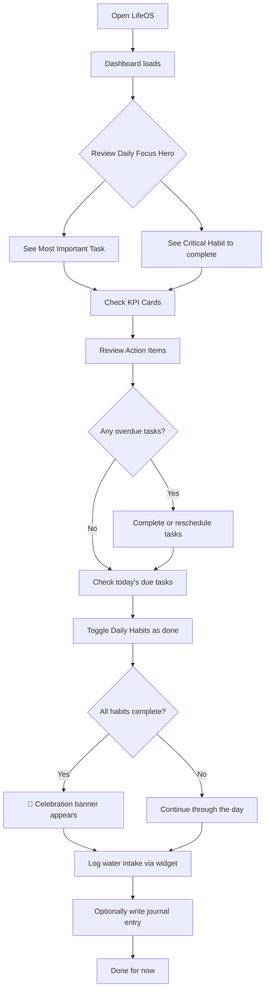
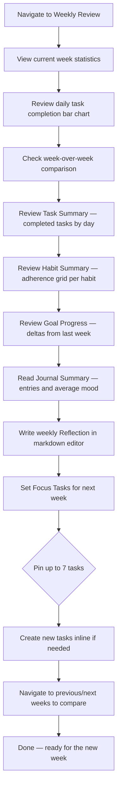
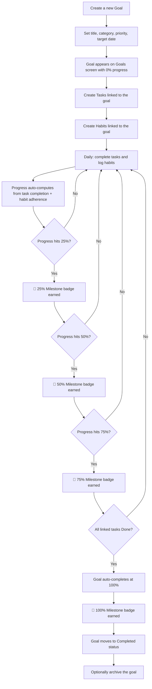
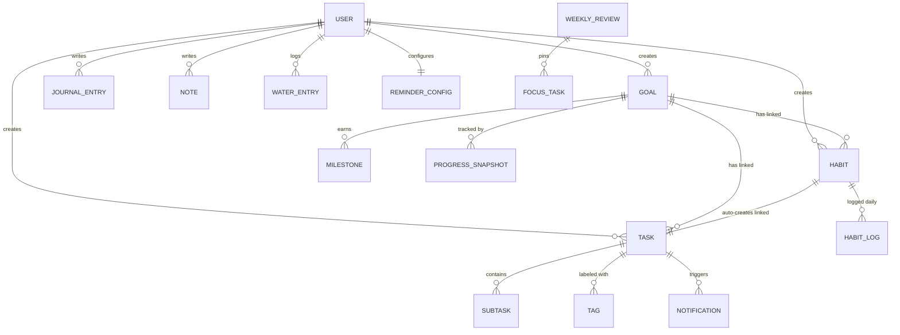
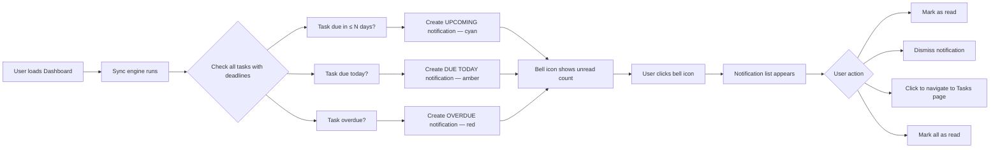

# LifeOS — Product Guide

> The definitive product reference for Product Managers, Designers, and Business Stakeholders.
> Last updated: 2025

---

## Table of Contents

1. [Product Overview](#1-product-overview)
2. [Feature Map](#2-feature-map)
3. [User Journeys](#3-user-journeys)
4. [Feature Deep Dives](#4-feature-deep-dives)
5. [Data Relationships](#5-data-relationships)
6. [Notification & Reminder System](#6-notification--reminder-system)
7. [Analytics & Gamification](#7-analytics--gamification)
8. [Export & Data Portability](#8-export--data-portability)
9. [Personalization](#9-personalization)
10. [Glossary](#10-glossary)

---

## 1. Product Overview

LifeOS is a personal management application designed to help individuals organize their goals, habits, tasks, journal entries, and knowledge in one unified workspace. It follows the **P.A.R.A. methodology** — Projects, Areas, Resources, and Archive — giving users a proven framework for categorizing everything in their life from deadline-driven projects to ongoing responsibilities and reference material.

The application is built for anyone who wants a structured, data-driven approach to personal productivity. Whether you are a student tracking study habits, a professional managing career goals, or someone building healthier daily routines, LifeOS provides the tools to plan, execute, and reflect. The target audience ranges from productivity enthusiasts to anyone seeking a single place to manage the many dimensions of their personal and professional life.

The core value proposition is **connected productivity**. Unlike standalone to-do apps or habit trackers, LifeOS links goals to habits and tasks, automatically computes progress, tracks streaks, and surfaces insights through analytics and weekly reviews. Users don't just check boxes — they see how daily actions compound into meaningful progress toward their bigger life goals. The dashboard, weekly review, and analytics screens close the feedback loop, turning raw activity into actionable self-awareness.

---

## 2. Feature Map

| Feature | Screen | Description | Key Metrics / Data |
|---|---|---|---|
| Authentication | Login | One-click Google sign-in with secure session management | Session duration: 7 days |
| Dashboard | Home | Personalized command center with KPIs, daily focus, habits, and action items | Active Streaks, Avg Goal Progress %, Upcoming Deadlines, Overdue Tasks, Task Efficiency |
| Goals | Goals | Life goals organized by P.A.R.A. categories with auto-computed progress | Progress 0–100%, Milestones at 25/50/75/100%, Priority levels |
| Tasks | Kanban Board | Visual task management with drag-and-drop, recurring tasks, and subtasks | Completion rates (daily/monthly/annual), Timeframe views, Energy levels |
| Habits | Habits | Recurring habit tracking with streaks, heatmaps, and goal linking | Streak count, Adherence %, Habit Strength badge |
| Journal | Journal | Daily markdown journal with mood tracking and writing prompts | Mood score (1–5), Entry count |
| Vault | Vault | Knowledge base organized by P.A.R.A. folders with markdown notes | Note count per folder |
| Weekly Review | Weekly Review | Structured weekly reflection with statistics, summaries, and focus tasks | Week-over-week completion rate, Habit adherence, Average mood |
| Analytics | Analytics | Growth scoring, leaderboard ranking, and year-in-pixels visualization | Growth Score (0–100), Category scores, 365-day heatmap |
| Hydration | Hydration | Daily water intake tracking with quick-add and history | Daily intake vs goal (ml), 7-day history |
| Notifications | Header (global) | Task deadline alerts with configurable reminders | Unread count, 3 urgency types |
| Data Export | Export | Full data export in JSON or CSV format | Supports 5 data types with optional date filtering |
| Profile & Settings | Profile | Account info, theme preference, and reminder configuration | Theme choice, Reminder preferences |

---

## 3. User Journeys

### Journey 1: The Daily Routine

This is the most common flow — what a user does when they open LifeOS each day.

**Step-by-step:**

1. The user opens LifeOS and lands on the **Dashboard**.
2. A personalized greeting appears ("Good morning, Alex") along with the **Daily Focus Hero**, which highlights the single most important task (the first due or overdue task) and the critical habit (the highest-streak habit not yet completed today).
3. The user scans the **KPI Cards** — active streaks, average goal progress, upcoming deadlines, and overdue task count — to get a pulse on their overall status.
4. They scroll to **Action Items** to see tasks that are due today or overdue, completing them directly with the inline complete button.
5. In the **Daily Habits** checklist, they toggle each habit as done or missed. Streak counters update in real time. When all habits are marked done, a celebration banner appears.
6. They use the **Hydration Widget** to log water intake with the quick-add 250ml button.
7. Optionally, they navigate to the **Journal** to write a daily entry and log their mood.

---

### Journey 2: The Weekly Review

This flow happens once a week, typically on Sunday or Monday, to reflect and plan ahead.

**Step-by-step:**

1. The user navigates to the **Weekly Review** screen and sees the current ISO week.
2. The **Statistics** section shows a daily task completion bar chart and week-over-week comparisons: how completion rate, habit adherence, and time efficiency changed versus the prior week.
3. **Task Summary** lists all completed tasks grouped by day of the week, with an overall completion rate.
4. **Habit Summary** displays a per-habit adherence grid showing Done, Missed, or N/A for each day, plus an overall adherence rate.
5. **Goal Progress** shows each goal's progress delta — how much it moved compared to the previous week — along with priority and target date.
6. **Journal Summary** surfaces all journal entries for the week with mood emojis and content previews, plus the average mood.
7. The user writes a **Reflection** in the markdown editor. This reflection is saved and tied to the specific week.
8. Finally, they set **Focus Tasks** for the upcoming week by pinning up to 7 tasks (or creating new ones inline).

---

### Journey 3: Goal Tracking (Creating and Achieving a Goal)

This flow covers the full lifecycle of a goal from creation to completion.

**Step-by-step:**

1. The user navigates to the **Goals** screen and creates a new goal, choosing a P.A.R.A. category (e.g., "Project"), setting a priority (High/Medium/Low), and optionally a target date.
2. The goal appears with 0% progress. The user then creates **Tasks** on the Kanban Board and links them to this goal. They also create **Habits** and link them to the goal.
3. Each day, as the user completes linked tasks and logs linked habits, the goal's **progress automatically recalculates** based on the ratio of completed tasks and habit adherence.
4. As progress crosses key thresholds, **Milestone badges** are automatically awarded at 25%, 50%, 75%, and 100%.
5. The goal's **Detail View** shows all linked habits (with their streaks), linked tasks (with their statuses), the milestones timeline, and a progress history chart built from daily snapshots.
6. When all linked tasks reach "Done" status, the goal **automatically transitions to "Completed"**.
7. The user can then archive the goal, moving it to the Archive category for historical reference.

---

## 4. Feature Deep Dives

### 4.1 Authentication & Onboarding

**What it does:**
Provides secure, frictionless sign-in using the user's existing Google account. No passwords to remember, no registration forms to fill out.

**How users interact:**
- Users click a single "Sign in with Google" button on the login screen.
- Google handles identity verification and returns the user to LifeOS.
- After sign-in, the user is automatically redirected to the Dashboard.

**Key behaviors and rules:**
- Sessions last 7 days before requiring re-authentication.
- The session is managed via a secure JWT (JSON Web Token) — users stay logged in across browser sessions within the 7-day window.
- The Profile page displays account information: display name, email, member-since date, and authentication method (Google).

**Relationships to other features:**
- All features require authentication — there is no anonymous access.
- User identity is tied to all data (goals, tasks, habits, journal entries, notes, hydration logs).

---

### 4.2 Dashboard (Home Screen)

**What it does:**
The Dashboard is the user's command center — a single screen that surfaces the most important information and actions for the day.

**How users interact:**
- This is the default landing page after login.
- Users scan KPIs, complete tasks, toggle habits, and log water — all without leaving the screen.

**Key behaviors and rules:**

| Component | Behavior |
|---|---|
| Personalized Greeting | Displays "Good morning/afternoon/evening, {name}" based on time of day |
| Daily Focus Hero | Highlights the single Most Important Task (first due or overdue task) and the Critical Habit (highest-streak habit not yet done today) |
| KPI Cards | Four cards: Active Streaks count, Average Goal Progress %, Upcoming Deadlines count, Overdue Tasks count |
| Task Efficiency Carousel | Auto-rotating display of daily, monthly, and annual task completion rates with a circular progress chart |
| Active Goals | Top 3 goals with progress bars, priority badges, and P.A.R.A. category color coding |
| Hydration Widget | Shows daily water intake progress with a quick-add 250ml button |
| Daily Habits | Checklist of today's habits with toggle (done/missed) and streak counters |
| Action Items | Due and overdue tasks with complete button, priority badges, and deadline indicators (overdue in red, due today in amber) |
| Celebration Banner | Appears when all daily habits are marked complete |

**Relationships to other features:**
- Pulls data from Goals, Tasks, Habits, Hydration, and Notifications.
- Completing tasks or toggling habits on the Dashboard updates those features in real time.
- The Hydration Widget links to the full Hydration Tracker screen.

---

### 4.3 Goals

**What it does:**
Goals represent the big-picture outcomes a user is working toward. They are organized using the P.A.R.A. methodology and automatically track progress based on linked tasks and habits.

**How users interact:**
- Create goals with a title, P.A.R.A. category, priority, and optional target date.
- View all goals with category filter tabs for quick filtering.
- Click into a goal's Detail View to see linked habits, linked tasks, milestones, and progress history.

**Key behaviors and rules:**

| Property | Details |
|---|---|
| P.A.R.A. Categories | **Project** (deadline-driven work), **Area** (ongoing responsibility), **Resource** (learning/reference material), **Archive** (completed or paused) |
| Priority Levels | High (red), Medium (amber), Low (green) |
| Status | Active, Completed, Archived |
| Progress | Auto-computed 0–100% based on linked task completion + linked habit adherence |
| Milestones | Automatic badges awarded at 25%, 50%, 75%, and 100% progress thresholds |
| Progress History | Daily snapshots stored for trend visualization over time |
| Auto-Complete | When all linked tasks reach "Done" status, the goal automatically transitions to "Completed" |

**Relationships to other features:**
- Goals are the parent entity that ties together Tasks and Habits.
- Progress is driven by activity in Tasks (completion) and Habits (adherence).
- Goals appear on the Dashboard (top 3), in Weekly Review (progress deltas), and in Analytics (goal rate score).

---

### 4.4 Tasks (Kanban Board)

**What it does:**
A visual task management system using a Kanban board layout with four columns. Supports recurring tasks, subtasks, tags, energy levels, and goal linking.

**How users interact:**
- View tasks in a 4-column Kanban board: Todo, In Progress, Done, Archived.
- Drag and drop tasks between columns or reorder within a column.
- Switch between timeframe views: Daily, Weekly, Monthly, Annual, or All — with date picker navigation.
- Create tasks with detailed properties; add subtasks as inline checklists.
- Apply color-coded tags for categorization and use filters to narrow the view.

**Key behaviors and rules:**

| Property | Details |
|---|---|
| Columns | Todo, In Progress, Done, Archived (column visibility is configurable) |
| Task Properties | Title, description, target date, priority (High/Medium/Low/None), energy level (High/Medium/Low), estimated minutes, goal link |
| Subtasks | Inline checklist items with a progress bar showing completion |
| Tags | Color-coded labels (8 colors available), multi-select, filterable |
| Recurring Tasks | Templates with frequency options: daily, weekly, monthly, annually, or custom. Configurable repeat interval, day-of-week selection, and end conditions (never, on a specific date, or after N occurrences). Instances are auto-generated from templates. |
| Habit-Linked Tasks | When a habit is created, a linked task is automatically generated with a 🔁 prefix |
| Deadline Badges | **Overdue** (red), **Due Today** (amber), **Due Soon** (cyan, ≤3 days away) |
| Filters | Energy level, priority, tags |
| Goal Link | Tasks can be linked to a goal; a goal-link indicator appears on the task card |

**Relationships to other features:**
- Tasks linked to Goals contribute to goal progress calculation.
- Habit-linked tasks are auto-created when habits are set up.
- Overdue and due-today tasks generate Notifications.
- Task completion data feeds the Dashboard KPIs, Weekly Review statistics, and Analytics scores.

---

### 4.5 Habits

**What it does:**
Tracks recurring habits with flexible scheduling, streak counting, and goal linking. Provides a visual heatmap of activity history and a strength badge indicating overall consistency.

**How users interact:**
- Create habits with a scheduling mode (Flexible or Scheduled), set recurrence details, and optionally link to a goal.
- Each day, toggle habits as done or missed from the Habits screen or the Dashboard.
- View the 30+ day activity heatmap to see patterns of consistency.

**Key behaviors and rules:**

| Property | Details |
|---|---|
| Flexible Mode | "X days in Y days" — e.g., exercise 3 times in 7 days |
| Scheduled Mode | Daily, weekly (with specific day-of-week selection), monthly, annually, or custom |
| Recurrence Config | Repeat interval, end conditions: never, on a specific date, or after N occurrences |
| Minimum Adherence Threshold | Configurable percentage target (default 80%) — the user's personal consistency goal |
| Activity Heatmap | Scrollable 30+ day view with done/missed indicators per day |
| Streak Tracking | Consecutive-day counter displayed with a fire 🔥 icon |
| Habit Strength Badge | Overall consistency percentage: green (≥75%), amber (≥40%), red (<40%) |
| Goal Linking | Habits can be linked to goals, contributing to the goal's progress calculation |
| Auto-Created Tasks | When a habit is created, a linked task is automatically generated on the Kanban Board |
| Progress Bar | Shows completion vs expected days with the threshold target line |
| Future Date Restriction | Users cannot log habits for future dates |

**Relationships to other features:**
- Habits linked to Goals contribute to goal progress.
- Habit creation auto-generates a linked Task.
- Habit streaks appear on the Dashboard and feed into the Analytics Growth Score.
- Habit adherence is summarized in the Weekly Review.

---

### 4.6 Journal

**What it does:**
A daily journaling tool with a markdown editor, mood tracking, and smart writing prompts to encourage reflection.

**How users interact:**
- Write entries using a markdown editor with live preview (supports bold, italic, headers, lists, code blocks, and links).
- Select a mood on a 5-point emoji scale for each entry.
- Use Smart Prompts — 3 random writing prompts from a curated list — to overcome writer's block. Prompts can be refreshed for new suggestions.
- Browse past entries in a timeline sidebar showing mood emojis and content previews.
- Click any past entry to edit it; delete entries with a confirmation dialog.

**Key behaviors and rules:**

| Property | Details |
|---|---|
| Editor | Full markdown support with live preview |
| Mood Scale | 5 points: 😔 Rough, 😐 Okay, 🙂 Good, 😊 Great, 🤩 Amazing |
| Smart Prompts | 3 random prompts displayed; refreshable for new prompts |
| Timeline | Chronological sidebar with mood emoji and content preview per entry |
| Date Picker | Each entry is associated with a specific date |
| Editing | Click an entry in the timeline to edit it |
| Deletion | Requires confirmation before removing an entry |

**Relationships to other features:**
- Journal entries appear in the Weekly Review (journal summary with average mood).
- Mood data feeds into the Analytics Year-in-Pixels heatmap.
- Journal activity contributes to the Analytics Growth Score.

---

### 4.7 Vault (Notes)

**What it does:**
A knowledge base for storing notes, organized using P.A.R.A. folders. Notes use a markdown editor with auto-save for a seamless writing experience.

**How users interact:**
- Browse notes across four P.A.R.A. folders: Projects, Areas, Resources, Archive.
- Create new notes within any folder (defaults to the current folder, or Resource if viewing All).
- Write and edit using the markdown editor — content auto-saves after 1.5 seconds of inactivity.
- Search across note titles and content to find information quickly.
- A manual save button is also available for explicit saves.

**Key behaviors and rules:**

| Property | Details |
|---|---|
| Folder Organization | Projects, Areas, Resources, Archive — matching the P.A.R.A. methodology |
| Auto-Save | Content saves automatically 1.5 seconds after the user stops typing |
| Manual Save | A save button is available for explicit saves |
| Search | Full-text search across note titles and content |
| Folder Tabs | Display note counts per folder |
| Default Folder | New notes default to the currently viewed folder (or Resource if viewing All) |

**Relationships to other features:**
- Notes are included as an exportable data type in Data Export.
- The P.A.R.A. folder structure mirrors the category system used in Goals.

---

### 4.8 Weekly Review

**What it does:**
A structured weekly reflection tool that aggregates data from across the application, helping users assess their week and plan the next one.

**How users interact:**
- Navigate between weeks using previous/next arrows; a current-week indicator shows which week is active.
- Work through 7 sections in sequence (or jump to any section).
- Write a reflection and pin focus tasks for the upcoming week.

**Key behaviors and rules:**

| Section | What It Shows |
|---|---|
| 1. Statistics | Daily task completion bar chart; week-over-week comparison of completion rate change, habit adherence change, and time efficiency ratio |
| 2. Task Summary | Completed tasks grouped by day of the week; overall completion rate |
| 3. Habit Summary | Per-habit adherence grid (Done/Missed/N/A for each day); overall adherence rate |
| 4. Goal Progress | Per-goal progress delta (current week vs previous week); priority and target date |
| 5. Journal Summary | Journal entries for the week with mood emoji and content preview; average mood |
| 6. Reflection | Markdown editor for writing a weekly reflection; saved and persisted per week |
| 7. Focus Tasks | Pin up to 7 tasks for the week; create new tasks inline; remove focus tasks |

**Relationships to other features:**
- Aggregates data from Tasks, Habits, Goals, and Journal.
- Focus Tasks link back to the Kanban Board.
- Reflections are stored independently per ISO week.

---

### 4.9 Analytics

**What it does:**
Provides gamified insights into the user's productivity through a composite Growth Score, a community leaderboard, and a year-long visual heatmap.

**How users interact:**
- Switch between three tabs: Leaderboard, My Stats, and Year in Pixels.
- View their ranking among all users on the Leaderboard.
- Explore their personal Growth Score breakdown on the My Stats tab.
- Hover over days in the Year in Pixels heatmap to see details.

**Key behaviors and rules:**

| Tab | What It Shows |
|---|---|
| Leaderboard | All-user ranking by Growth Score — a composite metric combining goal completion rate, habit adherence index, streak counts, and task efficiency |
| My Stats | Overall Growth Score (0–100); radar chart breaking down five categories: Goals, Habits, Tasks, Journal, Streaks; individual category scores with supporting counts |
| Year in Pixels | 365-day heatmap where each day is colored by habit completion intensity; hovering shows the date, mood emoji, and habit completion percentage |

**Relationships to other features:**
- Growth Score is computed from data across Goals, Habits, Tasks, Journal, and Streaks.
- Year in Pixels combines Habit and Journal (mood) data.

---

### 4.10 Hydration Tracker

**What it does:**
Tracks daily water intake against a configurable goal, with quick-add buttons and a 7-day history chart.

**How users interact:**
- Use quick-add buttons (250ml, 500ml, 750ml) or enter a custom amount (1–5000ml).
- View daily progress as a percentage of the goal with a progress bar.
- See a celebration indicator when the daily goal is reached.
- Review individual entries with timestamps; delete entries if logged in error.
- View a 7-day bar chart showing intake history with a goal reference line.
- Use the date selector to view past days' intake.

**Key behaviors and rules:**

| Property | Details |
|---|---|
| Default Goal | 2000ml per day |
| Configurable Range | 500ml to 10,000ml |
| Quick-Add Buttons | 250ml, 500ml, 750ml |
| Custom Input | 1ml to 5000ml per entry |
| History Chart | 7-day bar chart with goal reference line |
| Dashboard Widget | Shows daily progress with a quick-add 250ml button |

**Relationships to other features:**
- The Hydration Widget on the Dashboard provides quick access.
- Hydration data is included as an exportable data type (via Tasks/general export).

---

### 4.11 Notifications

**What it does:**
Alerts users about upcoming, due, and overdue task deadlines through an in-app notification system with configurable reminder preferences.

*See [Section 6: Notification & Reminder System](#6-notification--reminder-system) for the full end-to-end breakdown.*

---

### 4.12 Data Export

**What it does:**
Allows users to export their data in standard formats for backup, analysis, or migration purposes.

*See [Section 8: Export & Data Portability](#8-export--data-portability) for the full breakdown.*

---

### 4.13 Profile & Settings

**What it does:**
Displays account information and provides controls for personalizing the LifeOS experience.

**How users interact:**
- View account details: display name, email, member-since date, authentication method.
- Toggle between dark and light themes.
- Configure notification reminder preferences.
- Sign out of the application.

*See [Section 9: Personalization](#9-personalization) for theme and reminder configuration details.*

---

## 5. Data Relationships

Understanding how the core entities in LifeOS connect is essential for grasping the product's value. Here is how Goals, Habits, Tasks, and Progress relate to each other.

### How It All Connects (Plain English)

**Goals are the top-level containers.** A goal represents something meaningful the user wants to achieve — like "Run a half marathon" or "Learn Spanish." Each goal belongs to a P.A.R.A. category and has a priority level.

**Tasks are the actionable steps.** Tasks live on the Kanban Board and can be linked to a goal. When a user completes a task that is linked to a goal, the goal's progress automatically increases. Tasks can also exist independently (not every task needs a goal).

**Habits are the recurring behaviors.** Habits represent daily or periodic actions — like "Meditate 10 minutes" or "Read 30 pages." Habits can also be linked to a goal, and their adherence rate (how consistently the user completes them) contributes to the goal's progress calculation.

**When a habit is created, a linked task is automatically generated** on the Kanban Board with a 🔁 prefix. This ensures habits are visible alongside other tasks.

**Progress is auto-computed.** A goal's progress percentage is calculated from two inputs: the completion ratio of its linked tasks and the adherence rate of its linked habits. Users never manually set progress — it reflects their actual activity.

**Milestones mark the journey.** As a goal's progress crosses 25%, 50%, 75%, and 100%, milestone badges are automatically awarded. These provide a sense of achievement along the way.

**Progress snapshots are taken daily.** Each day, the system records a snapshot of every goal's progress. This creates a historical trend that users can visualize to see how their progress has evolved over time.

**Auto-completion closes the loop.** When every linked task on a goal reaches "Done" status, the goal automatically transitions to "Completed" — no manual status change needed.

**The Weekly Review ties it together.** Each week, the Weekly Review aggregates task completions, habit adherence, goal progress deltas, and journal entries into a single reflective view. Users can write a reflection and set focus tasks for the next week.

**Analytics gamify the experience.** The Growth Score combines goal completion rate, habit adherence, streak counts, task efficiency, and journal activity into a single 0–100 score. Users can see how they rank on the Leaderboard and track their consistency on the Year-in-Pixels heatmap.

---

## 6. Notification & Reminder System

### How Notifications Work End-to-End

### Notification Types

| Type | Color | Trigger Condition |
|---|---|---|
| Upcoming | Cyan | Task deadline is within the configured advance notice window (0–7 days) |
| Due Today | Amber | Task deadline is today |
| Overdue | Red | Task deadline has passed |

### Notification Lifecycle

1. **Generation:** Notifications are automatically generated when the Dashboard loads. The sync engine checks all tasks with deadlines against the user's reminder preferences.
2. **Display:** A bell icon in the application header shows the count of unread notifications as a badge.
3. **Interaction:** Users can:
   - Open the notification list by clicking the bell icon.
   - Mark individual notifications as read.
   - Mark all notifications as read at once.
   - Dismiss individual notifications (removes them from the list).
   - Click a notification to navigate directly to the Tasks page.
4. **Configuration:** Users control which notifications they receive via the Profile page:

| Setting | Options | Default |
|---|---|---|
| Advance Notice | 0 to 7 days before deadline | Configurable |
| Due Date Reminder | On / Off | On |
| Overdue Reminder | On / Off | On |

---

## 7. Analytics & Gamification

### Growth Score

The Growth Score is a composite metric (0–100) that measures a user's overall productivity and consistency across five dimensions:

| Category | What It Measures |
|---|---|
| Goals | Goal completion rate — percentage of goals that have reached "Completed" status |
| Habits | Habit adherence index — how consistently the user completes their habits relative to their schedule |
| Tasks | Task efficiency — ratio of completed tasks to total tasks, weighted by timeframe |
| Journal | Journal activity — frequency and consistency of journal entries |
| Streaks | Active streak count — number of habits with ongoing consecutive-day streaks |

These five scores are visualized as a **radar chart** on the My Stats tab, giving users a quick visual of their strengths and areas for improvement.

### Leaderboard

The Leaderboard ranks all LifeOS users by their Growth Score. This introduces a social/competitive element — users can see how they compare to the broader community. Rankings update as users' scores change.

### Year in Pixels

The Year in Pixels is a 365-day heatmap where each day is represented as a colored cell:

- **Color intensity** reflects habit completion percentage for that day (darker = higher completion).
- **Hover interaction** reveals the specific date, the user's mood emoji (from their journal entry), and the exact habit completion percentage.

This visualization helps users spot patterns — consistent weeks, dips during holidays, gradual improvement over months — at a glance.

---

## 8. Export & Data Portability

LifeOS allows users to export their data for backup, personal analysis, or migration to other tools.

### Export Options

| Option | Details |
|---|---|
| Formats | **JSON** (single structured file) or **CSV** (single file per data type, or ZIP archive for multiple types) |
| Data Types | Tasks, Goals, Habits, Journal entries, Notes — users can select one, multiple, or all |
| Date Range | Optional filter to export only data within a specific date range |
| CSV Encoding | Includes UTF-8 BOM (Byte Order Mark) for seamless opening in Microsoft Excel |
| JSON Metadata | Includes an envelope with `exported_at` timestamp, `user_id`, and `format` identifier |

### How Users Export

1. Navigate to the **Export** screen.
2. Select the desired data types (multi-select with a "Select All" option).
3. Optionally set a date range filter.
4. Choose the export format: JSON or CSV.
5. Click Export — the file downloads immediately.

---

## 9. Personalization

### Theme

LifeOS supports two visual themes:

| Theme | Description |
|---|---|
| Dark Mode | Dark backgrounds with glassmorphism panels and gradient accents — easier on the eyes in low-light environments |
| Light Mode | Light backgrounds with the same glassmorphism aesthetic — suited for daytime use |

- Users toggle between themes via the sidebar or Profile page.
- The theme preference is saved per user and persists across sessions.
- The UI uses a glassmorphism design language with gradient accents in amber, emerald, indigo, and cyan.

### Reminder Configuration

Users can fine-tune how and when they receive task deadline notifications:

| Setting | Description | Options |
|---|---|---|
| Advance Notice | How many days before a deadline to receive an "Upcoming" notification | 0 to 7 days |
| Due Date Reminder | Whether to receive a notification on the day a task is due | On / Off |
| Overdue Reminder | Whether to receive a notification when a task is past its deadline | On / Off |

These settings are configured on the Profile page and take effect on the next Dashboard load (when the notification sync runs).

### Responsive Layout

- The application adapts to different screen sizes.
- On mobile devices, the sidebar collapses to maximize content area.
- All features remain accessible on smaller screens.

---

## 10. Glossary

| Term | Definition |
|---|---|
| **P.A.R.A.** | An organizational methodology with four categories: **P**rojects (deadline-driven work), **A**reas (ongoing responsibilities), **R**esources (learning and reference material), and **A**rchive (completed or paused items). Used to categorize Goals and Vault notes. |
| **Growth Score** | A composite metric (0–100) measuring overall productivity across five dimensions: Goals, Habits, Tasks, Journal, and Streaks. Used for personal tracking and Leaderboard ranking. |
| **Streak** | The number of consecutive days a habit has been completed without a miss. Displayed with a 🔥 fire icon. Longer streaks indicate stronger consistency. |
| **Adherence Rate** | The percentage of expected habit completions that were actually done. For example, if a habit is scheduled 5 times in a week and the user completes it 4 times, the adherence rate is 80%. |
| **Habit Strength** | A badge indicating overall habit consistency: green (≥75% adherence), amber (≥40%), red (<40%). |
| **Minimum Adherence Threshold** | A user-configurable target percentage for habit completion (default 80%). Represents the user's personal consistency goal. |
| **Milestone** | An automatic achievement badge awarded when a goal's progress crosses 25%, 50%, 75%, or 100%. |
| **Progress Snapshot** | A daily recording of a goal's progress percentage, used to build trend charts over time. |
| **Kanban Board** | A visual task management layout with columns representing task status (Todo, In Progress, Done, Archived). Tasks move between columns via drag-and-drop. |
| **Recurring Task** | A task template that automatically generates new task instances on a schedule (daily, weekly, monthly, annually, or custom). |
| **Focus Task** | A task pinned to a specific week during the Weekly Review, representing a priority for that week. Up to 7 focus tasks per week. |
| **ISO Week** | The international standard for week numbering. Weeks start on Monday. Used in the Weekly Review for consistent week identification. |
| **Timeframe View** | A filter on the Kanban Board that shows tasks for a specific period: Daily, Weekly, Monthly, Annual, or All. |
| **Energy Level** | A task property (High, Medium, Low) indicating the mental or physical effort required. Useful for matching tasks to the user's current energy state. |
| **Smart Prompts** | Randomly selected writing prompts displayed in the Journal to inspire reflection. Three prompts are shown at a time and can be refreshed. |
| **Year in Pixels** | A 365-day heatmap visualization in Analytics where each day is colored by habit completion intensity. Hovering reveals date, mood, and completion details. |
| **Glassmorphism** | A UI design style featuring frosted-glass-like panels with transparency and blur effects. Used throughout LifeOS for a modern, layered aesthetic. |
| **Optimistic UI** | A design pattern where the interface updates immediately when a user takes an action (before the server confirms), creating a snappy, responsive feel. |
| **JWT (JSON Web Token)** | The secure token format used to maintain user sessions. Not visible to users — it works behind the scenes to keep users logged in for 7 days. |

---

*This document is the definitive product reference for LifeOS. For technical implementation details, see [CODE_WALKTHROUGH.md](./CODE_WALKTHROUGH.md). For API specifications, see [API_REFERENCE.md](./API_REFERENCE.md).*
