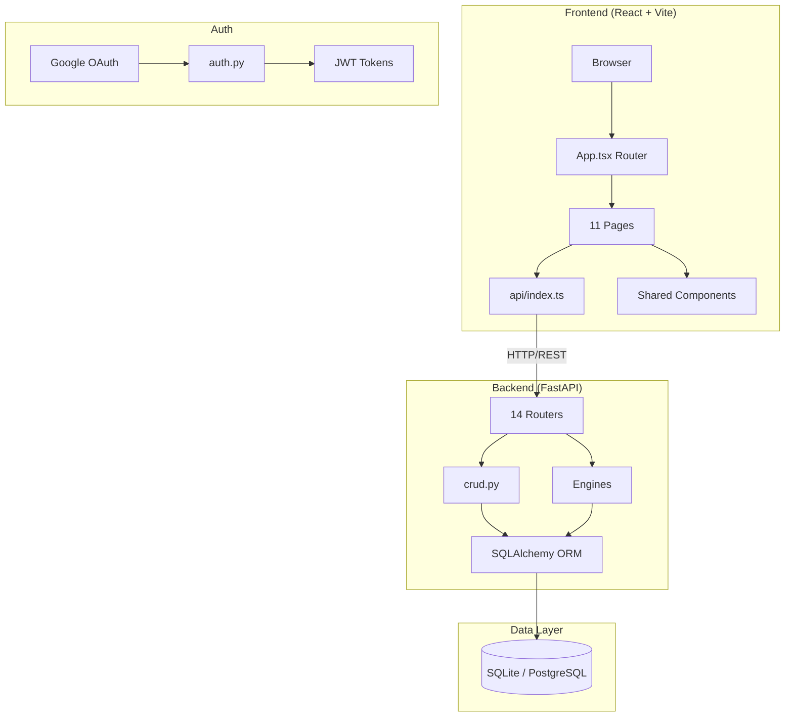
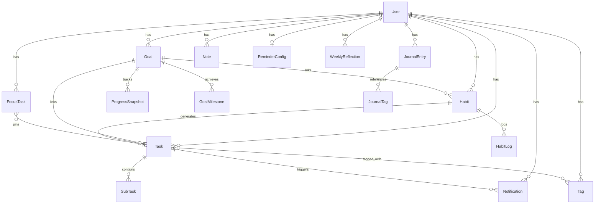
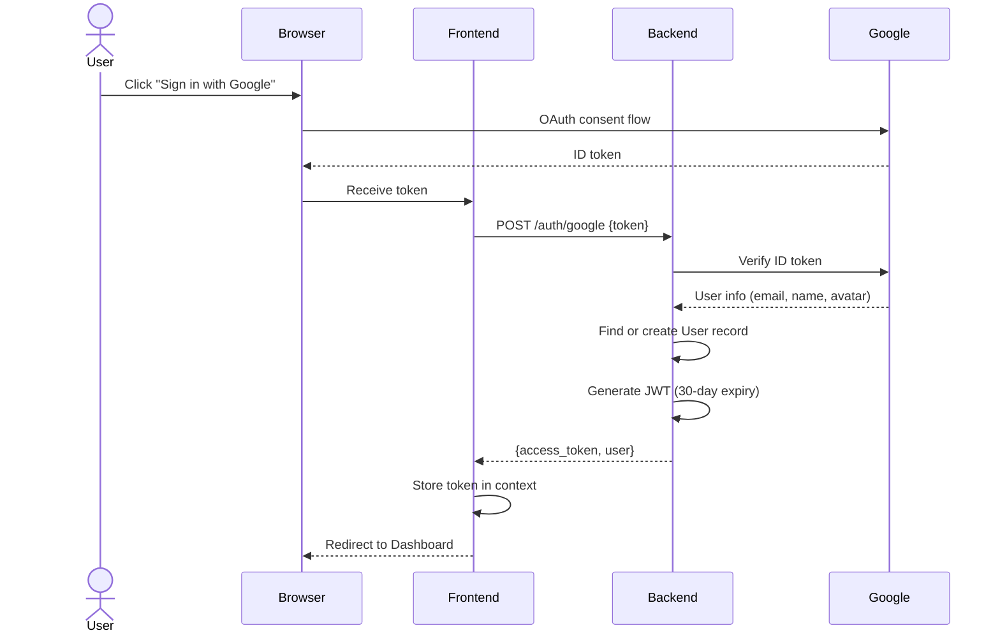
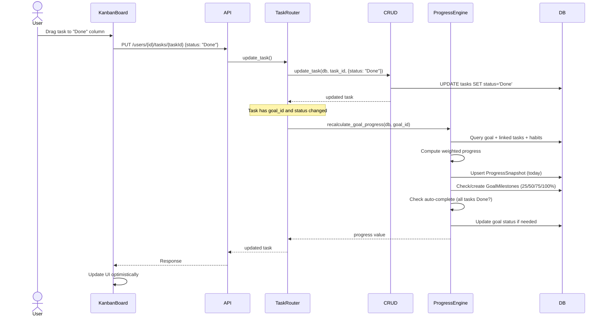
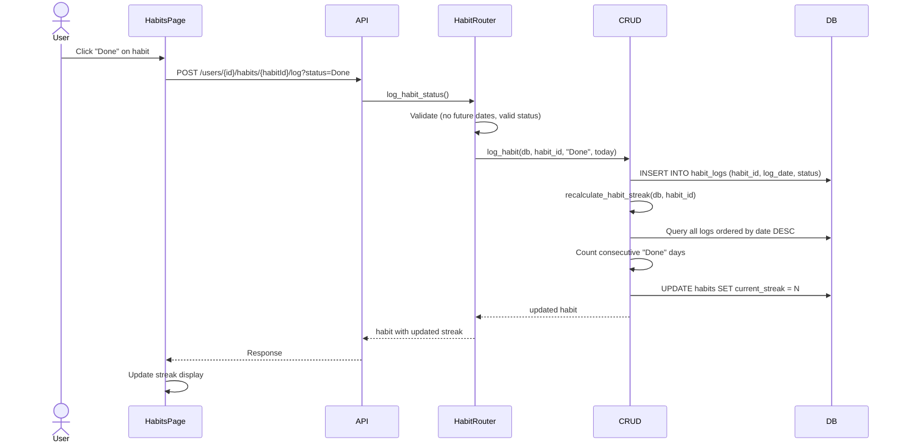
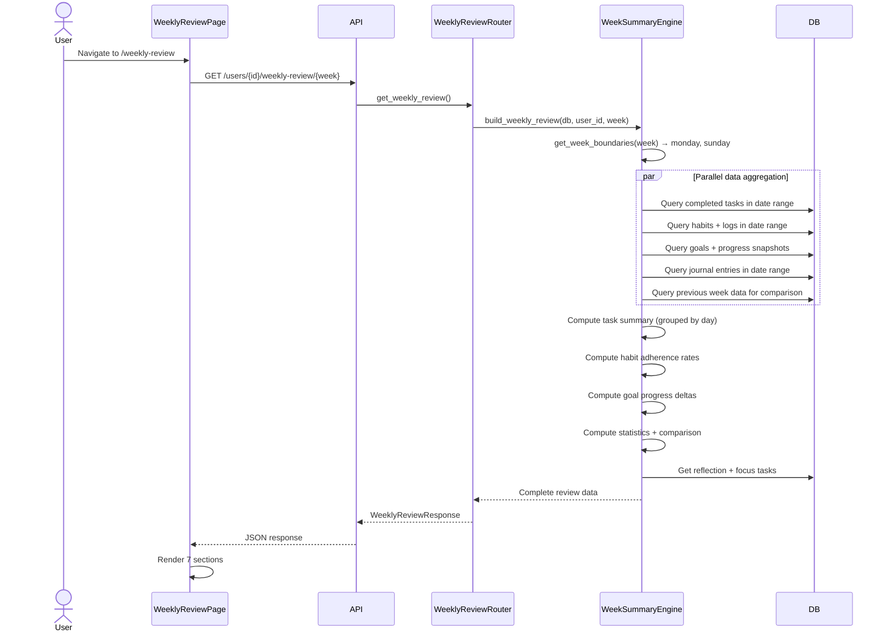
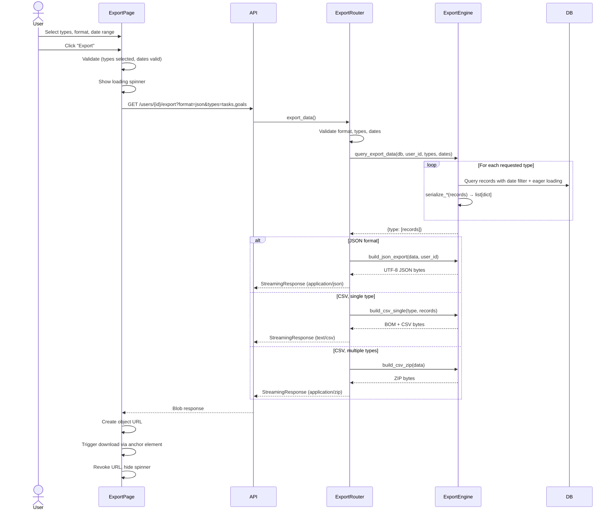
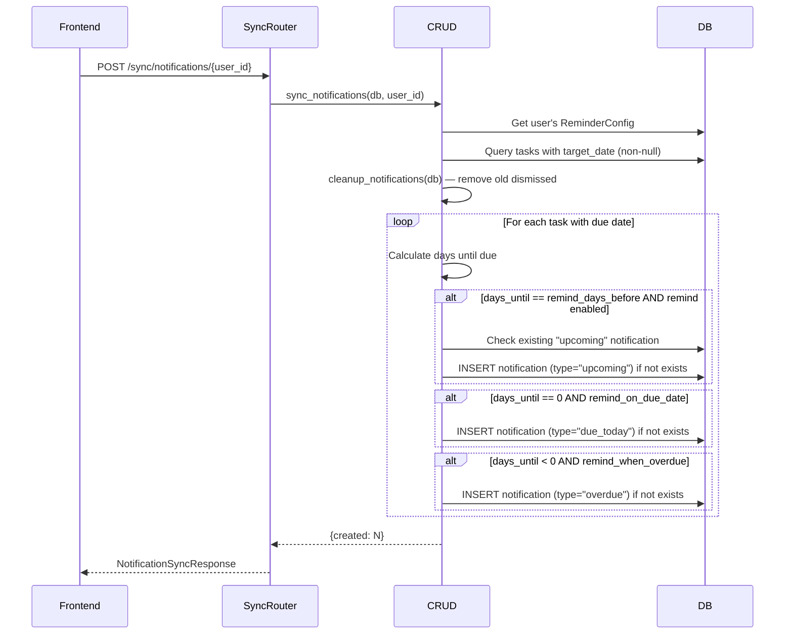
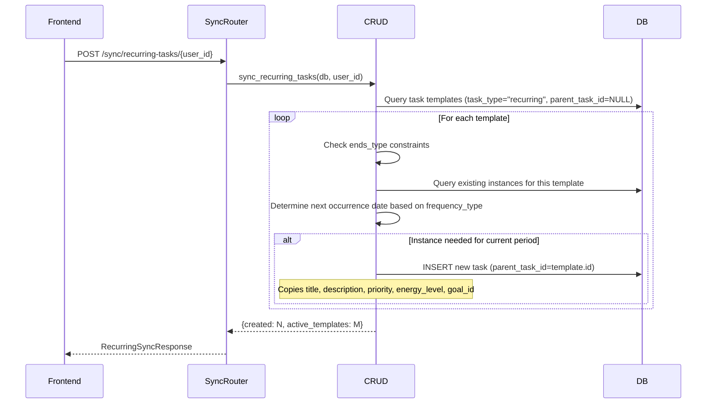

# LifeOS — Complete Project Documentation

## Table of Contents

1. [Project Overview](#1-project-overview)
2. [Architecture](#2-architecture)
3. [Feature Documentation](#3-feature-documentation)
4. [Database Documentation](#4-database-documentation)
5. [Backend API Documentation](#5-backend-api-documentation)
6. [Frontend UI Documentation](#6-frontend-ui-documentation)
7. [Sequence Diagrams](#7-sequence-diagrams)

---

## 1. Project Overview

LifeOS is a full-stack personal productivity application that integrates goal tracking, task management (Kanban), habit tracking, journaling, note-taking (Vault), analytics, notifications, weekly reviews, and data export into a unified platform.

### Tech Stack

| Layer | Technology |
|-------|-----------|
| Frontend | React 18 + TypeScript, Vite, Tailwind CSS, Lucide Icons |
| Backend | Python FastAPI, SQLAlchemy ORM, Pydantic v2 |
| Database | SQLite (configurable to PostgreSQL via `DATABASE_URL`) |
| Auth | Google OAuth 2.0 + JWT (HS256, 30-day expiry) |

### Project Structure

```
lifeos/
├── backend/
│   ├── main.py                  # FastAPI app entry point
│   ├── database.py              # SQLAlchemy engine + session
│   ├── models.py                # ORM models (16 tables)
│   ├── schemas.py               # Pydantic request/response schemas
│   ├── crud.py                  # Data access layer
│   ├── auth.py                  # Google OAuth + JWT auth
│   ├── progress_engine.py       # Goal progress computation engine
│   ├── week_summary_engine.py   # Weekly review data aggregation
│   ├── export_engine.py         # Data export serialization (JSON/CSV/ZIP)
│   ├── routers/                 # 14 API router modules
│   │   ├── auth.py, users.py, goals.py, habits.py, tasks.py
│   │   ├── journal.py, notes.py, tags.py, analytics.py
│   │   ├── dashboard.py, notifications.py, sync.py
│   │   ├── weekly_review.py, export.py
│   ├── tests/                   # Backend test suite
│   └── migrate_*.py             # Database migration scripts
├── frontend/
│   ├── src/
│   │   ├── App.tsx              # Router + protected routes
│   │   ├── pages/               # 11 page components
│   │   ├── components/          # 15+ shared components
│   │   ├── api/                 # Axios API client
│   │   ├── contexts/            # Auth context provider
│   │   ├── types.ts             # TypeScript interfaces
│   │   └── utils/               # Utility functions
│   └── package.json
└── .kiro/specs/                 # 10 feature specifications
```

---

## 2. Architecture



### Engine Modules

| Engine | Purpose |
|--------|---------|
| `progress_engine.py` | Computes goal progress from linked tasks/habits, manages snapshots, milestones, auto-completion |
| `week_summary_engine.py` | Aggregates weekly data for tasks, habits, goals, journal, and comparison stats |
| `export_engine.py` | Serializes user data to JSON/CSV/ZIP for download |

---

## 3. Feature Documentation

### 3.1 Authentication (Google OAuth)

Users sign in via Google OAuth 2.0. The backend verifies the Google ID token, creates or retrieves the user record, and issues a JWT (HS256, 30-day expiry). The frontend stores the token and sends it as a Bearer header on all API requests. A `ProtectedRoute` component guards authenticated pages.

### 3.2 Dashboard

The landing page after login. Displays:
- Active streak count across all habits
- Goal completion percentage
- Task efficiency breakdown (daily/monthly/annual)
- Upcoming deadline count
- Active goals summary with progress bars
- Today's habits and tasks

Endpoints: `GET /users/{id}/dashboard/stats`, `GET /users/{id}/dashboard/today`

### 3.3 Goals (with Progress Tracking)

Full CRUD for goals using the P.A.R.A. categorization (Project, Area, Resource, Archive). Goals have statuses (Active, Completed, Archived) and priorities (High, Medium, Low).

Progress is computed by the `progress_engine.py` as a weighted average of:
- Task completion ratio (% of linked tasks marked Done)
- Habit success rate (done logs vs expected based on target frequency)

Side effects on progress change:
- Daily `ProgressSnapshot` upserted for history charting
- `GoalMilestone` records created at 25%, 50%, 75%, 100% thresholds
- Auto-complete: goal status set to "Completed" when all linked tasks are Done; reverts to "Active" if a task is reopened (never overrides "Archived")

The goal detail view shows linked tasks, habits, progress history chart, and milestone badges.

### 3.4 Tasks (Kanban Board)

Three-column Kanban board (Todo, InProgress, Done) with:
- Drag-and-drop reordering via `sort_order` field
- Task priorities (High, Medium, Low, None) with color-coded badges
- Energy level tagging (High, Medium, Low)
- Time estimation and actual time tracking
- Subtasks with toggle completion
- Tags (many-to-many via `task_tags` junction table)
- Markdown support in descriptions
- Optional goal linking
- Recurring task templates (daily, weekly, monthly, annually, custom)
- Task instances spawned from templates via sync

Endpoints: Full CRUD + `PUT /reorder`, subtask CRUD, date filtering

### 3.5 Recurring Tasks

Tasks with `task_type = "recurring"` and `parent_task_id = null` serve as templates. The sync endpoint (`POST /sync/recurring-tasks/{user_id}`) creates child task instances based on the recurrence pattern:
- `frequency_type`: daily, weekly, monthly, annually, custom
- `repeat_interval`: e.g., every 2 weeks
- `repeat_days`: comma-separated day numbers (0=Sun..6=Sat) for weekly
- `ends_type`: never, on (specific date), after (N occurrences)

Validation ensures consistent configuration (e.g., weekly requires repeat_days).

### 3.6 Habits

Habits track recurring behaviors with flexible or scheduled frequency. Each habit has:
- Target: do X times in Y days (flexible) or scheduled recurrence
- Streak tracking with automatic recalculation
- Logging: Done or Missed per day (no future dates)
- Optional goal linking for progress contribution

The habit-task sync (`POST /sync/habits/{user_id}`) creates corresponding tasks for each habit and removes orphaned ones.

### 3.7 Journal

Daily journal entries with:
- Date-based entries (one per day)
- Free-text content with markdown support
- Mood tracking (1-5 scale)
- Journal tags linking entries to goals, habits, or tasks

### 3.8 Vault (Notes)

Markdown note-taking organized by P.A.R.A. folders:
- Full markdown editor with toolbar (bold, italic, headings, lists, code, links)
- Folder-based organization (Project, Area, Resource, Archive)
- Full CRUD with folder filtering

### 3.9 Tags

User-scoped tags with optional hex color codes:
- Tag names: 1-30 chars, unique per user
- Colors: validated hex format (#RGB or #RRGGBB)
- Many-to-many relationship with tasks via `task_tags` table
- Tag selector component with create-inline capability
- Color-coded tag chips in the UI

### 3.10 Task Priorities

Four-level priority system: High (red), Medium (yellow), Low (blue), None (gray).
- `PriorityBadge` component with color-coded display
- Priority filtering and sorting in the Kanban board
- Priority shown in task cards, goal detail, and weekly review

### 3.11 Drag-and-Drop Task Reorder

Tasks within each Kanban column can be reordered via drag-and-drop:
- `sort_order` integer field on tasks
- `PUT /users/{id}/tasks/reorder` endpoint accepts `{status, ordered_task_ids[]}`
- Bulk update of sort_order values in a single transaction
- Optimistic UI update on the frontend

### 3.12 Markdown Support

Rich markdown editing across journal entries, notes, and task descriptions:
- `MarkdownEditor` component with formatting toolbar
- Toolbar actions: bold, italic, heading, bullet list, numbered list, code block, link
- `markdownFormatting.ts` utility for text manipulation
- `stripMarkdown.ts` for generating plain-text previews

### 3.13 Due Date Reminders & Notifications

Automated notification system for task deadlines:
- Three notification types: `upcoming` (N days before), `due_today`, `overdue`
- `ReminderConfig` per user: `remind_days_before`, `remind_on_due_date`, `remind_when_overdue`
- Sync endpoint generates notifications based on config
- `NotificationCenter` component with bell icon, unread count badge, mark-read, dismiss
- Auto-cleanup of old dismissed notifications

### 3.14 Analytics & Leaderboard

Two analytics views:
- Leaderboard: ranks all users by Growth Score (weighted: goals 25%, habits 30%, streaks 10%, tasks 20%, journal 15%)
- Personal Stats: radar chart breakdown of individual scores
- Year in Pixels: 365-day heatmap blending mood (journal) and habit completion

### 3.15 Weekly Review

Comprehensive weekly summary dashboard:
- Week navigation (previous/next/current week)
- Task summary: completed tasks grouped by day, completion rate
- Habit summary: per-habit adherence rate, daily status grid, current streaks
- Goal progress: current progress, delta from previous week
- Journal summary: entries with mood and content preview
- Statistics: completion rate, habit adherence, time efficiency, week-over-week comparison
- Focus tasks: pin up to N tasks as weekly priorities
- Reflection: free-text weekly reflection with auto-save

### 3.16 Data Export

Export user data as JSON or CSV:
- Selectable data types: tasks, goals, habits, journal, notes
- Format: JSON (single file with metadata) or CSV (single file for one type, ZIP for multiple)
- Optional date range filtering
- CSV files include UTF-8 BOM for Excel compatibility
- Browser blob download with auto-generated filename

---

## 4. Database Documentation

### Entity-Relationship Diagram



### Table Definitions

#### `users`
| Column | Type | Constraints | Description |
|--------|------|-------------|-------------|
| id | Integer | PK, auto-increment | User ID |
| username | String | NOT NULL, indexed | Display name |
| email | String | UNIQUE, NOT NULL, indexed | Email address |
| password_hash | String | nullable | Legacy password (unused with OAuth) |
| google_id | String | UNIQUE, nullable, indexed | Google OAuth subject ID |
| avatar_url | String | nullable | Profile picture URL |
| created_at | DateTime | default: now | Registration timestamp |

#### `goals`
| Column | Type | Constraints | Description |
|--------|------|-------------|-------------|
| id | Integer | PK | Goal ID |
| user_id | Integer | FK → users.id | Owner |
| title | String | NOT NULL | Goal title |
| description | String | nullable | Goal description |
| status | String | default: "Active" | Active / Completed / Archived |
| category | String | default: "Project" | P.A.R.A. category |
| priority | String | default: "Medium" | High / Medium / Low |
| target_date | Date | nullable | Target completion date |
| created_at | DateTime | default: now | Creation timestamp |

#### `habits`
| Column | Type | Constraints | Description |
|--------|------|-------------|-------------|
| id | Integer | PK | Habit ID |
| goal_id | Integer | FK → goals.id, nullable | Linked goal |
| user_id | Integer | FK → users.id | Owner |
| title | String | NOT NULL | Habit title |
| target_x | Integer | nullable | Target completions |
| target_y_days | Integer | nullable | Within N days |
| current_streak | Integer | default: 0 | Current consecutive streak |
| start_date | Date | NOT NULL | Habit start date |
| frequency_type | String | default: "flexible" | flexible/daily/weekly/monthly/annually/custom |
| repeat_interval | Integer | default: 1 | Repeat every N periods |
| repeat_days | String | nullable | Comma-separated day numbers (0-6) |
| ends_type | String | default: "never" | never / on / after |
| ends_on_date | Date | nullable | End date (if ends_type = "on") |
| ends_after_occurrences | Integer | nullable | Max occurrences (if ends_type = "after") |

#### `habit_logs`
| Column | Type | Constraints | Description |
|--------|------|-------------|-------------|
| id | Integer | PK | Log ID |
| habit_id | Integer | FK → habits.id | Parent habit |
| log_date | Date | NOT NULL | Date of log |
| status | String | NOT NULL | "Done" or "Missed" |

#### `tasks`
| Column | Type | Constraints | Description |
|--------|------|-------------|-------------|
| id | Integer | PK | Task ID |
| user_id | Integer | FK → users.id | Owner |
| goal_id | Integer | FK → goals.id, nullable | Linked goal |
| habit_id | Integer | FK → habits.id, nullable | Source habit (for habit-tasks) |
| parent_task_id | Integer | FK → tasks.id, nullable | Template (for recurring instances) |
| title | String | NOT NULL | Task title |
| description | String | nullable | Task description (markdown) |
| status | String | default: "Todo" | Todo / InProgress / Done |
| task_type | String | default: "manual" | manual / habit / recurring |
| energy_level | String | nullable | High / Medium / Low |
| estimated_minutes | Integer | nullable | Time estimate |
| actual_minutes | Integer | nullable | Actual time spent |
| target_date | Date | nullable | Due date |
| priority | String | default: "None" | High / Medium / Low / None |
| sort_order | Integer | default: 0 | Kanban column position |
| created_at | DateTime | default: now | Creation timestamp |
| frequency_type | String | nullable | Recurrence type (templates only) |
| repeat_interval | Integer | default: 1 | Recurrence interval |
| repeat_days | String | nullable | Weekly recurrence days |
| ends_type | String | nullable | Recurrence end type |
| ends_on_date | Date | nullable | Recurrence end date |
| ends_after_occurrences | Integer | nullable | Max recurrence count |

#### `subtasks`
| Column | Type | Constraints | Description |
|--------|------|-------------|-------------|
| id | Integer | PK | SubTask ID |
| task_id | Integer | FK → tasks.id | Parent task |
| title | String | NOT NULL | SubTask title |
| is_complete | Integer | default: 0 | 0 = incomplete, 1 = complete |

#### `journal_entries`
| Column | Type | Constraints | Description |
|--------|------|-------------|-------------|
| id | Integer | PK | Entry ID |
| user_id | Integer | FK → users.id | Owner |
| entry_date | Date | NOT NULL | Journal date |
| content | Text | NOT NULL | Entry content (markdown) |
| mood | Integer | nullable | Mood 1-5 scale |
| created_at | DateTime | default: now | Creation timestamp |

#### `journal_tags`
| Column | Type | Constraints | Description |
|--------|------|-------------|-------------|
| id | Integer | PK | Tag ID |
| journal_entry_id | Integer | FK → journal_entries.id | Parent entry |
| entity_type | String | NOT NULL | "Goal", "Habit", or "Task" |
| entity_id | Integer | NOT NULL | Referenced entity ID |

#### `notes`
| Column | Type | Constraints | Description |
|--------|------|-------------|-------------|
| id | Integer | PK | Note ID |
| user_id | Integer | FK → users.id | Owner |
| title | String | NOT NULL | Note title |
| content | Text | nullable, default: "" | Note content (markdown) |
| folder | String | default: "Resource" | P.A.R.A. folder |
| created_at | DateTime | default: now | Creation timestamp |
| updated_at | DateTime | default: now, on_update: now | Last modified |

#### `tags`
| Column | Type | Constraints | Description |
|--------|------|-------------|-------------|
| id | Integer | PK | Tag ID |
| user_id | Integer | FK → users.id | Owner |
| name | String(30) | NOT NULL | Tag name |
| color | String | nullable | Hex color (#RGB or #RRGGBB) |
| | | UNIQUE(user_id, name) | Unique tag names per user |

#### `task_tags` (junction table)
| Column | Type | Constraints |
|--------|------|-------------|
| task_id | Integer | PK, FK → tasks.id |
| tag_id | Integer | PK, FK → tags.id (CASCADE) |

#### `notifications`
| Column | Type | Constraints | Description |
|--------|------|-------------|-------------|
| id | Integer | PK | Notification ID |
| user_id | Integer | FK → users.id | Recipient |
| task_id | Integer | FK → tasks.id (CASCADE) | Related task |
| type | String | NOT NULL | "upcoming", "due_today", "overdue" |
| message | String | NOT NULL | Display message |
| is_read | Integer | default: 0 | 0 = unread, 1 = read |
| dismissed | Integer | default: 0 | 0 = active, 1 = dismissed |
| created_at | DateTime | default: now | Creation timestamp |

#### `reminder_configs`
| Column | Type | Constraints | Description |
|--------|------|-------------|-------------|
| id | Integer | PK | Config ID |
| user_id | Integer | FK → users.id, UNIQUE | Owner |
| remind_days_before | Integer | default: 1 | Days before due date |
| remind_on_due_date | Integer | default: 1 | Notify on due date |
| remind_when_overdue | Integer | default: 1 | Notify when overdue |

#### `progress_snapshots`
| Column | Type | Constraints | Description |
|--------|------|-------------|-------------|
| id | Integer | PK | Snapshot ID |
| goal_id | Integer | FK → goals.id | Parent goal |
| date | Date | NOT NULL | Snapshot date |
| progress | Integer | NOT NULL | Progress 0-100 |
| | | UNIQUE(goal_id, date) | One snapshot per goal per day |

#### `goal_milestones`
| Column | Type | Constraints | Description |
|--------|------|-------------|-------------|
| id | Integer | PK | Milestone ID |
| goal_id | Integer | FK → goals.id | Parent goal |
| threshold | Integer | NOT NULL | 25, 50, 75, or 100 |
| achieved_at | DateTime | default: now | Achievement timestamp |
| | | UNIQUE(goal_id, threshold) | One milestone per threshold |

#### `weekly_reflections`
| Column | Type | Constraints | Description |
|--------|------|-------------|-------------|
| id | Integer | PK | Reflection ID |
| user_id | Integer | FK → users.id | Owner |
| week_identifier | String | NOT NULL | ISO week "YYYY-WNN" |
| content | Text | NOT NULL, default: "" | Reflection text |
| created_at | DateTime | default: now | Creation timestamp |
| updated_at | DateTime | default: now, on_update: now | Last modified |
| | | UNIQUE(user_id, week_identifier) | One reflection per week |

#### `focus_tasks`
| Column | Type | Constraints | Description |
|--------|------|-------------|-------------|
| id | Integer | PK | Focus task ID |
| user_id | Integer | FK → users.id | Owner |
| task_id | Integer | FK → tasks.id | Pinned task |
| week_identifier | String | NOT NULL | ISO week "YYYY-WNN" |
| created_at | DateTime | default: now | Creation timestamp |
| | | UNIQUE(user_id, task_id, week_identifier) | One pin per task per week |

---

## 5. Backend API Documentation

### 5.1 Authentication

| Method | Endpoint | Description |
|--------|----------|-------------|
| POST | `/auth/google` | Exchange Google ID token for JWT |

### 5.2 Users

| Method | Endpoint | Description |
|--------|----------|-------------|
| GET | `/users/` | List all users |
| GET | `/users/{user_id}` | Get user profile |
| PUT | `/users/{user_id}` | Update user profile |

### 5.3 Dashboard

| Method | Endpoint | Description |
|--------|----------|-------------|
| GET | `/users/{user_id}/dashboard/stats` | Dashboard statistics (streaks, goal %, task efficiency, deadlines, active goals) |
| GET | `/users/{user_id}/dashboard/today` | Today's habits and tasks |

### 5.4 Goals

| Method | Endpoint | Description |
|--------|----------|-------------|
| POST | `/users/{user_id}/goals/` | Create goal |
| GET | `/users/{user_id}/goals/` | List goals (with computed progress) |
| GET | `/users/{user_id}/goals/{goal_id}` | Goal detail (tasks, habits, milestones, progress history) |
| PUT | `/users/{user_id}/goals/{goal_id}` | Update goal |
| DELETE | `/users/{user_id}/goals/{goal_id}` | Delete goal |
| GET | `/users/{user_id}/goals/{goal_id}/progress` | Get computed progress |

### 5.5 Tasks

| Method | Endpoint | Description |
|--------|----------|-------------|
| POST | `/users/{user_id}/tasks/` | Create task |
| GET | `/users/{user_id}/tasks/` | List tasks (optional `start_date`, `end_date` filters) |
| PUT | `/users/{user_id}/tasks/{task_id}` | Update task (triggers goal progress recalc on status change) |
| DELETE | `/users/{user_id}/tasks/{task_id}` | Delete task |
| PUT | `/users/{user_id}/tasks/reorder` | Reorder tasks within a status column |

#### Subtasks

| Method | Endpoint | Description |
|--------|----------|-------------|
| POST | `/users/{user_id}/tasks/{task_id}/subtasks` | Create subtask |
| PATCH | `/users/{user_id}/tasks/{task_id}/subtasks/{subtask_id}/toggle` | Toggle subtask completion |
| DELETE | `/users/{user_id}/tasks/{task_id}/subtasks/{subtask_id}` | Delete subtask |

### 5.6 Habits

| Method | Endpoint | Description |
|--------|----------|-------------|
| POST | `/users/{user_id}/habits/` | Create habit |
| GET | `/users/{user_id}/habits/` | List habits (with logs) |
| POST | `/users/{user_id}/habits/{habit_id}/log` | Log habit status (Done/Missed) |
| PUT | `/users/{user_id}/habits/{habit_id}` | Update habit |
| DELETE | `/users/{user_id}/habits/{habit_id}` | Delete habit |

### 5.7 Journal

| Method | Endpoint | Description |
|--------|----------|-------------|
| POST | `/users/{user_id}/journal/` | Create journal entry |
| GET | `/users/{user_id}/journal/` | List journal entries |
| PUT | `/users/{user_id}/journal/{entry_id}` | Update journal entry |
| DELETE | `/users/{user_id}/journal/{entry_id}` | Delete journal entry |

### 5.8 Notes (Vault)

| Method | Endpoint | Description |
|--------|----------|-------------|
| POST | `/users/{user_id}/notes/` | Create note |
| GET | `/users/{user_id}/notes/` | List notes (optional `folder` filter) |
| PUT | `/users/{user_id}/notes/{note_id}` | Update note |
| DELETE | `/users/{user_id}/notes/{note_id}` | Delete note |

### 5.9 Tags

| Method | Endpoint | Description |
|--------|----------|-------------|
| GET | `/users/{user_id}/tags` | List user tags |
| POST | `/users/{user_id}/tags` | Create tag |
| PUT | `/users/{user_id}/tags/{tag_id}` | Update tag |
| DELETE | `/users/{user_id}/tags/{tag_id}` | Delete tag (cascades to task_tags) |

### 5.10 Notifications

| Method | Endpoint | Description |
|--------|----------|-------------|
| GET | `/users/{user_id}/notifications` | List notifications (active, non-dismissed) |
| GET | `/users/{user_id}/notifications/unread-count` | Get unread count |
| PUT | `/users/{user_id}/notifications/read-all` | Mark all as read |
| PUT | `/users/{user_id}/notifications/{id}/read` | Mark single as read |
| DELETE | `/users/{user_id}/notifications/{id}` | Dismiss notification |

#### Reminder Config

| Method | Endpoint | Description |
|--------|----------|-------------|
| GET | `/users/{user_id}/reminder-config` | Get reminder preferences |
| PUT | `/users/{user_id}/reminder-config` | Update reminder preferences |

### 5.11 Sync

| Method | Endpoint | Description |
|--------|----------|-------------|
| POST | `/sync/habits/{user_id}` | Sync habits → tasks (create missing, remove orphaned) |
| POST | `/sync/recurring-tasks/{user_id}` | Sync recurring templates → task instances |
| POST | `/sync/notifications/{user_id}` | Generate notifications for upcoming/due/overdue tasks |

### 5.12 Analytics

| Method | Endpoint | Description |
|--------|----------|-------------|
| GET | `/analytics/leaderboard` | Global leaderboard ranked by Growth Score |
| GET | `/analytics/users/{user_id}/personal` | Personal stats breakdown (radar chart data) |
| GET | `/analytics/users/{user_id}/year-in-pixels` | 365-day mood + habit heatmap |

### 5.13 Weekly Review

| Method | Endpoint | Description |
|--------|----------|-------------|
| GET | `/users/{user_id}/weekly-review/{week}` | Full weekly review data (tasks, habits, goals, journal, stats, comparison) |
| GET | `/users/{user_id}/weekly-review/{week}/reflection` | Get weekly reflection text |
| PUT | `/users/{user_id}/weekly-review/{week}/reflection` | Upsert weekly reflection |
| GET | `/users/{user_id}/weekly-review/{week}/focus-tasks` | List focus tasks for the week |
| POST | `/users/{user_id}/weekly-review/{week}/focus-tasks` | Add a focus task |
| DELETE | `/users/{user_id}/weekly-review/{week}/focus-tasks/{task_id}` | Remove a focus task |

### 5.14 Data Export

| Method | Endpoint | Query Params | Description |
|--------|----------|-------------|-------------|
| GET | `/users/{user_id}/export/` | `format` (json/csv), `types` (comma-separated), `start_date`, `end_date` | Export user data as JSON, CSV, or ZIP |

Response formats:
- JSON → `application/json` with metadata envelope
- CSV (1 type) → `text/csv; charset=utf-8` with BOM
- CSV (2+ types) → `application/zip` containing one CSV per type

---

## 6. Frontend UI Documentation

### 6.1 Pages

| Page | Route | Component | Description |
|------|-------|-----------|-------------|
| Login | `/login` | `LoginPage` | Google OAuth sign-in |
| Dashboard | `/` | `Dashboard` | Overview stats, today's tasks and habits |
| Goals | `/goals` | `GoalsPage` | Goal list with progress bars, detail modal with milestones and history chart |
| Tasks | `/tasks` | `KanbanBoard` | Three-column Kanban (Todo/InProgress/Done) with drag-and-drop |
| Habits | `/habits` | `HabitsPage` | Habit list with streak display, daily logging |
| Journal | `/journal` | `JournalPage` | Date-based entries with mood selector and markdown editor |
| Vault | `/vault` | `VaultPage` | P.A.R.A. folder-organized notes with markdown editor |
| Analytics | `/analytics` | `AnalyticsPage` | Leaderboard, personal radar chart, year-in-pixels heatmap |
| Weekly Review | `/weekly-review` | `WeeklyReviewPage` | Comprehensive weekly summary with 7 sections |
| Export | `/export` | `ExportPage` | Data export configuration and download |
| Profile | `/profile` | `ProfilePage` | User profile settings |

### 6.2 Shared Components

| Component | Description |
|-----------|-------------|
| `Layout` | App shell with sidebar and content area |
| `Sidebar` | Navigation links with active state indicators (9 routes) |
| `ProtectedRoute` | Auth guard redirecting unauthenticated users to login |
| `ProfileMenu` | User avatar dropdown with logout |
| `ConfirmModal` | Reusable confirmation dialog |
| `CustomDropdown` | Styled dropdown selector |
| `MarkdownEditor` | Rich text editor with formatting toolbar |
| `PriorityBadge` | Color-coded priority indicator (High=red, Medium=yellow, Low=blue) |
| `ProgressBar` | Animated progress bar for goal tracking |
| `TagChip` | Color-coded tag display chip |
| `TagSelector` | Tag picker with inline creation |
| `NotificationCenter` | Bell icon with unread badge, notification list, mark-read/dismiss |
| `QuickCaptureButton` | Floating action button for quick task creation |

### 6.3 Weekly Review Sub-Components

| Component | Description |
|-----------|-------------|
| `WeekNavigator` | Previous/next/current week navigation |
| `TaskSummarySection` | Completed tasks grouped by day with completion rate |
| `HabitSummarySection` | Per-habit adherence grid with streaks |
| `GoalProgressSection` | Goal progress bars with week-over-week delta |
| `JournalSummarySection` | Journal entries with mood indicators |
| `StatisticsSection` | Completion rate, habit adherence, efficiency, comparison |
| `FocusTasksSection` | Pinned priority tasks for the week |
| `ReflectionSection` | Free-text weekly reflection with auto-save |

### 6.4 Design System

- Dark theme with glassmorphism panels (`glass-panel` class)
- Emerald/cyan gradient accent colors
- Outfit font for headings
- Lucide React icons throughout
- Tailwind CSS utility classes
- Smooth animations (`animate-in`, `fade-in`, `slide-in-from-bottom`)
- Responsive layout with sidebar navigation

---

## 7. Sequence Diagrams

### 7.1 User Authentication Flow



### 7.2 Task Status Change with Goal Progress Recalculation



### 7.3 Habit Logging Flow



### 7.4 Weekly Review Data Loading



### 7.5 Data Export Flow



### 7.6 Notification Sync Flow



### 7.7 Recurring Task Sync Flow


