# LifeOS — Backend Security Audit

## 1. Authentication Security

### JWT Implementation

| Property | Value | Assessment |
|---|---|---|
| Algorithm | HS256 | ✅ Adequate for single-server. HMAC-SHA256 is symmetric — fine when only the backend signs and verifies. |
| Expiry | 7 days | ✅ Reasonable. Reduced from 30 days. |
| Secret source | `JWT_SECRET_KEY` env var | ✅ Required at startup — server refuses to boot without it. |
| Token payload | `{"sub": "<user_id>", "exp": "<timestamp>"}` | ✅ Minimal claims. No sensitive data in payload. |
| Library | `python-jose` | ⚠️ See recommendation below. |

**Secret enforcement** (`backend/auth.py`):
```python
_secret = os.environ.get("JWT_SECRET_KEY", "")
if not _secret:
    if "pytest" in sys.modules:
        _secret = "test-only-secret-do-not-use-in-prod"
    else:
        raise RuntimeError("JWT_SECRET_KEY environment variable is required.")
```
The server hard-crashes on startup if `JWT_SECRET_KEY` is missing, preventing accidental deployment with no secret. The test fallback is gated behind `"pytest" in sys.modules`, which cannot be triggered in production.

### Google OAuth Bypass Safety

```python
_bypass_env = os.environ.get("BYPASS_GOOGLE_AUTH", "false").lower() == "true"
BYPASS_GOOGLE_AUTH = _bypass_env and "pytest" in sys.modules
```

The bypass requires **both** the env var AND the pytest runtime. Setting `BYPASS_GOOGLE_AUTH=true` in production has no effect because `"pytest" not in sys.modules`. This is a safe implementation.

### Token Validation (`get_current_user`)

- Decodes JWT with algorithm pinning (`algorithms=[ALGORITHM]`) — prevents algorithm confusion attacks.
- Extracts `sub` claim, casts to `int`, queries database for user existence.
- Returns `401` with `WWW-Authenticate: Bearer` header on any failure.
- No token blacklist/revocation mechanism exists (see recommendations).

---

## 2. Authorization: Per-User Data Isolation

Every user-scoped router implements a `_verify_owner()` check:

```python
def _verify_owner(current_user: models.User, user_id: int):
    if current_user.id != user_id:
        raise HTTPException(status_code=403, detail="Not authorized")
```

This is called at the top of every endpoint handler, before any data access. The pattern is consistent across all 12 user-scoped routers (goals, habits, tasks, journal, notes, tags, notifications, dashboard, weekly_review, export, sync, users).

**CRUD-level isolation**: Most CRUD functions filter by `user_id`:
```python
db.query(models.Goal).filter(models.Goal.user_id == user_id)
```

**Tag cross-user protection** (`crud.py:_resolve_tag_ids`):
```python
tags = db.query(models.Tag).filter(Tag.id.in_(tag_ids), Tag.user_id == user_id).all()
if len(tags) != len(tag_ids):
    raise HTTPException(status_code=422, detail="One or more tag IDs are invalid or do not belong to this user")
```

**Water endpoints** use a different pattern — they extract `user_id` from `current_user` directly rather than from the URL path, which is actually more secure:
```python
def create_entry(entry, db, current_user):
    return crud.create_water_entry(db, user_id=current_user.id, entry=entry)
```

### ⚠️ Identified Gap: Subtask Ownership

The `toggle_subtask` and `delete_subtask` endpoints verify the parent task belongs to the user, but `crud.toggle_subtask()` and `crud.delete_subtask()` operate solely by `subtask_id` without verifying the subtask actually belongs to the specified `task_id`:

```python
# crud.py
def toggle_subtask(db: Session, subtask_id: int):
    db_subtask = db.query(models.SubTask).filter(models.SubTask.id == subtask_id).first()
```

If a user guesses a valid `subtask_id` belonging to a different task (but same user), the operation succeeds. The router does verify the task belongs to the user, so cross-user access is prevented, but the subtask-to-task binding is not enforced.

### ⚠️ Identified Gap: Analytics Leaderboard

`GET /analytics/leaderboard` queries **all users** and exposes usernames and scores. While it requires authentication, any authenticated user can see all other users' data. This may be intentional (gamification), but it leaks user existence and activity levels.

---

## 3. Input Validation

### Pydantic Schema Validation

All request bodies are validated through Pydantic models with explicit constraints:

| Schema | Constraints |
|---|---|
| `GoalCreate.title` | `min_length=1, max_length=200` |
| `TaskCreate.description` | `max_length=5000` |
| `JournalEntryCreate.content` | `min_length=1, max_length=50000` |
| `NoteCreate.content` | `max_length=100000` |
| `WaterEntryCreate.amount_ml` | `ge=1, le=5000` |
| `WaterGoalUpdate.amount_ml` | `ge=500, le=10000` |
| `TagCreate.name` | Custom validator: non-empty, max 30 chars |
| `TagCreate.color` | Must be one of 8 predefined hex values |
| `UserSettingsUpdate.theme_preference` | Must be `"dark"` or `"light"` |
| `GoogleAuthRequest.credential` | `max_length=4096` |

Pydantic rejects invalid input before it reaches any business logic, returning `422` with field-level error details.

### SQL Injection Prevention

All database queries use SQLAlchemy ORM with parameterized queries. No raw SQL strings are constructed. Example:
```python
db.query(models.Task).filter(models.Task.id == task_id, models.Task.user_id == user_id).first()
```

SQLAlchemy's `filter()` generates parameterized SQL, preventing injection.

### Request Body Size Limit

```python
MAX_BODY_BYTES = int(os.environ.get("MAX_REQUEST_BODY_BYTES", 1_048_576))  # 1 MB
```

A custom middleware rejects requests with `Content-Length` exceeding 1 MB before the body is read, preventing memory exhaustion attacks.

---

## 4. CORS Configuration

```python
_default_origins = "http://localhost:5173,http://localhost:5174,http://localhost:5175,http://localhost:3000,http://localhost:5176"
CORS_ORIGINS = os.environ.get("CORS_ORIGINS", _default_origins).split(",")

app.add_middleware(
    CORSMiddleware,
    allow_origins=[o.strip() for o in CORS_ORIGINS],
    allow_credentials=True,
    allow_methods=["*"],
    allow_headers=["*"],
)
```

**Assessment**:
- ✅ Origins are configurable via env var — production deployments should set this to the exact Cloudflare Pages domain.
- ✅ `allow_credentials=True` is needed for JWT auth.
- ⚠️ `allow_methods=["*"]` and `allow_headers=["*"]` are overly permissive. The app only uses GET, POST, PUT, PATCH, DELETE and standard headers.
- ⚠️ Default origins include 5 localhost ports — harmless in production if `CORS_ORIGINS` is set, but the defaults remain as fallback.

---

## 5. Rate Limiting

### Implementation (`backend/rate_limit.py`)

```python
limiter = Limiter(
    key_func=_get_rate_limit_key,
    default_limits=["30/minute"],
    storage_uri=_storage_uri,  # default: "memory://"
)
```

**Key function**: Uses `user:{user_id}` if authenticated, falls back to client IP. This prevents a single user from consuming the rate limit of other users sharing an IP.

**Per-endpoint override**: The login endpoint has a stricter limit:
```python
@limiter.limit("10/minute")
def google_login(request, body, db):
```

**Custom 429 handler**: Returns JSON with `Retry-After` header instead of plain text.

### ⚠️ Limitations

- **In-memory storage**: The default `memory://` storage resets on server restart and doesn't work across multiple workers/containers. Production should use Redis (`RATE_LIMIT_STORAGE_URI=redis://host:6379`).
- **No per-endpoint granularity**: Most endpoints use the global 30/minute default. Write-heavy endpoints (create task, log habit) share the same limit as read endpoints.

---

## 6. Secret Management

### Environment Variables

| Secret | Source | Required | Assessment |
|---|---|---|---|
| `JWT_SECRET_KEY` | `backend/.env` | Yes (crashes without it) | ✅ Enforced |
| `GOOGLE_CLIENT_ID` | `backend/.env` | Yes (OAuth fails without it) | ⚠️ Defaults to empty string silently |
| `DATABASE_URL` | `backend/.env` | No (defaults to SQLite) | ✅ OK |
| `CLOUDFLARE_TUNNEL_TOKEN` | `.env` (root) | Yes (tunnel won't start) | ✅ OK |

### 🚨 Critical Finding: `backend/.env` Not in `.gitignore`

The `.gitignore` file contains:
```
.env
frontend/.env
```

The root `.env` pattern matches `.env` at the repository root only. It does **not** match `backend/.env`. The `backend/.env` file (which contains `JWT_SECRET_KEY`, `GOOGLE_CLIENT_ID`, and `DATABASE_URL`) is **not gitignored**.

**Evidence**: `backend/.env` exists in the working tree and is not listed in `.gitignore` with a `backend/` prefix.

**Risk**: If committed, secrets are permanently in git history.

**Fix**: Add `backend/.env` to `.gitignore`:
```
backend/.env
```

### `.env.example` Files

Both `backend/.env.example` and root `.env.example` exist with placeholder values and no actual secrets. These are safe to commit.

---

## 7. Container Security

### Dockerfile (`backend/Dockerfile`)

```dockerfile
FROM python:3.12-slim
# ...
RUN useradd --create-home --shell /bin/bash appuser && \
    mkdir -p /app/data && \
    chown -R appuser:appuser /app
USER appuser
EXPOSE 8001
CMD ["uvicorn", "backend.main:app", "--host", "0.0.0.0", "--port", "8001"]
```

| Practice | Status | Notes |
|---|---|---|
| Non-root user | ✅ | `appuser` created and used |
| Slim base image | ✅ | `python:3.12-slim` minimizes attack surface |
| `EXPOSE` vs `ports` | ✅ | `docker-compose.yml` uses `expose: ["8001"]` (internal only), not `ports` |
| Health check | ✅ | `curl -f http://localhost:8001/` with 10s interval |
| No secrets in image | ✅ | Secrets injected via `env_file` at runtime |
| `--no-cache-dir` | ✅ | pip cache disabled |
| `.dockerignore` | ✅ | Exists in `backend/` |

### Docker Compose

```yaml
services:
  backend:
    expose: ["8001"]  # Internal only — not published to host
    env_file: ./backend/.env
    healthcheck: ...
    restart: unless-stopped

  cloudflared:
    environment:
      TUNNEL_TOKEN: ${CLOUDFLARE_TUNNEL_TOKEN}
    depends_on:
      backend:
        condition: service_healthy
```

- ✅ Backend port is only exposed internally on the Docker network — not published to the host.
- ✅ `cloudflared` waits for backend health check before starting.
- ✅ Both services use `restart: unless-stopped`.

---

## 8. Security Headers

### Cloudflare Pages (`frontend/public/_headers`)

```
/*
  X-Content-Type-Options: nosniff
  X-Frame-Options: DENY
  Referrer-Policy: strict-origin-when-cross-origin

/assets/*
  Cache-Control: public, max-age=31536000, immutable
```

| Header | Status | Notes |
|---|---|---|
| `X-Content-Type-Options: nosniff` | ✅ | Prevents MIME sniffing |
| `X-Frame-Options: DENY` | ✅ | Prevents clickjacking |
| `Referrer-Policy: strict-origin-when-cross-origin` | ✅ | Limits referrer leakage |
| `Content-Security-Policy` | ❌ Missing | See recommendations |
| `Strict-Transport-Security` | ❌ Missing | Cloudflare may add this, but explicit is better |
| `Permissions-Policy` | ❌ Missing | Should restrict camera, microphone, etc. |

---

## 9. Network Security

### Cloudflare Tunnel Architecture

```mermaid
graph LR
    Internet["Internet"]
    CF["Cloudflare Edge"]
    Tunnel["cloudflared container"]
    Backend["FastAPI container"]

    Internet -->|"HTTPS"| CF
    CF -->|"Encrypted tunnel"| Tunnel
    Tunnel -->|"HTTP (internal)"| Backend

    style Backend fill:#2d5016
    style Tunnel fill:#1a3a5c
```



- ✅ **No open inbound ports**: The backend has no published ports. All traffic enters through the Cloudflare Tunnel, which initiates an outbound connection to Cloudflare's edge.
- ✅ **TLS termination at Cloudflare**: All internet-facing traffic is HTTPS. The internal Docker network uses plain HTTP (acceptable within the same host).
- ✅ **DDoS protection**: Cloudflare's edge provides automatic DDoS mitigation.
- ✅ **No direct backend access**: Even if the server's IP is known, there are no open ports to connect to.

---

## 10. Identified Risks & Recommendations

### 🚨 Critical

| # | Issue | Details | Fix |
|---|---|---|---|
| 1 | `backend/.env` not gitignored | Contains `JWT_SECRET_KEY`, `GOOGLE_CLIENT_ID`, `DATABASE_URL`. Could be committed accidentally. | Add `backend/.env` to `.gitignore`. If already committed, rotate all secrets and use `git filter-branch` or BFG to purge history. |

### ⚠️ High

| # | Issue | Details | Fix |
|---|---|---|---|
| 2 | No token revocation | JWTs are valid for 7 days with no way to invalidate them (e.g., on password change, account compromise). | Implement a token blacklist (Redis set of revoked `jti` claims) or switch to short-lived access tokens + refresh tokens. |
| 3 | `python-jose` library | `python-jose` is unmaintained. The recommended replacement is `PyJWT` or `joserfc`. | Migrate to `PyJWT` (`pip install PyJWT`). The API is similar: `jwt.encode()` / `jwt.decode()`. |
| 4 | Missing `Content-Security-Policy` header | No CSP on the frontend. XSS payloads could load external scripts. | Add `Content-Security-Policy: default-src 'self'; script-src 'self'; style-src 'self' 'unsafe-inline'; img-src 'self' data: https:;` to `_headers`. |

### ⚠️ Medium

| # | Issue | Details | Fix |
|---|---|---|---|
| 5 | In-memory rate limit storage | Resets on restart, doesn't work with multiple workers. | Set `RATE_LIMIT_STORAGE_URI=redis://redis:6379` in production and add a Redis service to `docker-compose.yml`. |
| 6 | CORS allows all methods/headers | `allow_methods=["*"]` and `allow_headers=["*"]` are broader than needed. | Restrict to `allow_methods=["GET", "POST", "PUT", "PATCH", "DELETE", "OPTIONS"]` and `allow_headers=["Authorization", "Content-Type"]`. |
| 7 | `GOOGLE_CLIENT_ID` defaults to empty string | If unset, `verify_google_token()` will call Google with an empty client ID, which fails but doesn't crash on startup like `JWT_SECRET_KEY` does. | Add a startup check similar to `JWT_SECRET_KEY`: raise `RuntimeError` if `GOOGLE_CLIENT_ID` is empty and not in test mode. |
| 8 | Leaderboard exposes all users | `GET /analytics/leaderboard` returns usernames and activity scores for every user in the database. | Consider limiting to opted-in users, or anonymizing usernames, or removing the endpoint if not needed. |
| 9 | No `Strict-Transport-Security` header | While Cloudflare likely adds HSTS at the edge, the `_headers` file doesn't include it explicitly. | Add `Strict-Transport-Security: max-age=31536000; includeSubDomains` to `_headers`. |
| 10 | No `Permissions-Policy` header | Browser features like camera, microphone, geolocation are not restricted. | Add `Permissions-Policy: camera=(), microphone=(), geolocation=()` to `_headers`. |

### ℹ️ Low

| # | Issue | Details | Fix |
|---|---|---|---|
| 11 | Audit log doesn't include user ID | The `audit_log` middleware logs client IP but not the authenticated user ID (auth hasn't run yet at middleware level). | Log user ID in the route handlers or add a post-auth middleware. |
| 12 | No request ID / correlation ID | Requests can't be traced across logs. | Add a middleware that generates a UUID per request and includes it in logs and response headers (`X-Request-ID`). |
| 13 | SQLite in production | If `DATABASE_URL` defaults to SQLite, concurrent writes will fail under load. | Ensure production always sets `DATABASE_URL` to PostgreSQL. Add a startup warning if SQLite is detected in non-test mode. |
| 14 | Password hash field unused | `User.password_hash` exists but is never used for authentication (Google OAuth only). `create_user()` in CRUD stores `password + "notreallyhashed"`. | Remove the `password_hash` column and `create_user()` function if password auth is not planned. If it is planned, use `bcrypt` or `argon2`. |
